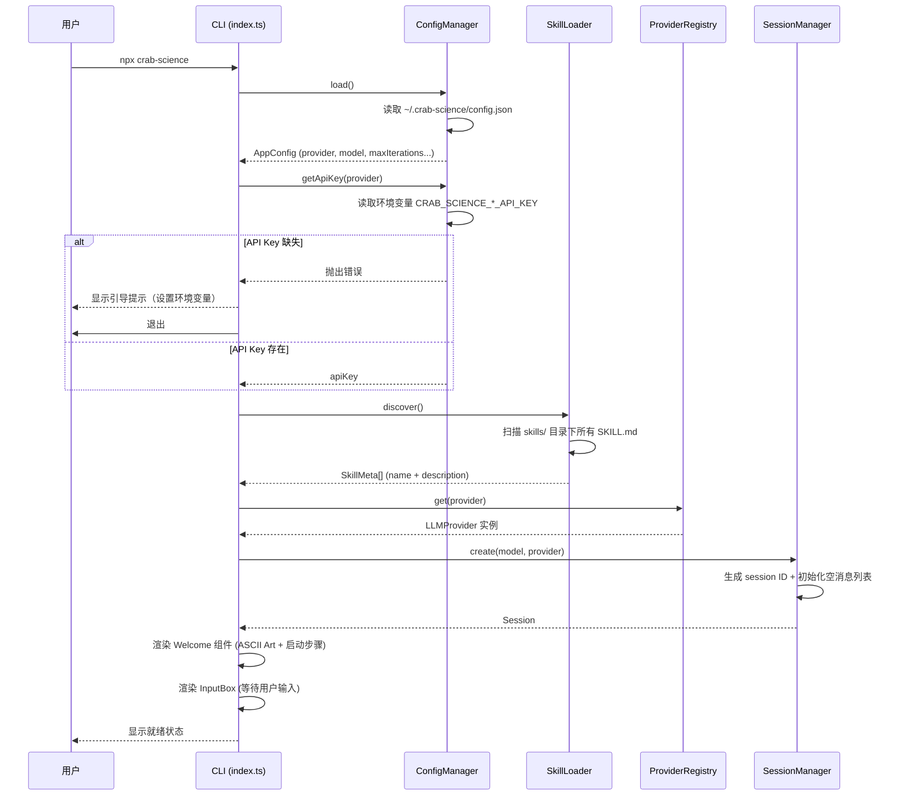
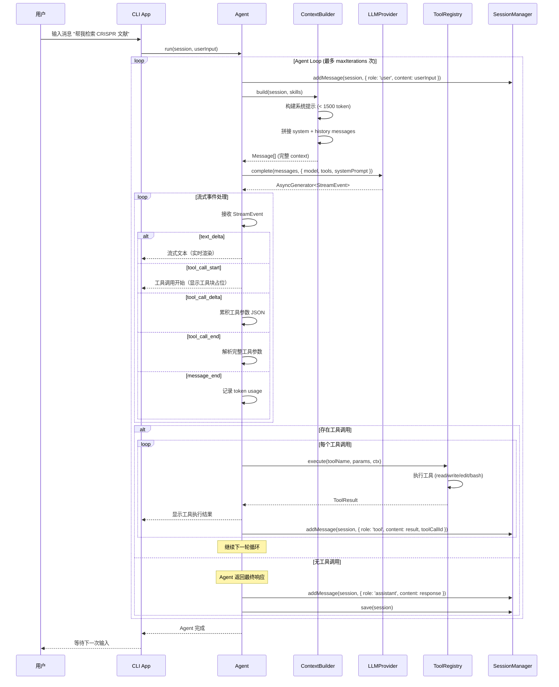
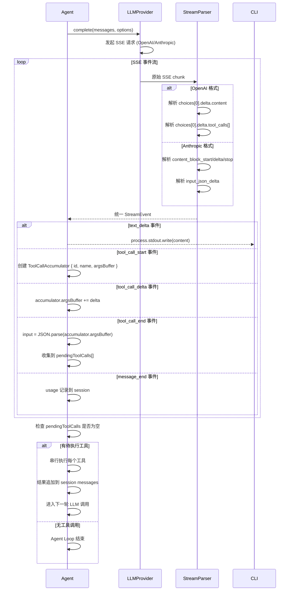
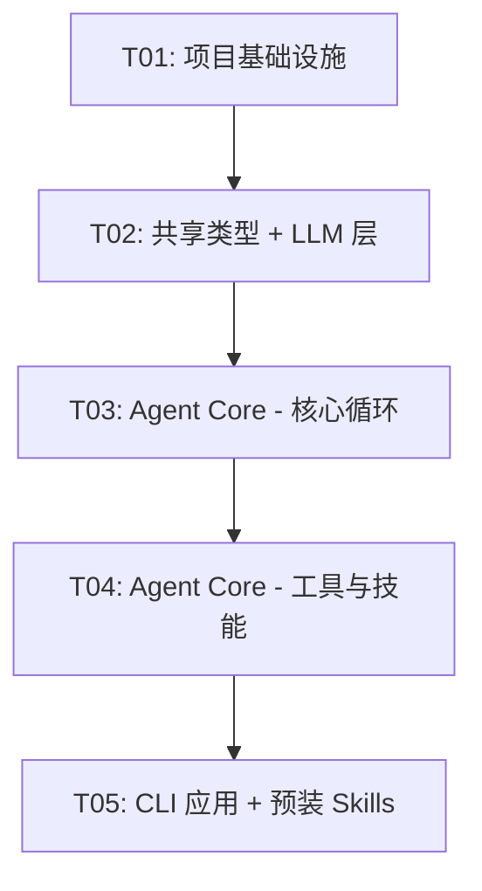

# Crab-Science Phase 1 架构设计文档

> **版本**：v1.0
> **日期**：2026-07-20
> **作者**：高见远（架构师）
> **状态**：待评审
> **Phase**：Phase 1 — 极简内核 MVP

---

## 目录

1. [实现方案与框架选型](#1-实现方案与框架选型)
2. [文件列表及相对路径](#2-文件列表及相对路径)
3. [数据结构和接口](#3-数据结构和接口)
4. [程序调用流程](#4-程序调用流程)
5. [任务列表](#5-任务列表)
6. [依赖包列表](#6-依赖包列表)
7. [共享知识（跨文件约定）](#7-共享知识跨文件约定)
8. [待明确事项](#8-待明确事项)

---

## 1. 实现方案与框架选型

### 1.1 技术栈确认

| 维度 | 选型 | 理由 |
|------|------|------|
| 语言 | TypeScript 5.x | 类型安全、LLM SDK 生态丰富、参考 Pi Agent |
| 运行时 | Node.js 20 LTS | 稳定、生态成熟 |
| Monorepo | Turborepo + pnpm workspace | 增量构建、依赖隔离、缓存加速 |
| CLI 框架 | Ink 4.x (React for CLI) | React 组件模型、流式渲染、社区活跃 |
| LLM SDK | openai + @anthropic-ai/sdk（官方 SDK） | 稳定性优先，流式 + 工具调用内置支持 |
| 终端样式 | chalk 5.x | 颜色输出，轻量 |
| Markdown 渲染 | marked + cli-highlight | CLI 中渲染 Markdown + 代码高亮 |
| 文件 Glob | fast-glob | 高性能 glob 匹配 |
| 配置管理 | 环境变量 + JSON 文件 | 敏感信息走环境变量，非敏感走配置文件 |

### 1.2 核心技术挑战与解决方案

#### 挑战 1：双 Provider 流式工具调用统一

OpenAI 和 Anthropic 的流式 SSE 协议差异巨大：
- **OpenAI**：`choices[0].delta.content` 输出文本，`choices[0].delta.tool_calls[]` 增量输出工具调用参数
- **Anthropic**：`content_block_start/delta/stop` 事件序列，工具调用通过 `input_json_delta` 增量拼接

**解决方案**：设计统一的 `StreamEvent` 类型和 `StreamParser`，每个 Provider 内部实现自己的 SSE 解析逻辑，对外暴露统一的 `AsyncGenerator<StreamEvent>` 接口。

```typescript
type StreamEvent =
  | { type: 'text_delta'; content: string }
  | { type: 'tool_call_start'; toolCallId: string; toolName: string }
  | { type: 'tool_call_delta'; toolCallId: string; delta: string }
  | { type: 'tool_call_end'; toolCallId: string; input: object }
  | { type: 'message_end'; usage: TokenUsage };
```

#### 挑战 2：Agent Loop 的工具调用编排

Agent 需要在一轮 LLM 响应中处理多个工具调用（并行或串行），并将结果按序回注。

**解决方案**：Agent Loop 在收到 `message_end` 事件后，收集所有 `tool_call_end` 事件，串行执行每个工具（Phase 1 不做并行），将每个工具结果作为 `tool` 角色消息追加到 session，然后重新构建 context 发起下一轮 LLM 调用。

#### 挑战 3：CLI 流式渲染与工具调用可视化

终端需要同时处理：流式文本输出（逐 token）、工具调用块渲染（完成后显示）、状态栏更新（token/cost）。

**解决方案**：使用 Ink 的 React 组件模型。`MessageList` 组件订阅 agent 的 stream events，实时更新 UI。工具调用块作为独立组件，在 `tool_call_start` 时创建占位，`tool_call_end` 后填充结果。

### 1.3 架构模式

采用**分层架构 + 依赖注入**：

```
┌─────────────────────────────────────────┐
│          apps/cli (表现层)               │
│  Ink React 组件 + 用户交互               │
├─────────────────────────────────────────┤
│       packages/agent-core (业务层)       │
│  Agent Loop + Tools + Session + Skills   │
├──────────────┬──────────────────────────┤
│ packages/    │ packages/                 │
│ llm-layer    │ shared                    │
│ (基础设施层)  │ (共享层)                   │
│ Provider     │ Types + Utils             │
│ 抽象 + 实现   │ Constants                 │
└──────────────┴──────────────────────────┘
```

**依赖方向**：`cli → agent-core → llm-layer → shared`，`agent-core → shared`。禁止反向依赖。

### 1.4 PRD 待确认问题决策

| # | 问题 | 决策 | 理由 |
|---|------|------|------|
| 1 | TUI 实现技术选型 | **Ink 4.x**（React for CLI） | 组件化开发、流式渲染原生支持、与未来 Tauri 前端技术栈一致（React）；包体积在 Phase 1 可接受 |
| 2 | OpenAI/Anthropic SDK 选择 | **官方 SDK**（`openai` + `@anthropic-ai/sdk`） | 稳定性优先，SDK 内置流式解析、工具调用、重试、错误处理；Phase 1 不追求极致包体积 |
| 3 | Skill 可执行脚本调用方式 | **Agent 用 bash + Python/curl 临时调用** | 极简优先，不预装二进制；SKILL.md 中写明 API 调用方法，agent 自主执行 |
| 4 | API Key 存储方式 | **环境变量优先**：`CRAB_SCIENCE_OPENAI_API_KEY` / `CRAB_SCIENCE_ANTHROPIC_API_KEY`；config.json 仅存非敏感配置 | 安全性 + 科研人员友好；首次运行引导设置环境变量 |
| 5 | Agent Loop 最大迭代次数 | **默认 50 次**，可通过 config.json 的 `maxIterations` 配置 | 平衡复杂任务需求与成本控制；达到上限时提示用户并保存 session |
| 6 | bash 工具安全边界 | **YOLO 模式 + 工作目录限制** | 参考 Pi Agent，不做权限弹窗；文件操作限制在工作目录内；后续 Phase 考虑容器化 |
| 7 | 流式输出中工具调用处理 | **统一 StreamEvent 解析器** | 定义 `StreamEvent` 联合类型，每个 Provider 内部解析各自 SSE 协议，对外暴露统一 AsyncGenerator |
| 8 | 第三个预装 Skill | **paper-writing** | 与 literature-search + data-analysis 形成"检索→分析→撰写"科研闭环 |
| 9 | Session 存储格式 | **全量 JSON 序列化**，一个 session 一个文件 | 简单优先；Phase 2 引入 tree 后再优化为增量写入 |
| 10 | 错误恢复策略 | **Ctrl+C 保存当前 session**，下次可恢复 | 信号监听 `SIGINT`，保存后退出；恢复时加载 JSON 重建消息历史 |

---

## 2. 文件列表及相对路径

### 2.1 项目根目录

```
crab-science/
├── package.json                        # Monorepo 根配置（scripts, devDeps）
├── pnpm-workspace.yaml                 # pnpm workspace 声明
├── turbo.json                          # Turborepo 任务编排配置
├── tsconfig.base.json                  # TypeScript 基础配置（被各包继承）
├── .gitignore                          # Git 忽略规则
├── README.md                           # 项目说明
```

### 2.2 packages/shared

```
packages/shared/
├── package.json
├── tsconfig.json
└── src/
    ├── index.ts                        # 统一导出
    ├── types.ts                        # 核心类型定义（Message, Tool, Session 等）
    ├── constants.ts                    # 常量（MAX_ITERATIONS, DEFAULT_MODEL 等）
    └── utils.ts                        # 工具函数（ID 生成、路径处理、token 估算）
```

### 2.3 packages/llm-layer

```
packages/llm-layer/
├── package.json
├── tsconfig.json
└── src/
    ├── index.ts                        # 统一导出
    ├── types.ts                        # LLM 专属类型（LLMProvider, LLMOptions, StreamEvent 等）
    ├── provider.ts                     # LLMProvider 抽象接口 + ProviderRegistry
    ├── stream-parser.ts                # 统一流式事件解析器
    ├── token-counter.ts                # Token 计数 + 成本估算
    └── providers/
        ├── openai-provider.ts          # OpenAI Provider 实现
        └── anthropic-provider.ts       # Anthropic Provider 实现
```

### 2.4 packages/agent-core

```
packages/agent-core/
├── package.json
├── tsconfig.json
└── src/
    ├── index.ts                        # 统一导出
    ├── agent.ts                        # Agent Loop 核心实现
    ├── context-builder.ts              # Context 构建（系统提示 + 历史 + skills 元数据）
    ├── system-prompt.ts                # 系统提示词构建器（< 1500 token）
    ├── tools/
    │   ├── index.ts                    # Tool 注册表 + 工具定义
    │   ├── types.ts                    # Tool 接口定义
    │   ├── read-tool.ts                # read 工具（支持 glob）
    │   ├── write-tool.ts               # write 工具（自动创建父目录）
    │   ├── edit-tool.ts                # edit 工具（old_string → new_string）
    │   └── bash-tool.ts                # bash 工具（工作目录 + 超时控制）
    ├── session/
    │   ├── manager.ts                  # Session 管理器（增删改查 + 持久化）
    │   └── types.ts                    # Session 数据结构
    ├── skills/
    │   ├── loader.ts                   # Skill 发现 + 加载（progressive disclosure）
    │   └── types.ts                    # Skill 数据结构
    └── config/
        └── manager.ts                  # 配置管理（读写 config.json + 环境变量）
```

### 2.5 apps/cli

```
apps/cli/
├── package.json
├── tsconfig.json
└── src/
    ├── index.ts                        # CLI 入口（启动流程）
    ├── app.tsx                         # 主应用组件（Ink 根组件）
    ├── components/
    │   ├── status-bar.tsx              # 顶部状态栏（版本/模型/Token/Cost）
    │   ├── message-list.tsx            # 对话区域（消息列表 + 流式渲染）
    │   ├── tool-block.tsx              # 工具调用可视化块
    │   ├── input-box.tsx               # 底部输入框
    │   └── welcome.tsx                 # 欢迎界面（ASCII Art + 启动步骤）
    ├── commands/
    │   └── handler.ts                  # 斜杠命令处理（/model, /clear, /skills 等）
    └── hooks/
        └── use-agent.ts                # Agent 交互 Hook（连接 agent-core）
```

### 2.6 skills（预装科研技能）

```
skills/
├── literature-search/
│   └── SKILL.md                        # 文献检索技能
├── data-analysis/
│   └── SKILL.md                        # 数据分析技能
└── paper-writing/
    └── SKILL.md                        # 论文撰写技能
```

### 2.7 完整文件树汇总

| 序号 | 文件路径 | 所属包 |
|------|---------|--------|
| 1 | `package.json` | 根 |
| 2 | `pnpm-workspace.yaml` | 根 |
| 3 | `turbo.json` | 根 |
| 4 | `tsconfig.base.json` | 根 |
| 5 | `.gitignore` | 根 |
| 6 | `README.md` | 根 |
| 7 | `packages/shared/package.json` | shared |
| 8 | `packages/shared/tsconfig.json` | shared |
| 9 | `packages/shared/src/index.ts` | shared |
| 10 | `packages/shared/src/types.ts` | shared |
| 11 | `packages/shared/src/constants.ts` | shared |
| 12 | `packages/shared/src/utils.ts` | shared |
| 13 | `packages/llm-layer/package.json` | llm-layer |
| 14 | `packages/llm-layer/tsconfig.json` | llm-layer |
| 15 | `packages/llm-layer/src/index.ts` | llm-layer |
| 16 | `packages/llm-layer/src/types.ts` | llm-layer |
| 17 | `packages/llm-layer/src/provider.ts` | llm-layer |
| 18 | `packages/llm-layer/src/stream-parser.ts` | llm-layer |
| 19 | `packages/llm-layer/src/token-counter.ts` | llm-layer |
| 20 | `packages/llm-layer/src/providers/openai-provider.ts` | llm-layer |
| 21 | `packages/llm-layer/src/providers/anthropic-provider.ts` | llm-layer |
| 22 | `packages/agent-core/package.json` | agent-core |
| 23 | `packages/agent-core/tsconfig.json` | agent-core |
| 24 | `packages/agent-core/src/index.ts` | agent-core |
| 25 | `packages/agent-core/src/agent.ts` | agent-core |
| 26 | `packages/agent-core/src/context-builder.ts` | agent-core |
| 27 | `packages/agent-core/src/system-prompt.ts` | agent-core |
| 28 | `packages/agent-core/src/tools/index.ts` | agent-core |
| 29 | `packages/agent-core/src/tools/types.ts` | agent-core |
| 30 | `packages/agent-core/src/tools/read-tool.ts` | agent-core |
| 31 | `packages/agent-core/src/tools/write-tool.ts` | agent-core |
| 32 | `packages/agent-core/src/tools/edit-tool.ts` | agent-core |
| 33 | `packages/agent-core/src/tools/bash-tool.ts` | agent-core |
| 34 | `packages/agent-core/src/session/manager.ts` | agent-core |
| 35 | `packages/agent-core/src/session/types.ts` | agent-core |
| 36 | `packages/agent-core/src/skills/loader.ts` | agent-core |
| 37 | `packages/agent-core/src/skills/types.ts` | agent-core |
| 38 | `packages/agent-core/src/config/manager.ts` | agent-core |
| 39 | `apps/cli/package.json` | cli |
| 40 | `apps/cli/tsconfig.json` | cli |
| 41 | `apps/cli/src/index.ts` | cli |
| 42 | `apps/cli/src/app.tsx` | cli |
| 43 | `apps/cli/src/components/status-bar.tsx` | cli |
| 44 | `apps/cli/src/components/message-list.tsx` | cli |
| 45 | `apps/cli/src/components/tool-block.tsx` | cli |
| 46 | `apps/cli/src/components/input-box.tsx` | cli |
| 47 | `apps/cli/src/components/welcome.tsx` | cli |
| 48 | `apps/cli/src/commands/handler.ts` | cli |
| 49 | `apps/cli/src/hooks/use-agent.ts` | cli |
| 50 | `skills/literature-search/SKILL.md` | skills |
| 51 | `skills/data-analysis/SKILL.md` | skills |
| 52 | `skills/paper-writing/SKILL.md` | skills |

**共计 52 个文件**。

---

## 3. 数据结构和接口

> 完整类图见 `docs/class-diagram.mermaid`

### 3.1 核心类型定义（packages/shared/src/types.ts）

```typescript
// ============ 消息类型 ============

/** 消息角色 */
type MessageRole = 'system' | 'user' | 'assistant' | 'tool';

/** 内容块类型 */
interface ContentBlock {
  type: 'text' | 'tool_use' | 'tool_result';
  text?: string;                    // type=text 时的文本内容
  toolCallId?: string;              // type=tool_use|tool_result 时的调用 ID
  toolName?: string;                // type=tool_use 时的工具名
  input?: Record<string, unknown>;  // type=tool_use 时的工具参数
  output?: string;                  // type=tool_result 时的工具输出
  isError?: boolean;                // type=tool_result 时是否为错误
}

/** 消息 */
interface Message {
  role: MessageRole;
  content: string | ContentBlock[];
  toolCallId?: string;              // role=tool 时关联的工具调用 ID
}

// ============ 工具类型 ============

/** 工具参数 schema（JSON Schema 子集） */
interface ToolParameterSchema {
  type: 'object';
  properties: Record<string, {
    type: string;
    description: string;
    enum?: string[];
  }>;
  required: string[];
}

/** 工具定义（传给 LLM 的格式） */
interface ToolDefinition {
  name: string;
  description: string;
  parameters: ToolParameterSchema;
}

/** 工具执行上下文 */
interface ToolContext {
  workDir: string;                  // 工作目录
  sessionId: string;                // 当前 session ID
}

/** 工具执行结果 */
interface ToolResult {
  success: boolean;
  output: string;                   // 输出内容（文本）
  error?: string;                   // 错误信息
}

// ============ Session 类型 ============

/** Session（线性，Phase 1） */
interface Session {
  id: string;
  messages: Message[];
  model: string;
  provider: string;
  createdAt: string;                // ISO 8601
  updatedAt: string;                // ISO 8601
  totalInputTokens: number;
  totalOutputTokens: number;
  totalCost: number;
}

// ============ 配置类型 ============

/** 配置文件结构 */
interface AppConfig {
  defaultProvider: 'openai' | 'anthropic';
  defaultModel: string;
  maxIterations: number;
  bashTimeoutMs: number;
  workDir: string;
}

// ============ Skill 类型 ============

/** Skill 元数据（从 SKILL.md frontmatter 解析） */
interface SkillMeta {
  name: string;
  description: string;
  version: number;
}

/** Skill 完整对象 */
interface Skill {
  meta: SkillMeta;
  path: string;                     // SKILL.md 文件路径
  content: string;                  // SKILL.md 完整内容
}

// ============ Token 使用量 ============

interface TokenUsage {
  inputTokens: number;
  outputTokens: number;
  cost: number;
}
```

### 3.2 LLM 层接口（packages/llm-layer/src/types.ts）

```typescript
/** LLM 调用选项 */
interface LLMOptions {
  model: string;
  tools?: ToolDefinition[];
  temperature?: number;
  maxTokens?: number;
  systemPrompt: string;
}

/** 流式事件（统一格式） */
type StreamEvent =
  | { type: 'text_delta'; content: string }
  | { type: 'tool_call_start'; toolCallId: string; toolName: string }
  | { type: 'tool_call_delta'; toolCallId: string; delta: string }
  | { type: 'tool_call_end'; toolCallId: string; input: Record<string, unknown> }
  | { type: 'message_end'; usage: TokenUsage };

/** 模型信息 */
interface ModelInfo {
  id: string;
  name: string;
  provider: string;
  contextWindow: number;
  pricing: { inputPerMillion: number; outputPerMillion: number };
}
```

### 3.3 核心类设计（classDiagram）

```mermaid
classDiagram
    class AppConfig {
        +defaultProvider: string
        +defaultModel: string
        +maxIterations: number
        +bashTimeoutMs: number
        +workDir: string
    }

    class ConfigManager {
        -configPath: string
        -config: AppConfig
        +load(): AppConfig
        +save(config: AppConfig): void
        +getApiKey(provider: string): string
        +validate(): boolean
    }

    class LLMProvider {
        <<interface>>
        +name: string
        +complete(messages: Message[], options: LLMOptions): AsyncGenerator~StreamEvent~
        +listModels(): ModelInfo[]
    }

    class OpenAIProvider {
        +name: string
        -client: OpenAIClient
        +complete(messages, options): AsyncGenerator~StreamEvent~
        +listModels(): ModelInfo[]
        -parseSSEChunk(chunk: any): StreamEvent[]
    }

    class AnthropicProvider {
        +name: string
        -client: AnthropicClient
        +complete(messages, options): AsyncGenerator~StreamEvent~
        +listModels(): ModelInfo[]
        -parseSSEEvent(event: any): StreamEvent[]
    }

    class ProviderRegistry {
        -providers: Map~string, LLMProvider~
        +register(provider: LLMProvider): void
        +get(name: string): LLMProvider
        +list(): string[]
    }

    class TokenCounter {
        -pricing: Map~string, ModelPricing~
        +count(text: string): number
        +estimateCost(inputTokens, outputTokens, model): number
    }

    class Tool {
        <<interface>>
        +name: string
        +description: string
        +parameters: ToolParameterSchema
        +execute(params: any, ctx: ToolContext): Promise~ToolResult~
    }

    class ReadTool {
        +name: string
        +execute(params, ctx): Promise~ToolResult~
        -readFile(path: string): string
        -globFiles(pattern: string, cwd: string): string[]
    }

    class WriteTool {
        +name: string
        +execute(params, ctx): Promise~ToolResult~
        -ensureDir(dirPath: string): void
    }

    class EditTool {
        +name: string
        +execute(params, ctx): Promise~ToolResult~
        -findMatches(content: string, oldStr: string): number
    }

    class BashTool {
        +name: string
        +execute(params, ctx): Promise~ToolResult~
        -executeCommand(cmd: string, cwd: string, timeout: number): ExecResult
    }

    class ToolRegistry {
        -tools: Map~string, Tool~
        +register(tool: Tool): void
        +get(name: string): Tool
        +getDefinitions(): ToolDefinition[]
        +execute(name: string, params: any, ctx: ToolContext): Promise~ToolResult~
    }

    class SessionManager {
        -sessionsDir: string
        +create(model, provider): Session
        +load(id: string): Session
        +save(session: Session): void
        +list(): SessionMeta[]
        +addMessage(session: Session, message: Message): void
    }

    class SkillLoader {
        -skillsDirs: string[]
        +discover(): SkillMeta[]
        +load(name: string): Skill
        +getMetadataForPrompt(): string
    }

    class ContextBuilder {
        -systemPromptBuilder: SystemPromptBuilder
        +build(session: Session, skills: SkillMeta[]): Message[]
    }

    class SystemPromptBuilder {
        +build(skills: SkillMeta[]): string
        -buildToolDescriptions(): string
        -buildSkillMetadata(skills: SkillMeta[]): string
    }

    class Agent {
        -provider: LLMProvider
        -toolRegistry: ToolRegistry
        -sessionManager: SessionManager
        -skillLoader: SkillLoader
        -contextBuilder: ContextBuilder
        -config: AppConfig
        +run(session: Session, userInput: string): AsyncGenerator~AgentEvent~
        -executeToolCall(toolCall: ToolCall, session: Session): ToolResult
        -checkIterationLimit(count: number): boolean
    }

    LLMProvider <|.. OpenAIProvider
    LLMProvider <|.. AnthropicProvider
    Tool <|.. ReadTool
    Tool <|.. WriteTool
    Tool <|.. EditTool
    Tool <|.. BashTool
    ProviderRegistry o-- LLMProvider
    ToolRegistry o-- Tool
    Agent --> LLMProvider : uses
    Agent --> ToolRegistry : uses
    Agent --> SessionManager : uses
    Agent --> SkillLoader : uses
    Agent --> ContextBuilder : uses
    ContextBuilder --> SystemPromptBuilder : uses
    ConfigManager --> AppConfig : manages
```



---

## 4. 程序调用流程

> 完整序列图见 `docs/sequence-diagram.mermaid`

### 4.1 CLI 启动流程



### 4.2 Agent Loop 执行流程



### 4.3 流式工具调用处理细节



---

## 5. 任务列表

### 任务依赖关系图



---

### T01: 项目基础设施

| 维度 | 内容 |
|------|------|
| **任务 ID** | T01 |
| **描述** | 搭建 Turborepo + pnpm monorepo 骨架，创建所有包的 package.json / tsconfig.json，配置构建管线 |
| **依赖** | 无 |
| **优先级** | P0 |
| **涉及文件** | `package.json`, `pnpm-workspace.yaml`, `turbo.json`, `tsconfig.base.json`, `.gitignore`, `README.md`, `packages/shared/package.json`, `packages/shared/tsconfig.json`, `packages/llm-layer/package.json`, `packages/llm-layer/tsconfig.json`, `packages/agent-core/package.json`, `packages/agent-core/tsconfig.json`, `apps/cli/package.json`, `apps/cli/tsconfig.json` |

**实现要点**：

1. **根 package.json**：
   - `name: "crab-science"`，`private: true`
   - `scripts`: `build` (turbo build), `dev` (turbo dev), `lint`, `clean`
   - `devDependencies`: `turbo`, `typescript`, `tsup`（打包工具）
   - `packageManager`: `pnpm@9.x`

2. **pnpm-workspace.yaml**：
   ```yaml
   packages:
     - 'packages/*'
     - 'apps/*'
   ```

3. **turbo.json**：
   - `build`: 依赖 `^build`，输出 `dist/**`
   - `dev`: 持久模式（persistent）
   - 包间依赖自动推断

4. **tsconfig.base.json**：
   - `target: ES2022`, `module: NodeNext`, `moduleResolution: NodeNext`
   - `strict: true`, `esModuleInterop: true`
   - `declaration: true`, `declarationMap: true`, `sourceMap: true`
   - `skipLibCheck: true`

5. **各包 tsconfig.json**：继承 base，设置 `outDir: ./dist`, `rootDir: ./src`

6. **包间依赖声明**：
   - `agent-core` depends on `@crab-science/shared`, `@crab-science/llm-layer`
   - `llm-layer` depends on `@crab-science/shared`
   - `cli` depends on `@crab-science/agent-core`, `@crab-science/shared`
   - 包名统一使用 `@crab-science/*` 命名空间

7. **tsup 配置**：各包使用 tsup 打包，输出 ESM 格式，`entry: ["src/index.ts"]`

---

### T02: 共享类型 + LLM 层

| 维度 | 内容 |
|------|------|
| **任务 ID** | T02 |
| **描述** | 实现 shared 包的核心类型定义和工具函数，实现 llm-layer 包的 Provider 抽象、OpenAI/Anthropic 双 Provider、统一流式解析器、Token 计数器 |
| **依赖** | T01 |
| **优先级** | P0 |
| **涉及文件** | `packages/shared/src/index.ts`, `packages/shared/src/types.ts`, `packages/shared/src/constants.ts`, `packages/shared/src/utils.ts`, `packages/llm-layer/src/index.ts`, `packages/llm-layer/src/types.ts`, `packages/llm-layer/src/provider.ts`, `packages/llm-layer/src/stream-parser.ts`, `packages/llm-layer/src/token-counter.ts`, `packages/llm-layer/src/providers/openai-provider.ts`, `packages/llm-layer/src/providers/anthropic-provider.ts` |

**实现要点**：

1. **shared/src/types.ts**：定义第 3 节中所有核心类型（Message, ContentBlock, Tool, ToolResult, Session, AppConfig, Skill, TokenUsage 等）。纯类型文件，不含运行时逻辑。

2. **shared/src/constants.ts**：
   - `DEFAULT_MAX_ITERATIONS = 50`
   - `DEFAULT_BASH_TIMEOUT_MS = 30000`
   - `DEFAULT_PROVIDER = 'anthropic'`
   - `DEFAULT_MODEL = 'claude-sonnet-4-20250514'`
   - `CONFIG_DIR = '~/.crab-science'`
   - `SESSIONS_DIR = '~/.crab-science/sessions'`
   - `SKILLS_DIR = 'skills'`（相对于项目根）

3. **shared/src/utils.ts**：
   - `generateId(prefix: string): string` — 生成 session/message ID
   - `expandTilde(path: string): string` — 展开 `~` 为 home 目录
   - `estimateTokens(text: string): number` — 简易 token 估算（字符数 / 4）
   - `truncateOutput(text: string, maxLines: number): string` — 截断长输出
   - `formatCost(cost: number): string` — 格式化成本显示

4. **llm-layer/src/types.ts**：定义 LLMOptions, StreamEvent, ModelInfo 等 LLM 层专属类型。

5. **llm-layer/src/provider.ts**：
   - `LLMProvider` 接口：`name`, `complete()`, `listModels()`
   - `ProviderRegistry` 类：注册/获取 provider 实例
   - `createProvider(name: string, apiKey: string): LLMProvider` 工厂函数

6. **llm-layer/src/stream-parser.ts**：
   - `StreamEvent` 联合类型定义
   - `OpenAIStreamParser` 类：解析 OpenAI SSE delta（`choices[0].delta.content` + `choices[0].delta.tool_calls`），累积 tool_calls 的 `function.arguments` 增量
   - `AnthropicStreamParser` 类：解析 Anthropic SSE 事件序列（`content_block_start` → `content_block_delta` → `content_block_stop`），累积 `input_json_delta`
   - 两者均输出统一的 `StreamEvent[]`

7. **llm-layer/src/providers/openai-provider.ts**：
   - 使用 `openai` SDK
   - `complete()` 方法：将统一 Message[] 转换为 OpenAI 格式，调用 `client.chat.completions.create({ stream: true })`，用 `OpenAIStreamParser` 解析每个 chunk，yield 统一 StreamEvent
   - 工具定义转换：统一 ToolDefinition → OpenAI `tools` 格式
   - 模型列表：GPT-4o, GPT-4o-mini 等

8. **llm-layer/src/providers/anthropic-provider.ts**：
   - 使用 `@anthropic-ai/sdk`
   - `complete()` 方法：将统一 Message[] 转换为 Anthropic 格式（system 消息单独传，tool_result 作为 user 消息的 content block），调用 `client.messages.create({ stream: true })`，用 `AnthropicStreamParser` 解析事件，yield 统一 StreamEvent
   - 工具定义转换：统一 ToolDefinition → Anthropic `tools` 格式
   - 模型列表：Claude Sonnet, Claude Opus 等

9. **llm-layer/src/token-counter.ts**：
   - 各模型的定价表（input/output per million tokens）
   - `estimateCost(inputTokens, outputTokens, model)` 方法
   - `countTokens(text)` 简易估算

10. **消息格式转换关键点**：
    - OpenAI：`tool` 角色消息直接在 messages 数组中
    - Anthropic：`tool_result` 作为 `user` 消息的 content block，`tool_use` 作为 `assistant` 消息的 content block
    - 统一 Message[] 在 Provider 内部转换，对 Agent 透明

---

### T03: Agent Core — 核心循环

| 维度 | 内容 |
|------|------|
| **任务 ID** | T03 |
| **描述** | 实现 Agent Loop 核心逻辑、Context 构建、系统提示词构建、Session 管理、配置管理 |
| **依赖** | T02 |
| **优先级** | P0 |
| **涉及文件** | `packages/agent-core/src/index.ts`, `packages/agent-core/src/agent.ts`, `packages/agent-core/src/context-builder.ts`, `packages/agent-core/src/system-prompt.ts`, `packages/agent-core/src/session/manager.ts`, `packages/agent-core/src/session/types.ts`, `packages/agent-core/src/config/manager.ts` |

**实现要点**：

1. **agent.ts — Agent 类**：
   - 构造函数注入：`LLMProvider`, `ToolRegistry`, `SessionManager`, `SkillLoader`, `ContextBuilder`, `AppConfig`
   - `run(session, userInput): AsyncGenerator<AgentEvent>` — 核心方法
   - `AgentEvent` 类型：`{ type: 'text', content }` | `{ type: 'tool_call', name, params }` | `{ type: 'tool_result', name, result }` | `{ type: 'error', message }` | `{ type: 'done', usage }`
   - 循环逻辑：
     ```
     1. addMessage(session, user/assistant message)
     2. context = contextBuilder.build(session, skills)
     3. stream = provider.complete(context, { tools, systemPrompt })
     4. for event in stream: yield agent events, accumulate tool calls
     5. if toolCalls: execute each, addMessage(tool results), goto 2
     6. else: save session, yield done
     7. iterationCount++, check maxIterations
     ```
   - 错误处理：LLM 调用失败时 yield error event；工具执行失败时将错误信息作为 tool_result 回注（isError=true）

2. **context-builder.ts — ContextBuilder 类**：
   - `build(session, skills): Message[]` — 构建完整消息数组
   - 逻辑：`[systemPrompt] + session.messages`（系统提示单独传入 LLM，不放入 messages）
   - 实际返回 `{ systemPrompt: string, messages: Message[] }`

3. **system-prompt.ts — SystemPromptBuilder 类**：
   - `build(skills: SkillMeta[]): string` — 构建 < 1500 token 的系统提示
   - 提示结构：
     ```
     # 角色
     你是 Crab-Science，一个科研 AI Agent。你能通过工具调用帮助科研人员完成文献检索、数据分析、论文撰写等任务。

     # 可用工具
     - read: 读取文件内容，支持 glob 模式
     - write: 创建或覆盖文件
     - edit: 精确编辑文件（old_string → new_string）
     - bash: 执行 shell 命令

     # 可用技能（按需读取 SKILL.md）
     - {skill_name}: {skill_description}
     ...

     # 工作原则
     - 先理解任务，再行动
     - 需要技能时用 read 工具加载 SKILL.md
     - 每步操作后检查结果，调整策略
     - 工作目录：{workDir}
     ```
   - Token 控制：各部分预算分配，skills 元数据约 50 token/skill

4. **session/manager.ts — SessionManager 类**：
   - `create(model, provider): Session` — 创建新 session
   - `load(id): Session` — 从 JSON 文件加载
   - `save(session): void` — 全量序列化到 `~/.crab-science/sessions/{id}.json`
   - `list(): SessionMeta[]` — 列出所有历史 session（id, createdAt, model, messageCount）
   - `addMessage(session, message): void` — 追加消息并更新 updatedAt
   - `delete(id): void` — 删除 session 文件

5. **session/types.ts**：Session 和 SessionMeta 类型定义（从 shared 导入或本地扩展）

6. **config/manager.ts — ConfigManager 类**：
   - `load(): AppConfig` — 读取 `~/.crab-science/config.json`，不存在则返回默认配置并创建文件
   - `save(config): void` — 保存配置
   - `getApiKey(provider): string` — 优先从环境变量 `CRAB_SCIENCE_{PROVIDER}_API_KEY` 读取，不存在则抛出友好错误
   - `validate(): { valid: boolean, errors: string[] }` — 校验配置完整性
   - `ensureConfigDir(): void` — 确保 `~/.crab-science/` 目录存在

---

### T04: Agent Core — 工具与技能

| 维度 | 内容 |
|------|------|
| **任务 ID** | T04 |
| **描述** | 实现 4 个核心工具（read/write/edit/bash）、工具注册表、Skill 发现与加载机制、3 个预装科研 Skills |
| **依赖** | T03 |
| **优先级** | P0 |
| **涉及文件** | `packages/agent-core/src/tools/index.ts`, `packages/agent-core/src/tools/types.ts`, `packages/agent-core/src/tools/read-tool.ts`, `packages/agent-core/src/tools/write-tool.ts`, `packages/agent-core/src/tools/edit-tool.ts`, `packages/agent-core/src/tools/bash-tool.ts`, `packages/agent-core/src/skills/loader.ts`, `packages/agent-core/src/skills/types.ts`, `skills/literature-search/SKILL.md`, `skills/data-analysis/SKILL.md`, `skills/paper-writing/SKILL.md` |

**实现要点**：

1. **tools/types.ts**：
   - `Tool` 接口：`name`, `description`, `parameters: ToolParameterSchema`, `execute(params, ctx): Promise<ToolResult>`
   - `ToolContext`: `{ workDir, sessionId }`

2. **tools/read-tool.ts — ReadTool**：
   - 参数：`{ path: string }`（必填），支持 glob 模式（如 `**/*.csv`）
   - 逻辑：
     - 检测 path 是否含 glob 字符（`*`, `?`, `[`, `{`）
     - 含 glob：用 `fast-glob` 匹配，返回匹配文件列表 + 每个文件的内容摘要（前 N 行）
     - 不含 glob：读取单个文件，返回完整内容
   - 大文件处理：超过 500 行时截断，末尾显示 `... (共 N 行，已截断)`
   - 路径安全：解析为绝对路径后检查是否在 workDir 内
   - ToolDefinition：`{ name: 'read', description: '读取文件内容，支持 glob 模式匹配', parameters: { type: 'object', properties: { path: { type: 'string', description: '文件路径或 glob 模式' } }, required: ['path'] } }`

3. **tools/write-tool.ts — WriteTool**：
   - 参数：`{ path: string, content: string }`（均必填）
   - 逻辑：
     - 解析路径为绝对路径
     - 检查是否在 workDir 内
     - `fs.mkdirSync(dirname, { recursive: true })` — 自动创建父目录
     - `fs.writeFileSync(path, content, 'utf-8')`
     - 返回写入的文件路径 + 行数
   - ToolDefinition：`{ name: 'write', description: '创建或完全覆盖文件，自动创建父目录', ... }`

4. **tools/edit-tool.ts — EditTool**：
   - 参数：`{ path: string, old_string: string, new_string: string }`（均必填）
   - 逻辑：
     - 读取文件内容
     - 统计 `old_string` 出现次数
     - 0 次 → 返回错误 `{ success: false, error: 'old_string 在文件中未找到' }`
     - >1 次 → 返回错误 `{ success: false, error: 'old_string 在文件中匹配多处，请提供更长的上下文' }`
     - =1 次 → 执行替换，写回文件
     - 返回替换前后的行数变化
   - ToolDefinition：`{ name: 'edit', description: '精确编辑文件：将 old_string 替换为 new_string，要求唯一匹配', ... }`

5. **tools/bash-tool.ts — BashTool**：
   - 参数：`{ command: string, timeout?: number }`（command 必填，timeout 可选默认 30000ms）
   - 逻辑：
     - 使用 `child_process.exec()` 执行命令
     - `cwd` 设为 `ctx.workDir`
     - 设置 `timeout` 选项，超时自动 kill 子进程
     - 捕获 stdout + stderr + exit code
     - 返回格式化输出（stdout + stderr + exit code）
     - 输出过长时截断（超过 100 行）
   - ToolDefinition：`{ name: 'bash', description: '在工作目录内执行 shell 命令', ... }`

6. **tools/index.ts — ToolRegistry**：
   - `register(tool: Tool): void`
   - `get(name: string): Tool`
   - `getDefinitions(): ToolDefinition[]` — 返回所有工具的定义（传给 LLM）
   - `execute(name, params, ctx): Promise<ToolResult>`
   - 构造函数中自动注册 4 个核心工具

7. **skills/loader.ts — SkillLoader**：
   - 构造函数接收 `skillsDirs: string[]`（项目根 `skills/` + 全局 `~/.crab-science/skills/`）
   - `discover(): SkillMeta[]` — 扫描所有 skillsDirs 下的 `*/SKILL.md`，解析 YAML frontmatter 获取 name + description
   - `load(name: string): Skill` — 读取指定 skill 的 SKILL.md 完整内容
   - `getMetadataForPrompt(): string` — 返回格式化的 skill 元数据字符串（用于系统提示注入）
   - YAML frontmatter 解析：使用简单的正则或 `gray-matter` 库

8. **3 个预装 SKILL.md**：
   - 每个 SKILL.md 包含 YAML frontmatter（name, description, version）+ Markdown 正文
   - **literature-search**：检索策略（Semantic Scholar API、arXiv API 的 curl/Python 调用方法）、多数据库使用方法、去重排序流程、综述生成模板
   - **data-analysis**：统计检验方法选择指南（t-test/ANOVA/回归）、Python 分析脚本模板、matplotlib/seaborn 可视化风格、数据清洗流程
   - **paper-writing**：论文结构模板（IMRaD）、各部分撰写指南、LaTeX 格式建议、引用格式化方法

---

### T05: CLI 应用

| 维度 | 内容 |
|------|------|
| **任务 ID** | T05 |
| **描述** | 实现 Ink CLI 应用：启动流程、主界面（状态栏 + 对话区 + 输入框）、工具调用可视化、斜杠命令、Agent 交互 Hook |
| **依赖** | T04 |
| **优先级** | P0 |
| **涉及文件** | `apps/cli/src/index.ts`, `apps/cli/src/app.tsx`, `apps/cli/src/components/status-bar.tsx`, `apps/cli/src/components/message-list.tsx`, `apps/cli/src/components/tool-block.tsx`, `apps/cli/src/components/input-box.tsx`, `apps/cli/src/components/welcome.tsx`, `apps/cli/src/commands/handler.ts`, `apps/cli/src/hooks/use-agent.ts` |

**实现要点**：

1. **index.ts — CLI 入口**：
   - 解析命令行参数（`--workdir`, `--model`, `--provider`）
   - 执行启动流程（见 4.1 序列图）：加载配置 → 验证 API Key → 发现 Skills → 初始化 Provider → 创建 Session
   - 挂载 `SIGINT` 信号处理器：Ctrl+C 时保存当前 session 再退出
   - 渲染 Ink App

2. **app.tsx — 主应用组件**：
   - State：`messages: DisplayMessage[]`（对话消息列表）, `isProcessing: boolean`, `currentModel`, `tokenUsage`, `cost`
   - 使用 `useAgent` hook 连接 agent-core
   - 布局：`<Box flexDirection="column">` → StatusBar + MessageList + InputBox
   - 处理用户输入：斜杠命令走 `CommandHandler`，普通消息走 `agent.run()`

3. **components/welcome.tsx**：
   - ASCII Art Logo（螃蟹形象）
   - 版本号 + 标语
   - 启动步骤动画（检查配置 → 加载 skills → 连接 LLM）
   - 就绪提示

4. **components/status-bar.tsx**：
   - 单行显示：`Crab-Science v0.1.0` | `[模型名]` | `[Token: XX.XK]` | `[$X.XX]` | `[●运行中/○空闲]`
   - 使用 chalk 着色

5. **components/message-list.tsx**：
   - 渲染消息列表：用户消息（`You:` 前缀）、Agent 消息（`Crab:` 前缀）
   - Agent 消息支持流式渲染（逐 token 追加）
   - Markdown 基本渲染：代码块（cli-highlight 语法高亮）、列表、加粗
   - 自动滚动到底部

6. **components/tool-block.tsx**：
   - 工具调用可视化块：
     ```
     ┌─ 🔧 read ──────────────────────────┐
     │ path: skills/literature-search/SKILL.md │
     │ ✓ 读取成功 (45 行)                     │
     └────────────────────────────────────┘
     ```
   - 不同工具不同图标：📄 read / ✏️ write / 🔧 edit / 💻 bash
   - 结果摘要显示（截断长输出）

7. **components/input-box.tsx**：
   - 底部固定输入框，`>` 提示符
   - 使用 Ink 的 `<TextInput>` 组件
   - Enter 发送，Shift+Enter 换行
   - 处理中时禁用输入并显示 spinner

8. **commands/handler.ts — CommandHandler**：
   - `/model [name]` — 切换模型（不传参列出可用模型）
   - `/clear` — 新建 session
   - `/skills` — 列出已安装 skills
   - `/session list` — 列出历史 session
   - `/session load [id]` — 加载历史 session
   - `/config` — 查看当前配置
   - `/help` — 显示帮助
   - `/exit` — 退出
   - 返回 `{ handled: boolean, output?: string, action?: Function }`

9. **hooks/use-agent.ts — useAgent Hook**：
   - 初始化 Agent 实例（注入所有依赖）
   - `sendMessage(text: string): Promise<void>` — 调用 `agent.run()`，订阅 AsyncGenerator，更新 messages state
   - `isProcessing: boolean` — 是否正在处理
   - `currentModel / currentProvider` — 当前模型/provider
   - `tokenUsage / cost` — 累计 token 和成本
   - `switchModel(model: string): void` — 切换模型
   - `clearSession(): void` — 新建 session

---

## 6. 依赖包列表

### 6.1 根 package.json

```json
{
  "devDependencies": {
    "turbo": "^2.0.0",
    "typescript": "^5.5.0",
    "tsup": "^8.2.0",
    "@types/node": "^20.14.0"
  }
}
```

### 6.2 packages/shared

```json
{
  "dependencies": {},
  "devDependencies": {
    "typescript": "^5.5.0",
    "tsup": "^8.2.0"
  }
}
```

### 6.3 packages/llm-layer

```json
{
  "dependencies": {
    "@crab-science/shared": "workspace:*",
    "openai": "^4.55.0",
    "@anthropic-ai/sdk": "^0.27.0"
  },
  "devDependencies": {
    "typescript": "^5.5.0",
    "tsup": "^8.2.0"
  }
}
```

### 6.4 packages/agent-core

```json
{
  "dependencies": {
    "@crab-science/shared": "workspace:*",
    "@crab-science/llm-layer": "workspace:*",
    "fast-glob": "^3.3.2",
    "gray-matter": "^4.0.3"
  },
  "devDependencies": {
    "typescript": "^5.5.0",
    "tsup": "^8.2.0",
    "@types/node": "^20.14.0"
  }
}
```

### 6.5 apps/cli

```json
{
  "dependencies": {
    "@crab-science/shared": "workspace:*",
    "@crab-science/agent-core": "workspace:*",
    "ink": "^4.4.1",
    "react": "^18.3.1",
    "chalk": "^5.3.0",
    "marked": "^13.0.2",
    "cli-highlight": "^2.1.11",
    "ink-text-input": "^6.0.0",
    "ink-spinner": "^5.0.0"
  },
  "devDependencies": {
    "typescript": "^5.5.0",
    "tsup": "^8.2.0",
    "@types/react": "^18.3.3",
    "@types/node": "^20.14.0"
  }
}
```

### 6.6 依赖包汇总

| 包名 | 用途 | 版本 |
|------|------|------|
| `turbo` | Monorepo 任务编排 | ^2.0.0 |
| `typescript` | 类型系统 | ^5.5.0 |
| `tsup` | TypeScript 打包 | ^8.2.0 |
| `openai` | OpenAI API SDK | ^4.55.0 |
| `@anthropic-ai/sdk` | Anthropic API SDK | ^0.27.0 |
| `fast-glob` | 文件 glob 匹配 | ^3.3.2 |
| `gray-matter` | YAML frontmatter 解析 | ^4.0.3 |
| `ink` | React for CLI | ^4.4.1 |
| `react` | UI 框架（CLI） | ^18.3.1 |
| `chalk` | 终端颜色 | ^5.3.0 |
| `marked` | Markdown 解析 | ^13.0.2 |
| `cli-highlight` | 代码语法高亮 | ^2.1.11 |
| `ink-text-input` | Ink 文本输入组件 | ^6.0.0 |
| `ink-spinner` | Ink 加载动画 | ^5.0.0 |

---

## 7. 共享知识（跨文件约定）

### 7.1 命名规范

| 类别 | 规范 | 示例 |
|------|------|------|
| 包名 | `@crab-science/{name}` | `@crab-science/agent-core` |
| 文件名 | kebab-case | `read-tool.ts`, `context-builder.ts` |
| 类名 | PascalCase | `Agent`, `SessionManager`, `OpenAIProvider` |
| 接口名 | PascalCase（不加 I 前缀） | `LLMProvider`, `Tool` |
| 类型名 | PascalCase | `Message`, `StreamEvent` |
| 常量 | UPPER_SNAKE_CASE | `MAX_ITERATIONS`, `DEFAULT_MODEL` |
| 函数名 | camelCase | `generateId`, `buildContext` |
| 环境变量 | `CRAB_SCIENCE_{PROVIDER}_API_KEY` | `CRAB_SCIENCE_OPENAI_API_KEY` |

### 7.2 目录约定

```
~/.crab-science/              # 用户全局配置目录
├── config.json               # 非敏感配置
└── sessions/                 # Session 存储
    ├── sess_20260720_001.json
    └── sess_20260720_002.json

{项目根}/skills/               # 预装 skills 目录
├── literature-search/
│   └── SKILL.md
├── data-analysis/
│   └── SKILL.md
└── paper-writing/
    └── SKILL.md
```

### 7.3 错误处理策略

| 层级 | 策略 |
|------|------|
| LLM 调用失败 | 抛出 `LLMError`，Agent 捕获后 yield error event；Phase 1 不做自动重试（P1 需求） |
| 工具执行失败 | 返回 `ToolResult { success: false, error: message }`，作为 `tool_result`（isError=true）回注给 LLM，让 agent 自行调整 |
| 配置缺失 | `ConfigManager.validate()` 返回错误列表，CLI 显示友好提示并退出 |
| API Key 缺失 | `ConfigManager.getApiKey()` 抛出错误，CLI 显示环境变量设置引导 |
| Session 文件损坏 | `SessionManager.load()` 捕获 JSON 解析错误，返回 null + 警告日志 |
| 路径越界 | 工具执行前检查路径是否在 workDir 内，越界时返回错误 |

### 7.4 消息格式约定

- **统一 Message 格式**：所有内部消息使用 `shared/types.ts` 中的 `Message` 类型
- **Provider 转换**：各 Provider 在 `complete()` 内部将统一格式转换为自己的 API 格式，对上层透明
- **工具结果回注**：工具结果作为 `{ role: 'tool', content: result.output, toolCallId }` 消息追加到 session
- **Session JSON 格式**：直接序列化 `Session` 对象，包含完整的 `messages` 数组

### 7.5 系统提示词约定

- Token 预算：< 1500 token
- 结构：角色定义（~100 token）+ 工具说明（~200 token）+ Skills 元数据（~50 token/skill）+ 工作原则（~150 token）
- Skills 元数据格式：`- {name}: {description}`（progressive disclosure Level 0）
- Agent 通过 `read` 工具加载完整 SKILL.md（Level 1）

### 7.6 Agent 事件流约定

Agent 通过 `AsyncGenerator<AgentEvent>` 向 CLI 层传递事件：

```typescript
type AgentEvent =
  | { type: 'text'; content: string }              // 流式文本片段
  | { type: 'tool_call'; name: string; params: Record<string, unknown> }  // 工具调用开始
  | { type: 'tool_result'; name: string; result: ToolResult }  // 工具执行完成
  | { type: 'error'; message: string }             // 错误事件
  | { type: 'done'; usage: TokenUsage };           // 循环结束
```

CLI 层订阅此 generator，根据事件类型更新 UI。

---

## 8. 待明确事项

| # | 问题 | 当前假设 | 需要确认 |
|---|------|---------|---------|
| 1 | OpenAI SDK 的 `tool_calls` 增量解析是否完全可靠？ | 假设 SDK 的流式接口能正确传递 `delta.tool_calls` 增量 | 需在实现时验证，可能需要手动处理 arguments JSON 拼接 |
| 2 | Ink 在 Windows 终端的兼容性（ANSI 转义、Unicode 字符） | 假设 Ink 4.x 已处理 Windows 兼容性 | 需在 Windows Terminal / PowerShell 中测试 |
| 3 | `gray-matter` 在浏览器/Edge 环境的兼容性 | Phase 1 仅在 Node.js 运行，无兼容问题 | 后续 Tauri 集成时需评估 |
| 4 | Skill 的 YAML frontmatter 解析容错 | 假设所有 SKILL.md 都有标准 frontmatter | 需处理缺失 frontmatter 的情况（跳过或使用文件名作为 name） |
| 5 | bash 工具的 shell 选择（sh / bash / cmd） | 使用 Node.js `child_process.exec` 默认 shell（Unix 为 /bin/sh，Windows 为 cmd.exe） | 科研场景可能需要 bash（Windows 用户可能需 Git Bash），后续可配置 |
| 6 | 流式输出中 Markdown 渲染的实时性 | 流式输出时先纯文本显示，消息完成后再做 Markdown 渲染 | 需确认用户体验是否可接受 |
| 7 | Token 估算的准确性 | 使用字符数/4 的简易估算 | 后续可集成 tiktoken 或各 SDK 的 token counting API |

---

## 附录：架构决策记录

### ADR-001: 选择 Ink 而非原生 ANSI 渲染

**背景**：CLI 需要实现状态栏、对话区、工具调用块、流式渲染等复杂 UI。

**决策**：使用 Ink 4.x（React for CLI）。

**理由**：
1. 组件化开发，可维护性高
2. 流式渲染原生支持（React state 更新自动重渲染）
3. 与未来 Tauri 前端技术栈（React）一致，代码可复用
4. 社区活跃，ink-text-input / ink-spinner 等生态完善

**代价**：引入 React 依赖（~45KB），CLI 包体积增加。Phase 1 可接受。

### ADR-002: 选择官方 SDK 而非直接 fetch

**背景**：需要处理 OpenAI 和 Anthropic 的流式 SSE 协议 + 工具调用。

**决策**：使用 `openai` 和 `@anthropic-ai/sdk` 官方 SDK。

**理由**：
1. SDK 内置流式解析、错误处理、重试逻辑
2. 类型定义完整，开发效率高
3. SDK 版本更新跟踪 API 变化，减少维护成本

**代价**：包体积增加（openai ~500KB, anthropic ~200KB）。Phase 1 稳定性优先。

### ADR-003: 统一 StreamEvent 类型隔离 Provider 差异

**背景**：OpenAI 和 Anthropic 的流式工具调用协议完全不同。

**决策**：定义统一的 `StreamEvent` 联合类型，各 Provider 内部解析后 yield 统一事件。

**理由**：
1. Agent Loop 代码与 Provider 无关，新增 Provider 不需修改 Agent
2. 事件类型明确，CLI 层可精确处理每种事件
3. 工具调用参数的增量累积在各 Provider 的 StreamParser 中完成，Agent 只接收完整的 `tool_call_end`

### ADR-004: Session 全量 JSON 序列化

**背景**：Session 需要持久化以支持恢复。

**决策**：Phase 1 使用全量 JSON 序列化，一个 session 一个文件。

**理由**：
1. 实现简单，无需增量写入逻辑
2. Phase 1 session 长度有限（maxIterations=50），JSON 文件不会过大
3. Phase 2 引入 Session Tree 后再优化为增量/结构化存储

---

*本文档为 Crab-Science Phase 1 架构设计，将随开发进展持续迭代。*
