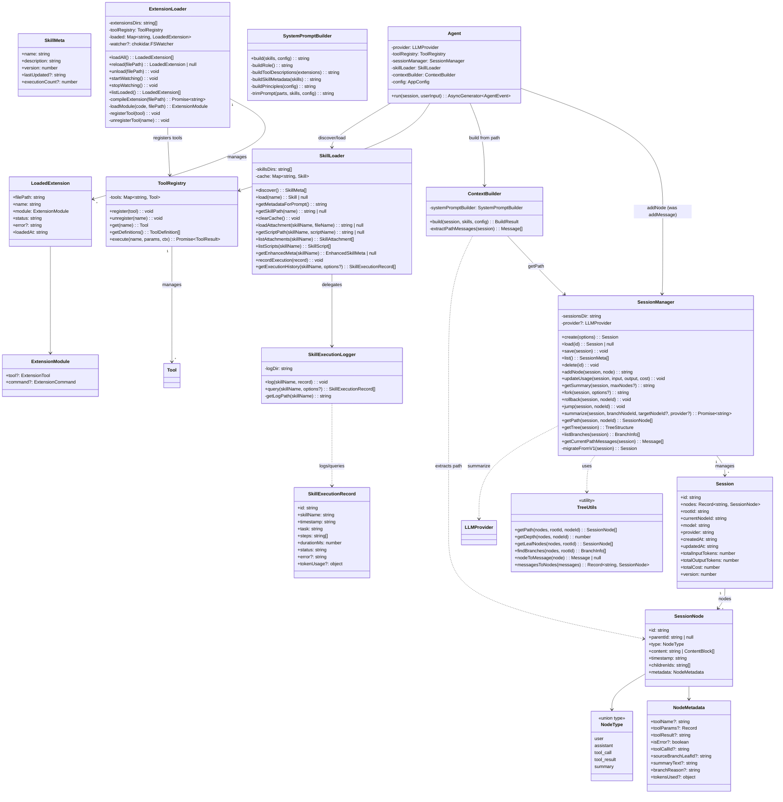
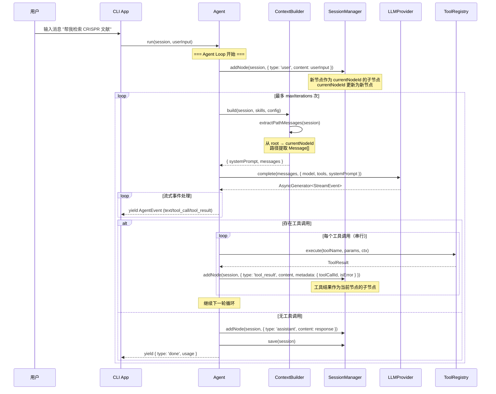
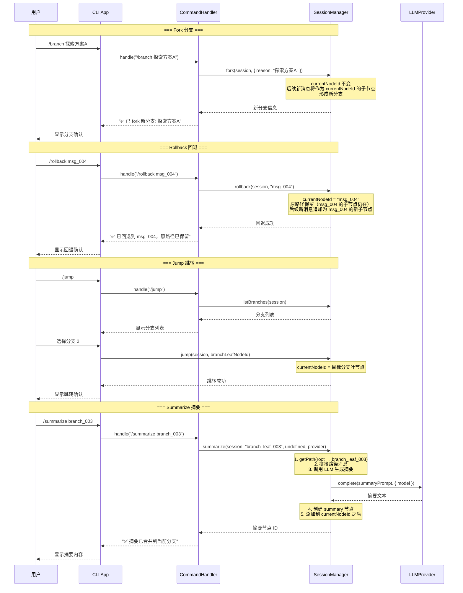
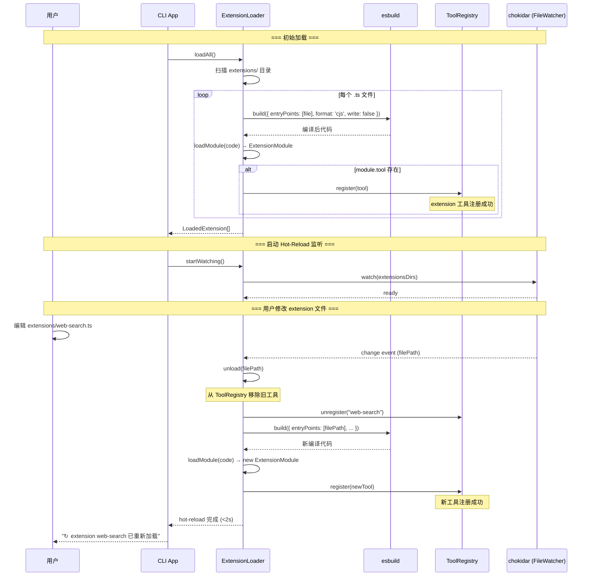
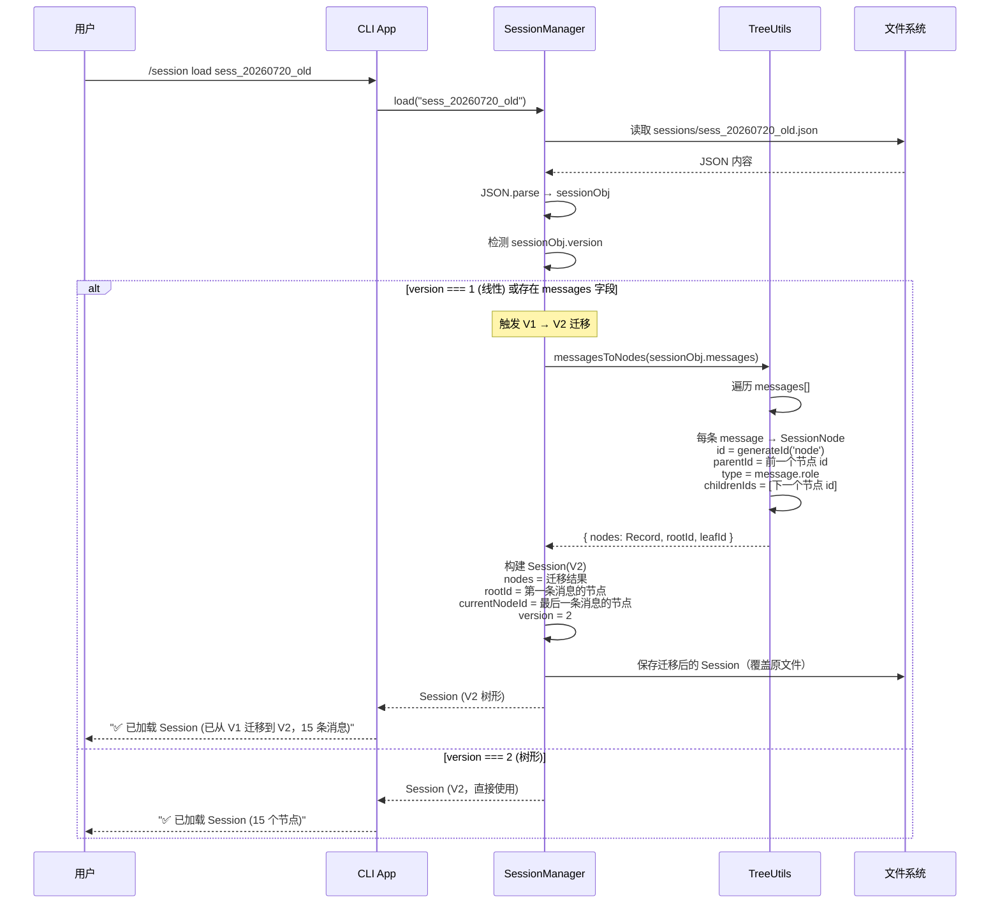
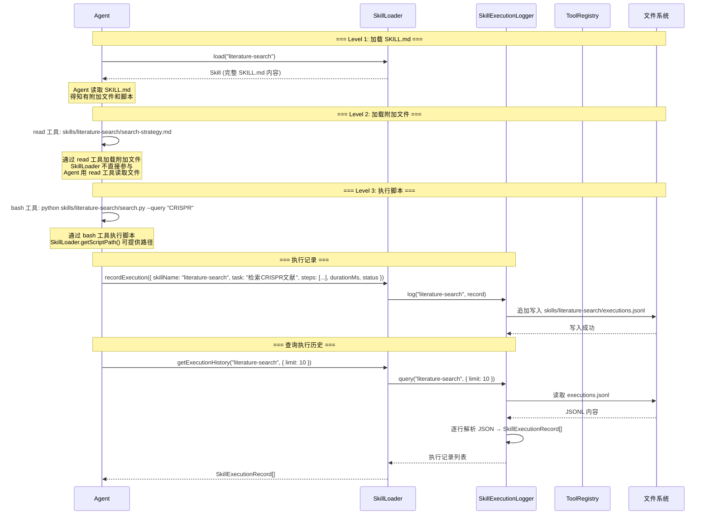
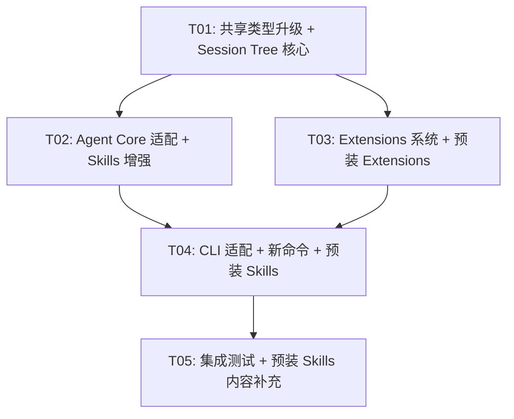

# Crab-Science Phase 2 架构设计文档

> **版本**：v2.0
> **日期**：2026-07-20
> **作者**：高见远（架构师）
> **状态**：待评审
> **Phase**：Phase 2 — Session Trees + Skills 增强 + Extensions 系统

---

## 目录

1. [架构决策记录（12 个待确认问题）](#1-架构决策记录)
2. [实现方案与框架选型](#2-实现方案与框架选型)
3. [文件列表及相对路径](#3-文件列表及相对路径)
4. [数据结构和接口](#4-数据结构和接口)
5. [类图](#5-类图)
6. [程序调用流程](#6-程序调用流程)
7. [任务列表](#7-任务列表)
8. [依赖包列表](#8-依赖包列表)
9. [共享知识（跨文件约定）](#9-共享知识跨文件约定)
10. [待明确事项](#10-待明确事项)

---

## 1. 架构决策记录

对 PRD 中 12 个待确认问题逐一给出决策和理由。

### ADR-P2-001: Session Tree 存储格式

**决策**：Phase 2 继续使用全量 JSON 序列化，但采用扁平节点 Map 结构。

**理由**：
1. 扁平 `Record<string, SessionNode>` 结构避免了深层嵌套的 JSON，序列化/反序列化性能好
2. 全量 JSON 实现简单，与 Phase 1 的 `save()` 方法保持一致
3. Phase 2 的 session 节点数量在百级别，全量序列化性能完全可接受（<1s）
4. 增量写入（JSONL + 索引）增加复杂度且 Phase 3 将迁移 SQLite，投入产出比低
5. 扁平结构天然支持 Phase 3 的 SQLite 迁移——每个 SessionNode 可直接映射为一张表的行

### ADR-P2-002: SessionNode children 嵌套 vs 扁平存储

**决策**：采用扁平存储。

```typescript
interface Session {
  id: string;
  nodes: Record<string, SessionNode>;  // 扁平 Map
  rootId: string;                      // 根节点 ID
  currentNodeId: string;               // 当前所在节点
  model: string;
  provider: string;
  // ... 其余字段不变
}

interface SessionNode {
  id: string;
  parentId: string | null;             // null 表示根节点
  type: NodeType;                      // user | assistant | tool_call | tool_result | summary
  content: string | ContentBlock[];
  timestamp: string;
  childrenIds: string[];               // 子节点 ID 列表
  metadata: NodeMetadata;              // 扩展元数据
}
```

**理由**：
1. 序列化简单——扁平 JSON，无深层嵌套
2. 查找 O(1)——直接 `nodes[id]` 访问，无需递归遍历
3. 避免深嵌套 JSON 的性能问题
4. `childrenIds` 数组保留了树形关系，便于遍历
5. 天然适配 SQLite 迁移

### ADR-P2-003: 分支摘要 LLM 调用

**决策**：确认 PM 建议。使用当前 session 模型生成摘要，独立计费并提示用户，默认自动生成。

**实现要点**：
- `SessionManager.summarize()` 内部调用 `LLMProvider.complete()` 生成摘要
- 摘要 prompt：将分支路径的所有消息拼接，请求 LLM 总结为 200-500 字
- 摘要调用的 token 用量单独累加到 `session.totalCost`
- CLI 层显示 `"正在生成分支摘要..."` 提示

### ADR-P2-004: Extensions 安全边界

**决策**：Phase 2 仅用户手动修改 extension 文件 + 系统 hot-reload。Agent 不主动修改 extension 文件。

**理由**：
1. Phase 2 聚焦 Session Tree + Skills 增强，Extensions 是 P1 优先级
2. Agent 自我修改 extensions 属于 Phase 3 进化机制范畴
3. 但不做硬性拦截——Agent 通过 write/edit 工具修改 extension 文件不被禁止（YOLO 模式一致性），hot-reload 会自动生效
4. 系统提示词中不引导 agent 修改 extensions

### ADR-P2-005: Extension TypeScript 编译方案

**决策**：使用 esbuild 动态编译 + 内存缓存。

**理由**：
1. esbuild 编译速度极快（毫秒级），适合 hot-reload 场景
2. API 简单——`esbuild.build()` 或 `esbuild.transform()` 一行调用
3. 编译结果缓存在内存中（`Map<string, CompiledExtension>`），避免重复编译
4. 文件变化时重新编译并热替换，旧工具自动卸载
5. 无需预编译步骤，用户体验好

**实现方案**：
```typescript
import * as esbuild from 'esbuild';

// 编译单个 extension 文件
async function compileExtension(filePath: string): Promise<string> {
  const result = await esbuild.build({
    entryPoints: [filePath],
    bundle: true,
    format: 'cjs',           // CommonJS 便于 require
    platform: 'node',
    write: false,            // 不写文件，返回内存
    external: [],            // 不排除任何依赖
  });
  return result.outputFiles[0].text;
}

// 加载编译后的代码
function loadCompiledCode(code: string): ExtensionModule {
  const module = { exports: {} };
  const fn = new Function('module', 'exports', 'require', code);
  fn(module, module.exports, require);
  return module.exports as ExtensionModule;
}
```

### ADR-P2-006: Extensions 优先级

**决策**：Extensions 降为 P1，Session Tree + Skills 优先。

**理由**：确认 PM 建议。Session Tree 是核心破坏性变更，必须优先完成。Extensions 作为增量能力，可独立开发和加载。

### ADR-P2-007: Skill 执行记录存储

**决策**：Phase 2 使用 JSONL，Phase 3 迁移 SQLite。

**JSONL 格式设计**（预留 SQLite 迁移字段）：
```jsonl
{"id":"exec_20260720_a1b2c3","skillName":"literature-search","timestamp":"2026-07-20T10:30:00Z","task":"检索CRISPR脱靶文献","steps":["加载SKILL.md","调用search.py","去重"],"durationMs":15200,"status":"success","tokenUsage":{"inputTokens":1200,"outputTokens":800}}
```

**理由**：
1. JSONL 追加写入性能好，无需读取整个文件
2. 每行一个 JSON 对象，便于后续逐行解析
3. 字段设计预留 `id`、`timestamp` 等 SQLite 主键/索引字段

### ADR-P2-008: 回退时自动 fork

**决策**：方案 (b)——回退时自动 fork 新分支，保留原路径。

**实现逻辑**：
1. 用户执行 `/rollback nodeId`
2. `SessionManager.rollback(session, nodeId)` 将 `currentNodeId` 设为目标节点
3. 后续新消息追加为目标节点的子节点（自动形成新分支）
4. 原路径的节点保留在 `nodes` Map 中，可通过 `/jump` 访问
5. CLI 提示 `"原路径已保留为分支，可用 /jump 切换回去"`

### ADR-P2-009: Skill 附加文件展示

**决策**：只在 SKILL.md 中引用附加文件，不进系统提示。

**理由**：
1. 系统提示 token 预算有限（<2000 token），附加文件名列表会膨胀
2. Agent 读取 SKILL.md 后自然知道有哪些附加文件可用
3. SKILL.md 中用相对路径引用：`详见 search-strategy.md`、`脚本：python search.py`
4. Agent 通过 `read` 工具加载附加文件（Level 2），通过 `bash` 工具执行脚本（Level 3）

### ADR-P2-010: Tree 最大深度限制

**决策**：不限制深度，`/tree` 命令对 >10 分支做折叠显示。

**实现要点**：
- `/tree` 输出时，如果一个节点有超过 2 个子分支，只显示前 2 个 + `... 还有 N 个分支（/jump 查看）`
- 当前路径全程展开
- 性能问题在出现后再优化

### ADR-P2-011: Extension 网络依赖

**决策**：Extension 内部处理网络错误，代理走环境变量。

**实现要点**：
- Extension 的 `execute()` 方法内部 try-catch 网络请求
- 网络错误返回 `ToolResult { success: false, error: '网络请求失败: ...' }`
- 代理配置通过 `HTTP_PROXY` / `HTTPS_PROXY` 环境变量，Node.js 的 `fetch` / `http` 模块自动读取
- Extension 内部使用 `process.env.HTTPS_PROXY` 配置代理

### ADR-P2-012: Agent 自主 fork

**决策**：Phase 2 仅用户手动 fork，Agent 可建议。

**实现要点**：
- 系统提示词中加入：`"探索不同方案时，可建议用户使用 /branch 命令 fork 分支"`
- Agent 不调用 `SessionManager.fork()`，只在响应文本中建议
- Phase 3 进化机制中再考虑 agent 自主 fork

---

## 2. 实现方案与框架选型

### 2.1 技术栈延续

Phase 2 在 Phase 1 技术栈基础上增量扩展，不引入新的核心框架：

| 维度 | 选型 | 变更说明 |
|------|------|---------|
| 语言 | TypeScript 5.x | 不变 |
| 运行时 | Node.js 20 LTS | 不变 |
| Monorepo | Turborepo + pnpm | 不变 |
| CLI 框架 | Ink 4.x | 不变 |
| LLM SDK | openai + @anthropic-ai/sdk | 不变 |
| YAML 解析 | gray-matter | 不变 |
| 文件 Glob | fast-glob | 不变 |
| **Extension 编译** | **esbuild** | **新增** — 动态编译 TypeScript extension |
| **文件监听** | **chokidar** | **新增** — 跨平台文件系统监听（hot-reload） |

### 2.2 核心技术挑战与解决方案

#### 挑战 1：Session 从线性到树形的破坏性变更

Phase 1 的 `Session.messages: Message[]` 被 Phase 2 的树形结构替代。这影响到：
- `SessionManager.addMessage()` — 从 `push` 改为 `addChildNode`
- `Agent.run()` — 从遍历 `session.messages` 改为遍历 `root → currentNodeId` 路径
- `ContextBuilder.build()` — 从直接返回 `session.messages` 改为路径提取
- `SessionManager.getSummary()` — 从 `slice(-N)` 改为路径末尾 N 个节点
- CLI `useAgent` hook — 消息显示从线性列表改为路径渲染

**解决方案**：
1. **向后兼容**：`SessionManager.load()` 检测旧格式（有 `messages` 字段），自动转换为树形（线性链 → root → ... → leaf）
2. **路径提取**：新增 `SessionManager.getPath(session, nodeId)` 方法，从 root 到指定节点的路径
3. **节点追加**：`SessionManager.addNode(session, node)` 方法，将新节点作为 `currentNodeId` 的子节点追加，然后更新 `currentNodeId`

#### 挑战 2：ContextBuilder 适配树形路径

Phase 1 的 `ContextBuilder.build()` 直接返回 `session.messages`。Phase 2 需要从树中提取 `root → currentNodeId` 路径上的所有消息。

**解决方案**：
```typescript
build(session: Session, skills: SkillMeta[], config: AppConfig): BuildResult {
  const systemPrompt = this.systemPromptBuilder.build(skills, config);
  const messages = this.extractPathMessages(session);
  return { systemPrompt, messages };
}

private extractPathMessages(session: Session): Message[] {
  const path = this.getPathNodes(session, session.currentNodeId);
  return path.map(node => this.nodeToMessage(node)).filter(Boolean) as Message[];
}
```

#### 挑战 3：Extension 动态编译与 Hot-Reload

Extension 是 TypeScript 文件，需要运行时编译为 JS 执行，且文件修改后需自动重新加载。

**解决方案**：
1. **编译**：使用 esbuild 将 `.ts` 文件编译为 CJS 字符串
2. **加载**：使用 `new Function()` 或 `vm.runInNewContext()` 执行编译后的代码，获取 `exports`
3. **注册**：Extension 导出的 `tool` 对象注册到 `ToolRegistry`
4. **监听**：使用 chokidar 监听 extensions 目录，文件变化时重新编译 + 卸载旧工具 + 注册新工具
5. **缓存**：编译结果缓存在内存 `Map<string, { code: string; module: ExtensionModule }>` 中

#### 挑战 4：Skill Level 2/3 加载与执行记录

Phase 2 需要支持 Skill 的附加文件加载（Level 2）和脚本调用（Level 3），并记录执行日志。

**解决方案**：
1. `SkillLoader.loadAttachment(skillName, fileName)` — 读取 skill 目录下的附加文件
2. `SkillLoader.getScriptPath(skillName, scriptName)` — 返回脚本路径，Agent 通过 bash 工具执行
3. `SkillLoader.listAttachments(skillName)` — 列出 skill 目录下的所有附加文件
4. `SkillLoader.listScripts(skillName)` — 列出 skill 目录下的所有脚本
5. `SkillExecutionLogger.log(record)` — 追加写入 `executions.jsonl`
6. `SkillExecutionLogger.query(skillName, options)` — 读取并筛选执行记录

#### 挑战 5：分支摘要的 LLM 调用

`SessionManager.summarize()` 需要调用 LLM 生成摘要，但 SessionManager 当前不持有 LLMProvider 引用。

**解决方案**：
- `SessionManager.summarize()` 接收一个 `LLMProvider` 参数（由 Agent 或 CLI 层注入）
- 或者在 SessionManager 构造函数中注入 `LLMProvider`（更符合 DI 模式）
- 选择后者：构造函数注入 `LLMProvider`，使 SessionManager 具备摘要能力

### 2.3 架构模式延续

Phase 2 延续 Phase 1 的分层架构 + 依赖注入，新增 extensions 模块：

```
┌──────────────────────────────────────────────────┐
│              apps/cli (表现层)                     │
│  Ink React 组件 + 用户交互 + 新增 Tree 命令        │
├──────────────────────────────────────────────────┤
│          packages/agent-core (业务层)              │
│  Agent Loop + Tools + Session(Tree) + Skills(L4)  │
│  + Extensions(hot-reload)                         │
├───────────────┬──────────────────────────────────┤
│ packages/     │ packages/                         │
│ llm-layer     │ shared                            │
│ (基础设施层)   │ (共享层)                           │
│ Provider      │ Types(升级) + Utils + Constants   │
│ 抽象 + 实现    │                                    │
└───────────────┴──────────────────────────────────┘
```

**依赖方向**：`cli → agent-core → llm-layer → shared`，`agent-core → shared`。禁止反向依赖。

---

## 3. 文件列表及相对路径

### 3.1 修改的文件（Phase 1 已有）

| # | 文件路径 | 修改说明 |
|---|---------|---------|
| 1 | `packages/shared/src/types.ts` | 新增 SessionNode、NodeType、NodeMetadata、SkillExecutionRecord、ExtensionModule 等类型；升级 Session、SkillMeta 类型 |
| 2 | `packages/shared/src/constants.ts` | 新增 EXTENSIONS_DIR、GLOBAL_EXTENSIONS_DIR、MAX_TREE_DISPLAY_BRANCHES 等常量 |
| 3 | `packages/shared/src/utils.ts` | 新增 `getPathFromRoot()` 路径提取辅助函数 |
| 4 | `packages/agent-core/src/session/manager.ts` | 核心重构：addMessage→addNode、新增 fork/rollback/jump/summarize/getPath/getTree/migrateFromV1 |
| 5 | `packages/agent-core/src/session/types.ts` | 新增 SessionNode 相关类型、ForkOptions 等 |
| 6 | `packages/agent-core/src/agent.ts` | 适配树形 Session：从 currentNodeId 路径构建 context、addNode 替代 addMessage |
| 7 | `packages/agent-core/src/context-builder.ts` | 核心修改：extractPathMessages 从树形路径提取消息 |
| 8 | `packages/agent-core/src/system-prompt.ts` | 适配：skills 元数据增加附加文件/脚本提示、extensions 工具说明 |
| 9 | `packages/agent-core/src/skills/loader.ts` | 新增 loadAttachment/getScriptPath/listAttachments/listScripts/recordExecution/getExecutionHistory |
| 10 | `packages/agent-core/src/skills/types.ts` | 新增 SkillExecutionRecord、SkillFrontmatter 扩展字段 |
| 11 | `packages/agent-core/src/index.ts` | 新增导出：ExtensionLoader、SkillExecutionLogger、新类型 |
| 12 | `packages/agent-core/package.json` | 新增依赖：esbuild、chokidar |
| 13 | `apps/cli/src/app.tsx` | 适配树形 session 的消息渲染 |
| 14 | `apps/cli/src/commands/handler.ts` | 新增 /tree、/branch、/rollback、/jump、/summarize、/extensions、/skill-history 命令 |
| 15 | `apps/cli/src/hooks/use-agent.ts` | 适配树形 session：fork/rollback/jump/summarize 操作、extension 初始化 |
| 16 | `apps/cli/src/components/message-list.tsx` | 适配：从路径消息渲染、分支标记显示 |
| 17 | `skills/literature-search/SKILL.md` | 增强：引用附加文件和脚本 |
| 18 | `skills/data-analysis/SKILL.md` | 增强：引用附加文件和脚本 |
| 19 | `skills/paper-writing/SKILL.md` | 增强：引用附加文件和脚本 |

### 3.2 新建的文件

| # | 文件路径 | 说明 |
|---|---------|------|
| 20 | `packages/agent-core/src/extensions/loader.ts` | ExtensionLoader：发现、编译、加载、hot-reload |
| 21 | `packages/agent-core/src/extensions/types.ts` | Extension 类型定义 |
| 22 | `packages/agent-core/src/extensions/index.ts` | Extensions 模块导出 |
| 23 | `packages/agent-core/src/skills/execution-logger.ts` | SkillExecutionLogger：JSONL 写入和查询 |
| 24 | `packages/agent-core/src/session/tree-utils.ts` | Session Tree 工具函数：路径提取、树遍历、迁移 |
| 25 | `apps/cli/src/components/tree-view.tsx` | /tree 命令的树形可视化组件 |
| 26 | `skills/literature-search/search-strategy.md` | 附加参考：多数据库检索策略 |
| 27 | `skills/literature-search/api-reference.md` | 附加参考：各 API 文档 |
| 28 | `skills/literature-search/search.py` | 可执行脚本：统一检索脚本 |
| 29 | `skills/literature-search/dedup.py` | 可执行脚本：文献去重脚本 |
| 30 | `skills/data-analysis/stat-methods.md` | 附加参考：统计方法选择指南 |
| 31 | `skills/data-analysis/visualize.py` | 可执行脚本：可视化脚本 |
| 32 | `skills/paper-writing/imrad-template.md` | 附加参考：IMRaD 结构模板 |
| 33 | `skills/experiment-design/SKILL.md` | 新预装 Skill：实验设计 |
| 34 | `skills/experiment-design/design-templates.md` | 附加参考：实验设计模板 |
| 35 | `skills/experiment-design/sample-size.py` | 可执行脚本：样本量计算 |
| 36 | `skills/citation-management/SKILL.md` | 新预装 Skill：引用管理 |
| 37 | `skills/citation-management/format-citation.py` | 可执行脚本：引用格式化 |
| 38 | `skills/research-workflow/SKILL.md` | 新预装 Skill：科研工作流 |
| 39 | `skills/research-workflow/workflow-templates.md` | 附加参考：工作流模板 |
| 40 | `extensions/web-search.ts` | 预装 Extension：网络搜索 |
| 41 | `extensions/arxiv-search.ts` | 预装 Extension：arXiv 搜索 |
| 42 | `docs/phase2-class-diagram.mermaid` | Phase 2 类图 |
| 43 | `docs/phase2-sequence-diagram.mermaid` | Phase 2 时序图 |

### 3.3 文件变更汇总

- **修改文件**：19 个
- **新建文件**：24 个
- **总计**：43 个文件涉及变更

---

## 4. 数据结构和接口

### 4.1 新增/修改的类型定义

> 以下类型定义位于 `packages/shared/src/types.ts`，除非特别标注。

#### 4.1.1 Session Tree 类型（新增）

```typescript
// ============ Session Tree 类型（Phase 2 新增） ============

/** Session 节点类型 */
type NodeType = 'user' | 'assistant' | 'tool_call' | 'tool_result' | 'summary';

/** 节点元数据 */
interface NodeMetadata {
  /** type=tool_call 时的工具名 */
  toolName?: string;
  /** type=tool_call 时的工具参数 */
  toolParams?: Record<string, unknown>;
  /** type=tool_result 时的工具输出 */
  toolResult?: string;
  /** type=tool_result 时是否为错误 */
  isError?: boolean;
  /** type=tool_call/tool_result 时的工具调用 ID */
  toolCallId?: string;
  /** type=summary 时的原分支引用（源分支叶节点 ID） */
  sourceBranchLeafId?: string;
  /** type=summary 时的摘要内容 */
  summaryText?: string;
  /** fork 时的分支原因 */
  branchReason?: string;
  /** 该节点的 token 使用量 */
  tokensUsed?: { inputTokens: number; outputTokens: number };
}

/** Session 树节点 */
interface SessionNode {
  /** 节点唯一 ID */
  id: string;
  /** 父节点 ID（null 表示根节点） */
  parentId: string | null;
  /** 节点类型 */
  type: NodeType;
  /** 节点内容（文本或 ContentBlock 数组） */
  content: string | ContentBlock[];
  /** 创建时间戳（ISO 8601） */
  timestamp: string;
  /** 子节点 ID 列表 */
  childrenIds: string[];
  /** 节点元数据 */
  metadata: NodeMetadata;
}
```

#### 4.1.2 Session 类型升级

```typescript
/** Session（树形，Phase 2） */
interface Session {
  id: string;
  /** 扁平节点 Map */
  nodes: Record<string, SessionNode>;
  /** 根节点 ID */
  rootId: string;
  /** 当前所在节点 ID */
  currentNodeId: string;
  /** 模型 */
  model: string;
  /** Provider */
  provider: string;
  /** 创建时间 */
  createdAt: string;
  /** 更新时间 */
  updatedAt: string;
  /** 累计输入 token */
  totalInputTokens: number;
  /** 累计输出 token */
  totalOutputTokens: number;
  /** 累计成本 */
  totalCost: number;
  /** Session 版本（1=线性, 2=树形） */
  version: number;
}
```

#### 4.1.3 Skill 类型增强

```typescript
/** Skill 元数据（Phase 2 增强） */
interface SkillMeta {
  name: string;
  description: string;
  version: number;
  /** 最后更新时间（Phase 2 新增） */
  lastUpdated?: string;
  /** 执行次数（Phase 2 新增） */
  executionCount?: number;
}

/** Skill 附加文件信息 */
interface SkillAttachment {
  /** 文件名 */
  name: string;
  /** 相对于 skill 目录的路径 */
  path: string;
  /** 文件大小（字节） */
  size: number;
}

/** Skill 脚本信息 */
interface SkillScript {
  /** 脚本名（不含扩展名） */
  name: string;
  /** 完整路径 */
  path: string;
  /** 脚本语言（python/shell） */
  language: 'python' | 'shell';
}

/** Skill 执行记录 */
interface SkillExecutionRecord {
  /** 记录 ID */
  id: string;
  /** Skill 名称 */
  skillName: string;
  /** 执行时间（ISO 8601） */
  timestamp: string;
  /** 任务描述 */
  task: string;
  /** 执行步骤 */
  steps: string[];
  /** 执行耗时（毫秒） */
  durationMs: number;
  /** 执行状态 */
  status: 'success' | 'failed' | 'partial';
  /** 错误信息（status != success 时） */
  error?: string;
  /** Token 使用量 */
  tokenUsage?: {
    inputTokens: number;
    outputTokens: number;
  };
}
```

#### 4.1.4 Extension 类型

```typescript
/** Extension 模块导出格式 */
interface ExtensionModule {
  /** 导出的工具（可选） */
  tool?: ExtensionTool;
  /** 导出的命令（可选，Phase 2 预留） */
  command?: ExtensionCommand;
}

/** Extension 工具（扩展 Tool 接口） */
interface ExtensionTool {
  name: string;
  description: string;
  parameters: ToolParameterSchema;
  execute: (params: Record<string, unknown>, ctx: ToolContext) => Promise<ToolResult>;
}

/** Extension 命令（Phase 2 预留，暂不实现） */
interface ExtensionCommand {
  name: string;
  description: string;
  handler: (args: string[]) => string;
}

/** 已加载的 Extension 信息 */
interface LoadedExtension {
  /** Extension 文件路径 */
  filePath: string;
  /** Extension 名称（文件名去扩展名） */
  name: string;
  /** 编译后的模块 */
  module: ExtensionModule;
  /** 加载状态 */
  status: 'loaded' | 'error';
  /** 错误信息 */
  error?: string;
  /** 加载时间 */
  loadedAt: string;
}
```

#### 4.1.5 SessionManager 新增方法签名

```typescript
/** Fork 选项 */
interface ForkOptions {
  /** 从指定节点 fork（默认 currentNodeId） */
  fromNodeId?: string;
  /** 分支原因 */
  reason?: string;
}

/** Session 摘要信息（列表展示用，Phase 2 升级） */
interface SessionMeta {
  id: string;
  createdAt: string;
  updatedAt: string;
  model: string;
  provider: string;
  /** 节点总数（替代 Phase 1 的 messageCount） */
  nodeCount: number;
  /** 版本号 */
  version: number;
}
```

### 4.2 SessionManager API 升级（完整接口）

```typescript
class SessionManager {
  // === Phase 1 保留方法（适配树形） ===

  /** 创建新 Session（树形） */
  create(options: CreateSessionOptions): Session;

  /** 加载 Session（自动检测版本，V1 自动迁移） */
  load(id: string): Session | null;

  /** 保存 Session（全量 JSON 序列化） */
  save(session: Session): void;

  /** 列出所有历史 Session */
  list(): SessionMeta[];

  /** 删除 Session */
  delete(id: string): void;

  // === Phase 1 方法升级 ===

  /**
   * 添加节点到当前节点（替代 Phase 1 的 addMessage）
   * 新节点作为 currentNodeId 的子节点，currentNodeId 更新为新节点
   */
  addNode(session: Session, node: Omit<SessionNode, 'id' | 'parentId' | 'timestamp' | 'childrenIds'>): string;

  /** 更新 Session token 统计 */
  updateUsage(session: Session, inputTokens: number, outputTokens: number, cost: number): void;

  /** 获取 Session 摘要（从当前路径末尾取 N 个节点） */
  getSummary(session: Session, maxNodes?: number): string;

  // === Phase 2 新增方法 ===

  /**
   * Fork 分支
   * 从指定节点（默认 currentNodeId）创建新分支
   * 新分支的第一个子节点将成为新的 currentNodeId
   * @returns 新分支的根节点 ID
   */
  fork(session: Session, options?: ForkOptions): string;

  /**
   * 回退到指定节点
   * 将 currentNodeId 设为目标节点，后续消息从该节点继续追加
   * 原路径保留，可通过 jump 恢复
   */
  rollback(session: Session, nodeId: string): void;

  /**
   * 跳转到指定分支
   * 将 currentNodeId 设为目标节点（通常是某分支的叶节点）
   */
  jump(session: Session, nodeId: string): void;

  /**
   * 生成分支摘要
   * 用 LLM 总结从 root 到指定节点的路径内容
   * 将摘要节点添加到目标分支的当前节点之后
   * @returns 摘要节点 ID
   */
  summarize(
    session: Session,
    branchNodeId: string,
    targetNodeId?: string,
    provider?: LLMProvider,
  ): Promise<string>;

  /**
   * 获取从 root 到指定节点的路径
   * @returns 路径上的节点数组（从 root 到目标节点）
   */
  getPath(session: Session, nodeId: string): SessionNode[];

  /**
   * 获取整个树结构（用于 /tree 命令可视化）
   * @returns 树的根节点及所有分支
   */
  getTree(session: Session): { root: SessionNode; branches: SessionNode[][] };

  /**
   * 列出所有分支（叶节点）
   * @returns 分支叶节点列表，每个包含叶节点和从 root 到该叶节点的路径长度
   */
  listBranches(session: Session): { leafNode: SessionNode; pathLength: number; branchReason?: string }[];

  /**
   * Phase 1 线性 Session 迁移到树形
   * 将 messages[] 转换为 root → 线性链 → leaf
   * @internal
   */
  migrateFromV1(session: Session & { messages: Message[] }): Session;

  /**
   * 获取当前路径上的消息数组（供 ContextBuilder 使用）
   * @returns 从 root 到 currentNodeId 的 Message[]
   */
  getCurrentPathMessages(session: Session): Message[];
}
```

### 4.3 SkillLoader API 升级（完整接口）

```typescript
class SkillLoader {
  // === Phase 1 保留方法 ===

  /** 发现所有 Skills（Level 0） */
  discover(): SkillMeta[];

  /** 加载完整 Skill（Level 1） */
  load(name: string): Skill | null;

  /** 获取格式化的 skill 元数据字符串 */
  getMetadataForPrompt(): string;

  /** 获取 skill 文件路径 */
  getSkillPath(name: string): string | null;

  /** 清除缓存 */
  clearCache(): void;

  // === Phase 2 新增方法 ===

  /**
   * 加载 Skill 附加文件（Level 2）
   * @param skillName - skill 名称
   * @param fileName - 附加文件名（如 'search-strategy.md'）
   * @returns 文件内容，未找到返回 null
   */
  loadAttachment(skillName: string, fileName: string): string | null;

  /**
   * 获取 Skill 脚本路径（Level 3）
   * @param skillName - skill 名称
   * @param scriptName - 脚本名（如 'search.py'）
   * @returns 脚本完整路径，未找到返回 null
   */
  getScriptPath(skillName: string, scriptName: string): string | null;

  /**
   * 列出 Skill 的所有附加文件
   * @returns 附加文件信息列表
   */
  listAttachments(skillName: string): SkillAttachment[];

  /**
   * 列出 Skill 的所有可执行脚本
   * @returns 脚本信息列表
   */
  listScripts(skillName: string): SkillScript[];

  /**
   * 获取 Skill 的增强元数据（含附加文件和脚本列表）
   * 用于系统提示词中展示 skill 的完整能力
   */
  getEnhancedMeta(skillName: string): SkillMeta & {
    attachments: SkillAttachment[];
    scripts: SkillScript[];
  } | null;

  /**
   * 记录 Skill 执行
   * @param record - 执行记录
   */
  recordExecution(record: Omit<SkillExecutionRecord, 'id' | 'timestamp'>): void;

  /**
   * 查询 Skill 执行历史
   * @param skillName - skill 名称
   * @param options - 查询选项（limit、状态筛选）
   * @returns 执行记录列表（按时间倒序）
   */
  getExecutionHistory(
    skillName: string,
    options?: { limit?: number; status?: SkillExecutionRecord['status'] },
  ): SkillExecutionRecord[];
}
```

### 4.4 ExtensionLoader 接口（新增）

```typescript
class ExtensionLoader {
  /**
   * @param extensionsDirs - extension 搜索目录
   * @param toolRegistry - 工具注册表（extension 注册的工具加入此处）
   */
  constructor(extensionsDirs: string[], toolRegistry: ToolRegistry);

  /**
   * 发现并加载所有 extension
   * 扫描目录下的 .ts 文件，编译并注册
   * @returns 已加载的 extension 列表
   */
  loadAll(): LoadedExtension[];

  /**
   * 重新加载指定 extension（hot-reload）
   * 卸载旧工具，重新编译加载
   */
  reload(filePath: string): LoadedExtension | null;

  /**
   * 卸载指定 extension
   * 从 ToolRegistry 中移除对应的工具
   */
  unload(filePath: string): void;

  /**
   * 启动文件监听（hot-reload）
   * 使用 chokidar 监听 extension 目录变化
   */
  startWatching(): void;

  /**
   * 停止文件监听
   */
  stopWatching(): void;

  /**
   * 列出所有已加载的 extension
   */
  listLoaded(): LoadedExtension[];

  /**
   * 编译单个 extension 文件
   * @internal
   */
  private compileExtension(filePath: string): Promise<string>;

  /**
   * 加载编译后的代码并获取模块导出
   * @internal
   */
  private loadModule(code: string, filePath: string): ExtensionModule;
}
```

---

## 5. 类图

> 完整类图见 `docs/phase2-class-diagram.mermaid`



---

## 6. 程序调用流程

> 完整时序图见 `docs/phase2-sequence-diagram.mermaid`

### 6.1 Agent Loop 在树形 Session 上的工作流



### 6.2 Fork / Rollback / Jump / Summarize 流程



### 6.3 Extension Hot-Reload 流程



### 6.4 Phase 1 Session 向后兼容迁移流程



### 6.5 Skill Level 2/3 加载与执行记录流程



---

## 7. 任务列表

### 任务依赖关系图



---

### T01: 共享类型升级 + Session Tree 核心

| 维度 | 内容 |
|------|------|
| **任务 ID** | T01 |
| **描述** | 升级 shared 包的类型定义（SessionNode、Session V2、SkillExecutionRecord、Extension 类型）；重构 SessionManager 为树形结构，实现 fork/rollback/jump/summarize/getPath/getTree 和 V1→V2 迁移；新增 TreeUtils 工具函数 |
| **依赖** | 无（基于 Phase 1 已有代码） |
| **优先级** | P0 |
| **涉及文件** | `packages/shared/src/types.ts`, `packages/shared/src/constants.ts`, `packages/shared/src/utils.ts`, `packages/agent-core/src/session/manager.ts`, `packages/agent-core/src/session/types.ts`, `packages/agent-core/src/session/tree-utils.ts` |

**实现要点**：

1. **shared/src/types.ts 升级**：
   - 新增 `NodeType`、`NodeMetadata`、`SessionNode` 类型
   - 升级 `Session` 接口：`messages` → `nodes` + `rootId` + `currentNodeId` + `version`
   - 升级 `SkillMeta`：新增 `lastUpdated`、`executionCount`
   - 新增 `SkillAttachment`、`SkillScript`、`SkillExecutionRecord` 类型
   - 新增 `ExtensionModule`、`ExtensionTool`、`ExtensionCommand`、`LoadedExtension` 类型
   - 新增 `ForkOptions` 接口
   - 升级 `SessionMeta`：`messageCount` → `nodeCount` + `version`

2. **shared/src/constants.ts 升级**：
   - 新增 `GLOBAL_EXTENSIONS_DIR = '~/.crab-science/extensions'`
   - 新增 `PROJECT_EXTENSIONS_DIR = 'extensions'`
   - 新增 `MAX_TREE_DISPLAY_BRANCHES = 2`（/tree 命令折叠阈值）
   - 新增 `SKILL_ATTACHMENTS_GLOB = '*.md'`（附加文件匹配）
   - 新增 `SKILL_SCRIPTS_GLOB = '*.{py,sh}'`（脚本匹配）

3. **shared/src/utils.ts 升级**：
   - 新增 `getPathFromRoot(nodes, rootId, targetId): SessionNode[]` — 从扁平 Map 提取路径

4. **session/tree-utils.ts（新建）**：
   - `getPath(nodes, rootId, nodeId): SessionNode[]` — 从 root 到 nodeId 的路径
   - `getDepth(nodes, nodeId): number` — 节点深度
   - `getLeafNodes(nodes, rootId): SessionNode[]` — 所有叶节点
   - `findBranches(nodes, rootId): BranchInfo[]` — 找出所有分支
   - `nodeToMessage(node): Message | null` — SessionNode 转 Message
   - `messagesToNodes(messages): { nodes, rootId, leafId }` — Phase 1 线性消息转树形

5. **session/manager.ts 核心重构**：
   - `create()` — 创建树形 Session（root 节点为空 placeholder 或第一个用户消息）
   - `load()` — 检测 version，V1 自动调用 `migrateFromV1()`
   - `save()` — 全量 JSON 序列化（结构变了但方法签名不变）
   - `addNode()` — 替代 `addMessage()`，新节点作为 currentNodeId 子节点
   - `fork()` — 不改变 currentNodeId，后续 addNode 自然形成新分支
   - `rollback()` — 设置 currentNodeId 为目标节点
   - `jump()` — 设置 currentNodeId 为目标分支叶节点
   - `summarize()` — 调用 LLM 生成摘要，创建 summary 节点
   - `getPath()` — 委托 TreeUtils
   - `getTree()` — 返回树结构供可视化
   - `listBranches()` — 列出所有分支叶节点
   - `getCurrentPathMessages()` — 从当前路径提取 Message[]
   - `migrateFromV1()` — 调用 TreeUtils.messagesToNodes
   - 构造函数新增可选 `LLMProvider` 参数（用于 summarize）

6. **session/types.ts 升级**：
   - 新增 `ForkOptions`、`BranchInfo`、`TreeStructure` 类型
   - 保留 `CreateSessionOptions`

---

### T02: Agent Core 适配 + Skills 增强

| 维度 | 内容 |
|------|------|
| **任务 ID** | T02 |
| **描述** | 适配 Agent Loop 和 ContextBuilder 为树形 Session；升级 SkillLoader 支持 Level 2/3 加载和执行记录；新增 SkillExecutionLogger |
| **依赖** | T01 |
| **优先级** | P0 |
| **涉及文件** | `packages/agent-core/src/agent.ts`, `packages/agent-core/src/context-builder.ts`, `packages/agent-core/src/system-prompt.ts`, `packages/agent-core/src/skills/loader.ts`, `packages/agent-core/src/skills/types.ts`, `packages/agent-core/src/skills/execution-logger.ts`, `packages/agent-core/src/index.ts` |

**实现要点**：

1. **agent.ts 适配**：
   - `run()` 方法中 `addMessage` → `addNode`
   - 用户消息：`addNode(session, { type: 'user', content: userInput })`
   - Assistant 消息：`addNode(session, { type: 'assistant', content: assistantBlocks })`
   - 工具调用：`addNode(session, { type: 'tool_call', content: '', metadata: { toolName, toolParams, toolCallId } })`
   - 工具结果：`addNode(session, { type: 'tool_result', content: result.output, metadata: { toolCallId, isError } })`
   - context 构建调用不变（ContextBuilder 内部适配）

2. **context-builder.ts 核心修改**：
   - `build()` 方法不再直接返回 `session.messages`
   - 新增 `extractPathMessages(session)` 私有方法：
     ```typescript
     private extractPathMessages(session: Session): Message[] {
       const path = TreeUtils.getPath(session.nodes, session.rootId, session.currentNodeId);
       return path.map(node => TreeUtils.nodeToMessage(node)).filter(Boolean) as Message[];
     }
     ```
   - `build()` 返回 `{ systemPrompt, messages: this.extractPathMessages(session) }`

3. **system-prompt.ts 适配**：
   - `buildToolDescriptions()` 增加动态工具列表（包含 extension 注册的工具）
   - `buildSkillMetadata()` 可选展示附加文件/脚本提示（简短）
   - 工作原则新增：`"探索不同方案时可建议用户使用 /branch 命令 fork 分支"`

4. **skills/loader.ts 升级**：
   - `loadAttachment(skillName, fileName)` — 读取 skill 目录下的附加文件
   - `getScriptPath(skillName, scriptName)` — 返回脚本完整路径
   - `listAttachments(skillName)` — 扫描 skill 目录下 `*.md`（排除 SKILL.md）
   - `listScripts(skillName)` — 扫描 skill 目录下 `*.py` 和 `*.sh`
   - `getEnhancedMeta(skillName)` — 返回含附加文件和脚本的增强元数据
   - `recordExecution(record)` — 委托 SkillExecutionLogger
   - `getExecutionHistory(skillName, options)` — 委托 SkillExecutionLogger
   - `discover()` 升级 — 解析 frontmatter 中的 `lastUpdated`，读取 executions.jsonl 获取 `executionCount`

5. **skills/execution-logger.ts（新建）**：
   - `log(skillName, record)` — 追加写入 `skills/{skillName}/executions.jsonl`
   - `query(skillName, options)` — 读取 JSONL，逐行解析，按 options 筛选
   - `getLogPath(skillName)` — 返回 executions.jsonl 路径
   - 自动创建不存在的 JSONL 文件

6. **skills/types.ts 升级**：
   - `SkillFrontmatter` 新增 `lastUpdated?: string`
   - 重新导出新增类型

7. **index.ts 升级**：
   - 新增导出：`SkillExecutionLogger`、`TreeUtils`、Extension 相关类型

---

### T03: Extensions 系统 + 预装 Extensions

| 维度 | 内容 |
|------|------|
| **任务 ID** | T03 |
| **描述** | 实现 ExtensionLoader（esbuild 编译 + chokidar hot-reload + ToolRegistry 注册）；创建预装 extension（web-search、arxiv-search） |
| **依赖** | T01（需要 Extension 类型定义） |
| **优先级** | P1 |
| **涉及文件** | `packages/agent-core/src/extensions/loader.ts`, `packages/agent-core/src/extensions/types.ts`, `packages/agent-core/src/extensions/index.ts`, `packages/agent-core/src/index.ts`, `packages/agent-core/package.json`, `extensions/web-search.ts`, `extensions/arxiv-search.ts` |

**实现要点**：

1. **extensions/types.ts（新建）**：
   - `ExtensionModule`、`ExtensionTool`、`ExtensionCommand`、`LoadedExtension` 类型
   - 从 shared 导入或本地定义

2. **extensions/loader.ts（新建）**：
   - 构造函数接收 `extensionsDirs: string[]` 和 `toolRegistry: ToolRegistry`
   - `loadAll()` — 扫描目录，编译每个 .ts 文件，注册工具
   - `compileExtension(filePath)` — 使用 esbuild 编译为 CJS 字符串
   - `loadModule(code, filePath)` — 使用 `vm.runInNewContext()` 或 `new Function()` 加载
   - `registerTool(tool)` — 调用 `toolRegistry.register(tool)`
   - `unregisterTool(name)` — 调用 `toolRegistry.unregister(name)`（ToolRegistry 需新增此方法）
   - `reload(filePath)` — unload + 重新 compile + load + register
   - `startWatching()` — chokidar 监听目录变化，变化时调用 `reload()`
   - `stopWatching()` — 关闭 watcher
   - `listLoaded()` — 返回已加载 extension 列表
   - 错误处理：编译失败时记录错误状态，不影响其他 extension

3. **extensions/index.ts（新建）**：
   - 导出 `ExtensionLoader` 和相关类型

4. **ToolRegistry 升级**（在 `tools/index.ts` 中修改）：
   - 新增 `unregister(name: string): void` 方法 — 从 Map 中移除工具
   - `register()` 方法已有，无需修改

5. **agent-core/package.json**：
   - 新增依赖：`esbuild@^0.23.0`、`chokidar@^3.6.0`

6. **extensions/web-search.ts（新建）**：
   - 导出 `tool` 对象：`name: 'web-search'`
   - `execute()` 方法：使用 Node.js 内置 `fetch` 或 `https` 模块调用搜索 API
   - 支持代理（`process.env.HTTPS_PROXY`）
   - 返回结构化结果（标题、URL、摘要）
   - 网络错误处理

7. **extensions/arxiv-search.ts（新建）**：
   - 导出 `tool` 对象：`name: 'arxiv-search'`
   - `execute()` 方法：调用 arXiv API (`http://export.arxiv.org/api/query`)
   - 解析 Atom XML 返回结构化结果
   - 支持按关键词、分类、时间搜索

---

### T04: CLI 适配 + 新命令 + 预装 Skills

| 维度 | 内容 |
|------|------|
| **任务 ID** | T04 |
| **描述** | 适配 CLI 层为树形 Session（use-agent hook、消息渲染、分支标记）；新增 CLI 命令（/tree、/branch、/rollback、/jump、/summarize、/extensions、/skill-history）；初始化 ExtensionLoader；新增 3 个预装 Skill（experiment-design、citation-management、research-workflow）；增强已有 3 个 Skill |
| **依赖** | T02, T03 |
| **优先级** | P0 |
| **涉及文件** | `apps/cli/src/app.tsx`, `apps/cli/src/commands/handler.ts`, `apps/cli/src/hooks/use-agent.ts`, `apps/cli/src/components/message-list.tsx`, `apps/cli/src/components/tree-view.tsx`, `skills/experiment-design/SKILL.md`, `skills/experiment-design/design-templates.md`, `skills/experiment-design/sample-size.py`, `skills/citation-management/SKILL.md`, `skills/citation-management/format-citation.py`, `skills/research-workflow/SKILL.md`, `skills/research-workflow/workflow-templates.md`, `skills/literature-search/SKILL.md`, `skills/literature-search/search-strategy.md`, `skills/literature-search/api-reference.md`, `skills/literature-search/search.py`, `skills/literature-search/dedup.py`, `skills/data-analysis/SKILL.md`, `skills/data-analysis/stat-methods.md`, `skills/data-analysis/visualize.py`, `skills/paper-writing/SKILL.md`, `skills/paper-writing/imrad-template.md` |

**实现要点**：

1. **use-agent.ts 适配**：
   - `sendMessage()` — 调用 `agent.run()` 不变，但内部已适配树形
   - `loadSession()` — 适配树形 session 的消息渲染（从当前路径提取）
   - 新增 `forkSession(reason?)` — 调用 `sessionManager.fork()`
   - 新增 `rollbackSession(nodeId)` — 调用 `sessionManager.rollback()`
   - 新增 `jumpToBranch(nodeId)` — 调用 `sessionManager.jump()`
   - 新增 `summarizeBranch(branchNodeId)` — 调用 `sessionManager.summarize()`
   - 新增 `getTree()` — 调用 `sessionManager.getTree()`
   - 新增 `listBranches()` — 调用 `sessionManager.listBranches()`
   - 新增 `extensions` 状态 — 存储已加载 extension 列表
   - 初始化时创建 `ExtensionLoader` 并 `loadAll()` + `startWatching()`
   - `switchProvider()` 重建 Agent 时也要重建 ExtensionLoader

2. **commands/handler.ts 新增命令**：
   - `/tree` — 调用 `agent.getTree()`，返回树形结构文本
   - `/branch [reason]` — 调用 `agent.forkSession(reason)`
   - `/rollback [node_id]` — 无参列出候选节点，有参执行回退
   - `/jump` — 列出分支，用户选择后跳转
   - `/summarize [branch_id]` — 调用 `agent.summarizeBranch()`
   - `/extensions` — 列出已加载 extension
   - `/skill-history [name]` — 调用 `skillLoader.getExecutionHistory()`
   - `/help` 更新 — 加入新命令说明

3. **components/tree-view.tsx（新建）**：
   - 接收树结构数据，渲染 ASCII tree
   - 当前分支高亮（`●` 标记）
   - 超过 MAX_TREE_DISPLAY_BRANCHES 的分支折叠
   - 节点显示：`msg_id [type] content_preview`

4. **components/message-list.tsx 适配**：
   - 从当前路径消息渲染（不再直接遍历 `session.messages`）
   - 分支节点显示标记：`↳ branch: {reason}`
   - 摘要节点显示特殊标记：`📋 [summary] {content}`

5. **3 个新预装 Skill**：
   - **experiment-design**：实验设计方法论（对照/随机/重复原则）、样本量计算、变量控制
   - **citation-management**：引用格式标准（APA/IEEE/Nature）、BibTeX 管理、去重方法
   - **research-workflow**：科研项目阶段管理、里程碑追踪、TODO 管理

6. **3 个已有 Skill 增强**：
   - **literature-search**：新增 search-strategy.md、api-reference.md、search.py、dedup.py
   - **data-analysis**：新增 stat-methods.md、visualize.py
   - **paper-writing**：新增 imrad-template.md

---

### T05: 集成测试 + 预装 Skills 内容补充

| 维度 | 内容 |
|------|------|
| **任务 ID** | T05 |
| **描述** | 全链路集成测试：Session Tree CRUD + Agent Loop 在树形 session 上工作 + Skill Level 2/3 加载执行 + Extension hot-reload + Phase 1 向后兼容；补充预装 Skills 的附加文件和脚本内容 |
| **依赖** | T04 |
| **优先级** | P0 |
| **涉及文件** | 所有 Phase 2 涉及的文件（集成测试验证） |

**实现要点**：

1. **Session Tree 集成测试**：
   - 创建 session → addNode → fork → addNode → rollback → addNode → jump → 验证路径正确
   - 大 session（100+ 节点）保存/加载性能测试（<1s）
   - V1 session 迁移测试

2. **Agent Loop 树形适配测试**：
   - 在树形 session 上运行 Agent Loop，验证 context 只包含当前路径
   - Fork 后在新分支运行 Agent，验证主分支 context 不膨胀

3. **Skill Level 2/3 测试**：
   - Agent 加载 SKILL.md → read 附加文件 → bash 执行脚本 → 验证执行记录写入

4. **Extension hot-reload 测试**：
   - 修改 extension 文件 → 验证 <2s 内重新加载
   - 编译错误 → 验证错误状态记录、不影响其他 extension

5. **预装 Skills 内容补充**：
   - 确保每个 Skill 的附加文件和脚本内容完整、可执行
   - 脚本测试：search.py 能正确调用 API、sample-size.py 能正确计算

6. **端到端验收场景**：
   - PRD 中的 4 个验收场景全部通过

---

## 8. 依赖包列表

### 8.1 新增依赖

| 包名 | 用途 | 版本 | 安装位置 |
|------|------|------|---------|
| `esbuild` | Extension TypeScript 动态编译 | ^0.23.0 | `packages/agent-core` |
| `chokidar` | 跨平台文件系统监听（hot-reload） | ^3.6.0 | `packages/agent-core` |
| `@types/chokidar` | chokidar 类型定义（如需） | ^2.1.5 | `packages/agent-core` (devDependencies) |

### 8.2 依赖变更说明

- **esbuild**：用于 ExtensionLoader 编译 .ts extension 文件为 CJS 代码。esbuild 的 `build()` API 支持内存编译（`write: false`），编译速度毫秒级。
- **chokidar**：用于 ExtensionLoader 的 hot-reload 文件监听。chokidar 比 Node.js 原生 `fs.watch` 更稳定，跨平台兼容性好。
- Phase 1 的所有依赖保持不变。

### 8.3 完整依赖汇总（Phase 2）

| 包名 | 用途 | 版本 | 来源 |
|------|------|------|------|
| `turbo` | Monorepo 任务编排 | ^2.0.0 | Phase 1 |
| `typescript` | 类型系统 | ^5.5.0 | Phase 1 |
| `tsup` | TypeScript 打包 | ^8.2.0 | Phase 1 |
| `openai` | OpenAI API SDK | ^4.55.0 | Phase 1 |
| `@anthropic-ai/sdk` | Anthropic API SDK | ^0.27.0 | Phase 1 |
| `fast-glob` | 文件 glob 匹配 | ^3.3.2 | Phase 1 |
| `gray-matter` | YAML frontmatter 解析 | ^4.0.3 | Phase 1 |
| `ink` | React for CLI | ^4.4.1 | Phase 1 |
| `react` | UI 框架（CLI） | ^18.3.1 | Phase 1 |
| `chalk` | 终端颜色 | ^5.3.0 | Phase 1 |
| `marked` | Markdown 解析 | ^13.0.2 | Phase 1 |
| `cli-highlight` | 代码语法高亮 | ^2.1.11 | Phase 1 |
| `ink-text-input` | Ink 文本输入组件 | ^6.0.0 | Phase 1 |
| `ink-spinner` | Ink 加载动画 | ^5.0.0 | Phase 1 |
| **`esbuild`** | **Extension 动态编译** | **^0.23.0** | **Phase 2 新增** |
| **`chokidar`** | **文件监听 hot-reload** | **^3.6.0** | **Phase 2 新增** |

---

## 9. 共享知识（跨文件约定）

### 9.1 Session Tree 约定

1. **节点 ID 格式**：`node_{timestamp}_{random}`，如 `node_20260720_a1b2c3`
2. **根节点**：`parentId = null`，每个 Session 有且仅有一个根节点
3. **当前节点**：`currentNodeId` 始终指向当前对话位置的节点，新消息追加为此节点的子节点
4. **路径**：从 root 到 currentNodeId 的路径是 Agent 的 context 来源
5. **分支**：一个节点有多个 childrenIds 时，每个 child 代表一个分支
6. **版本号**：`version = 1` 为 Phase 1 线性格式，`version = 2` 为 Phase 2 树形格式
7. **迁移**：加载时检测 version，V1 自动迁移为 V2 并覆盖保存

### 9.2 SessionNode → Message 转换规则

| NodeType | Message.role | Message.content | Message.toolCallId |
|----------|-------------|-----------------|-------------------|
| `user` | `'user'` | `node.content` | - |
| `assistant` | `'assistant'` | `node.content` | - |
| `tool_call` | `'assistant'` | `ContentBlock[]`（含 tool_use block） | `node.metadata.toolCallId` |
| `tool_result` | `'tool'` | `node.metadata.toolResult` | `node.metadata.toolCallId` |
| `summary` | `'assistant'` | `node.metadata.summaryText` | - |

**关键约定**：`tool_call` 和 `tool_result` 节点在转换为 Message 时需要合并——`tool_call` 产生 assistant 消息（含 tool_use block），`tool_result` 产生 tool 消息。ContextBuilder 在提取路径消息时自动处理此合并。

### 9.3 Skill 约定

1. **目录结构**：每个 Skill 是一个目录，包含 `SKILL.md` + 附加文件 + 脚本 + `executions.jsonl`
2. **附加文件**：`*.md` 文件（排除 SKILL.md），通过 `read` 工具加载
3. **脚本**：`*.py` 或 `*.sh` 文件，通过 `bash` 工具执行
4. **执行记录**：`executions.jsonl`，每行一个 JSON 对象，追加写入
5. **Frontmatter**：`name`、`description`、`version` 必填，`lastUpdated` 可选（自动维护）
6. **SKILL.md 引用**：用相对路径引用附加文件和脚本，如 `详见 search-strategy.md`、`执行 python search.py --query "..."`

### 9.4 Extension 约定

1. **目录**：项目级 `extensions/` + 全局 `~/.crab-science/extensions/`
2. **文件格式**：`.ts` 文件，导出 `tool` 对象（符合 `ExtensionTool` 接口）
3. **编译**：esbuild 编译为 CJS，内存缓存，不生成 .js 文件
4. **注册**：`ExtensionTool` 注册到 `ToolRegistry`，对 Agent 透明
5. **Hot-Reload**：chokidar 监听文件变化，自动重新编译 + 卸载旧工具 + 注册新工具
6. **错误处理**：编译失败时记录错误状态，不影响其他 extension；执行失败返回 `ToolResult { success: false }`
7. **网络**：Extension 内部处理网络错误，代理通过 `HTTP_PROXY`/`HTTPS_PROXY` 环境变量

### 9.5 命名规范（Phase 2 新增）

| 类别 | 规范 | 示例 |
|------|------|------|
| SessionNode ID | `node_{date}_{random}` | `node_20260720_a1b2c3` |
| NodeType | lowercase 枚举 | `'user'`, `'tool_call'`, `'summary'` |
| Extension 文件 | kebab-case.ts | `web-search.ts`, `arxiv-search.ts` |
| Skill 附加文件 | kebab-case.md | `search-strategy.md`, `api-reference.md` |
| Skill 脚本 | kebab-case.py/sh | `search.py`, `format-citation.py` |
| 执行记录文件 | 固定名 | `executions.jsonl` |

### 9.6 错误处理策略（Phase 2 新增）

| 场景 | 策略 |
|------|------|
| V1 Session 迁移失败 | 记录错误，返回 null，CLI 显示警告 |
| Fork/Rollback/Jump 目标节点不存在 | 抛出错误，CLI 显示友好提示 |
| Summarize LLM 调用失败 | 记录错误，摘要节点 content 为错误信息，status = 'failed' |
| Extension 编译失败 | 记录错误状态，不影响其他 extension |
| Extension 执行失败 | 返回 `ToolResult { success: false, error }` |
| Skill 附加文件不存在 | `loadAttachment()` 返回 null |
| Skill 脚本不存在 | `getScriptPath()` 返回 null |
| executions.jsonl 解析失败 | 跳过损坏行，继续解析其余行 |

### 9.7 系统提示词约定（Phase 2 升级）

- Token 预算：< 2000 token（Phase 1 是 1500，Phase 2 增加 extension 工具说明）
- 结构：
  ```
  # 角色 (~100 token)
  # 可用工具 (~250 token，含 extension 工具)
  # 可用技能 (~100 token，含附加文件/脚本简提示)
  # 工作原则 (~200 token，含分支建议)
  ```
- Skills 元数据格式：`- {name}: {description}`（Level 0）
- Extension 工具自动加入工具说明部分

---

## 10. 待明确事项

| # | 问题 | 当前假设 | 需要确认 |
|---|------|---------|---------|
| 1 | SessionNode 的 `content` 字段是否需要支持多种类型（文本 + ContentBlock 混合）？ | 假设 `content` 保持 `string | ContentBlock[]` 联合类型，与 Phase 1 Message.content 一致 | 实现时验证类型安全 |
| 2 | Summarize 的 LLM prompt 具体如何设计？ | 假设使用通用摘要 prompt：`"请将以下对话总结为 200-500 字的摘要，保留关键信息和决策..."` | 可在实现时优化 |
| 3 | Extension 是否需要支持导出多个工具？ | Phase 2 假设每个 extension 只导出一个 `tool`。若需多工具，可在 `ExtensionModule` 中改为 `tools?: ExtensionTool[]` | 视实际需求决定 |
| 4 | `/jump` 命令的交互方式？ | 假设列出分支后用户输入编号选择。但 Ink 的 TextInput 是否支持这种交互？ | 可能需要用类似 `/jump 2` 的直接参数模式 |
| 5 | Skill 执行记录的自动记录时机？ | 假设 Agent 在加载 SKILL.md 后自动记录执行开始，任务完成后记录执行结束。但如何判定"任务完成"？ | 可能需要 Agent 显式调用 `recordExecution()`，或通过工具调用日志推断 |
| 6 | Extension 的 `require()` 在 ESM 环境中的兼容性？ | 使用 `new Function()` 加载 CJS 代码时，`require` 需要从 Node.js 注入。假设 `createRequire(import.meta.url)` 可用 | 需在 ESM + Node 20 环境中验证 |
| 7 | TreeUtils.getPath 在极深树上的性能？ | 扁平 Map 查找 O(1)，路径长度 = 树深度。假设 1000 节点的树路径提取 <1ms | 性能问题在出现后再优化 |
| 8 | Phase 1 的 `session.messages` 引用是否全部清除？ | Agent.ts、ContextBuilder、use-agent.ts 中的 `session.messages` 引用需要全部替换为树形路径提取 | 代码审查时确认 |

---

## 附录：架构决策记录汇总

| ADR # | 决策 | 关键理由 |
|-------|------|---------|
| P2-001 | Session 全量 JSON + 扁平结构 | 简单优先，Phase 3 迁 SQLite |
| P2-002 | SessionNode 扁平存储 | O(1) 查找，避免深嵌套 |
| P2-003 | 摘要用当前 session 模型 | 确认 PM 建议 |
| P2-004 | Extensions 用户手动修改 | Phase 3 再引入 agent 自修改 |
| P2-005 | esbuild 动态编译 | 毫秒级编译，内存缓存 |
| P2-006 | Extensions 降为 P1 | Session Tree + Skills 优先 |
| P2-007 | 执行记录用 JSONL | 简单，预留 SQLite 迁移 |
| P2-008 | 回退自动 fork | 保留原路径，不丢历史 |
| P2-009 | 附加文件只在 SKILL.md 引用 | 节省系统提示 token |
| P2-010 | Tree 不限深度 | 折叠显示 >10 分支 |
| P2-011 | Extension 网络错误内部处理 | 代理走环境变量 |
| P2-012 | Agent 不自主 fork | Phase 2 仅用户手动 |

---

*本文档为 Crab-Science Phase 2 架构设计，将随开发进展持续迭代。*
