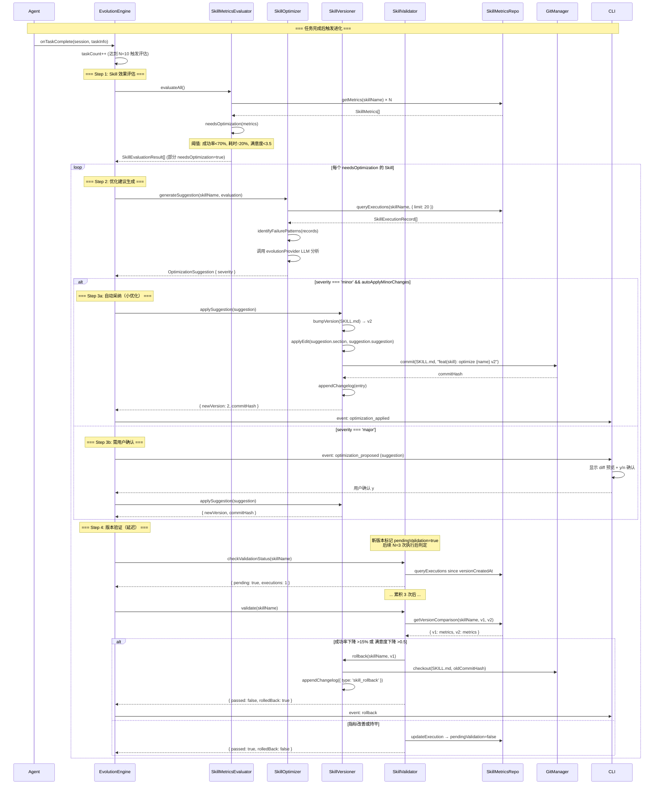
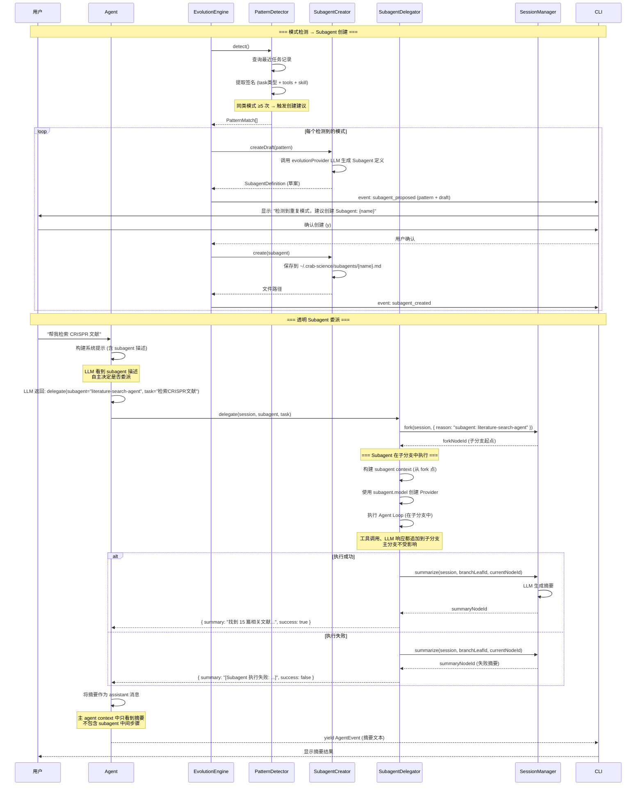
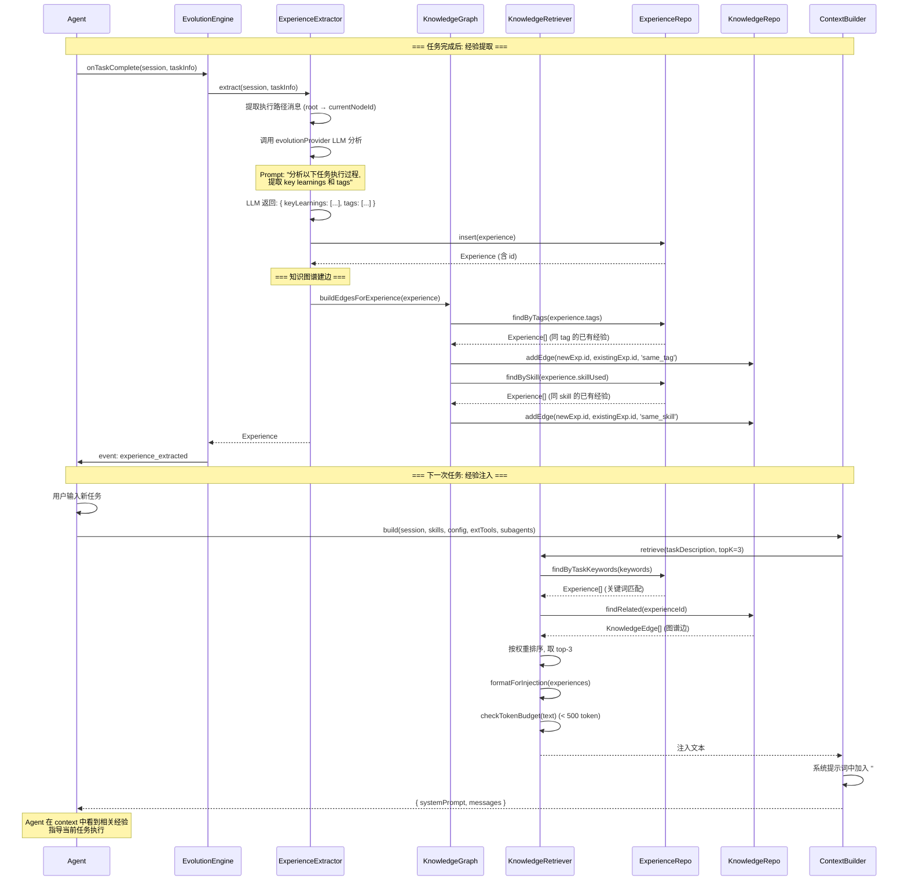
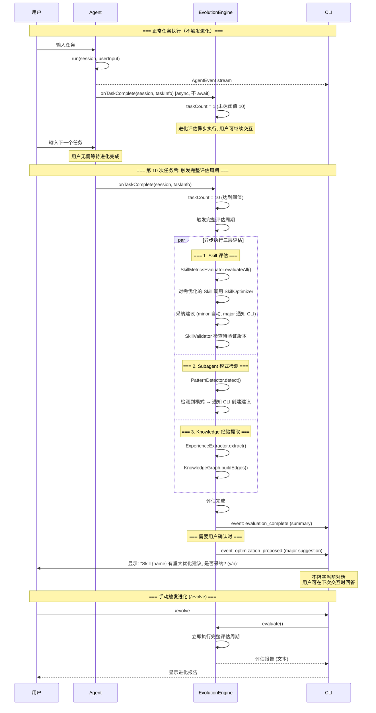
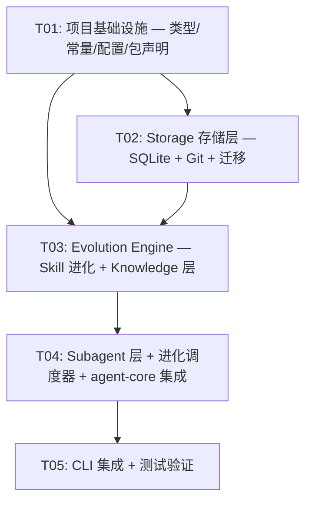

# Crab-Science Phase 3 架构设计文档

> **版本**：v3.0
> **日期**：2026-07-20
> **作者**：高见远（架构师）
> **状态**：待评审
> **Phase**：Phase 3 — 进化机制（Skill/Subagent/Knowledge 三层进化）

---

## 目录

1. [架构决策记录（15 个待确认问题）](#1-架构决策记录)
2. [实现方案与框架选型](#2-实现方案与框架选型)
3. [文件列表及相对路径](#3-文件列表及相对路径)
4. [数据结构和接口](#4-数据结构和接口)
5. [类图](#5-类图)
6. [程序调用流程](#6-程序调用流程)
7. [任务列表](#7-任务列表)
8. [依赖包列表](#8-依赖包列表)
9. [共享知识（跨文件约定）](#9-共享知识跨文件约定)
10. [待明确事项](#10-待明确事项)

---

## 1. 架构决策记录

对 PRD 中 15 个待确认问题逐一给出决策和理由。

### ADR-P3-001: SQLite 库选择

**决策**：使用 `better-sqlite3`。

**理由**：
1. `better-sqlite3` 是同步 API，代码简洁直观，无需 async/await 包裹，与当前代码风格一致（SkillExecutionLogger 也是同步 fs 操作）
2. 性能优秀——C++ 原生绑定，同步执行比异步 node-sqlite3 快 2-3 倍
3. Node.js 20 LTS 原生支持 `node:sqlite`，但该模块仍为实验性 API（`--experimental-sqlite` flag），生产环境不适合
4. `better-sqlite3` 成熟稳定，npm 周下载量 2M+，社区生态完善
5. 支持 prepared statements、事务、WAL 模式，满足进化引擎的查询需求
6. 安装时需要 node-gyp 编译，但项目已要求 Node.js >= 20，且 pnpm 会自动处理 native 模块

### ADR-P3-002: Git 实现选择

**决策**：使用 `isomorphic-git`。

**理由**：
1. 纯 JavaScript 实现，无需系统安装 git 二进制文件，跨平台兼容（Windows/macOS/Linux）
2. 提供完整的 Git 操作 API（init、add、commit、log、diff、checkout），满足 skill/subagent 版本控制需求
3. Node.js 环境下可直接使用 `fs` 模块作为文件系统后端
4. 项目是 CLI 工具，用户环境可能未安装 git，isomorphic-git 消除了这个外部依赖
5. 虽然性能不如原生 git，但 Phase 3 的 git 操作频率低（每次 skill 变更才 commit），性能不是瓶颈
6. API 设计良好，Promise-based，与项目异步代码风格兼容

### ADR-P3-003: 进化分析 LLM 模型选择

**决策**：在 `AppConfig` 中新增 `evolutionModel` 字段，默认使用便宜模型（如 `deepseek-chat`）。

**理由**：
1. 进化分析（效果评估、优化建议、经验提取）不需要最强推理能力，使用便宜模型可大幅降低成本
2. 用户可通过 config.json 自定义 `evolutionModel`，灵活选择不同模型
3. 默认值设为 `deepseek-chat`（DeepSeek 最便宜模型），如果用户未配置 DeepSeek API Key，回退到 `defaultModel`
4. 进化引擎的 LLM 调用使用独立的 Provider 实例（`evolutionProvider`），与主 Agent 的 Provider 隔离
5. 配置结构：`config.json` 新增 `evolutionModel?: string`（可选字段，缺失时回退到 defaultModel）

### ADR-P3-004: Skill 优化建议采纳决策权

**决策**：分级决策——小优化 Agent 自主执行，重大变更需用户确认。

**分级标准**：
- **小优化（自动执行）**：单段落修改、措辞调整、补充说明，不改变 Skill 核心流程
- **重大变更（需用户确认）**：修改 Skill 核心步骤、新增/删除步骤、改变工具使用、修改前置条件

**实现要点**：
1. `SkillOptimizer` 生成的 `OptimizationSuggestion` 包含 `severity: 'minor' | 'major'` 字段
2. `minor` 建议：`SkillVersioner` 直接执行修改，Git commit，记录 CHANGELOG
3. `major` 建议：通过 `EvolutionEngine` 返回给 CLI 层，CLI 显示 diff 预览 + y/n 确认
4. 分级标准可配置：`config.json` 新增 `evolutionConfig.autoApplyMinorChanges?: boolean`（默认 true）

### ADR-P3-005: Subagent 委派触发机制

**决策**：LLM 自主判断委派，系统提示中包含 subagent 描述。

**理由**：
1. 与 Skill 的 Progressive Disclosure 模式一致——系统提示中展示 subagent name + description（Level 0），Agent 自主决定何时委派
2. 无需额外规则引擎或模式匹配逻辑，保持极简
3. Subagent 委派通过特殊工具调用实现：Agent 调用 `delegate` 工具，参数为 `{ subagent: string, task: string }`
4. `delegate` 工具在 `SubagentDelegator` 中实现，创建子分支 session、执行 subagent、返回摘要
5. 如果没有已注册的 subagent，`delegate` 工具不注册，Agent 自然不会调用

### ADR-P3-006: 透明 Subagent context 隔离

**决策**：Subagent 执行作为 session tree 子分支（fork），主 agent 收到 summary 节点。

**实现要点**：
1. Subagent 执行时，`SubagentDelegator` 调用 `SessionManager.fork(session, { reason: 'subagent: {name}' })`
2. Fork 后的新分支作为 subagent 的独立 context（从 fork 点到分支叶节点的路径）
3. Subagent 在新分支中执行，工具调用和 LLM 响应都追加到该分支
4. 执行完成后，调用 `SessionManager.summarize()` 生成分支摘要
5. 摘要节点添加到主分支的当前节点之后（通过 `summarize` 的 `targetNodeId` 参数）
6. 主 agent 的 context 中只看到 summary 节点（摘要文本），不包含 subagent 的中间步骤
7. 复用 Phase 2 已有的 fork + summarize 机制，无需新增 session 操作

### ADR-P3-007: 经验注入 token 预算

**决策**：默认 top-3 条相关经验，每条 key_learnings < 100 字，总预算 < 500 token。

**实现要点**：
1. `KnowledgeRetriever.retrieve(taskDescription, topK=3)` 返回最多 3 条相关 Experience
2. 每条 Experience 只注入 `task`（< 50 字）+ `keyLearnings`（数组，每项 < 100 字）+ `outcome`（单字）
3. 注入格式：
   ```
   # 相关经验（自动检索）
   - [成功] 检索CRISPR脱靶文献 → 关键经验: 使用布尔运算符组合关键词；先搜索 PubMed 再扩展...
   - [部分] 数据清洗流程 → 关键经验: 缺失值超过30%的列应删除...
   ```
4. 总 token 预算硬限制 500 token，超出时截断（保留前 2 条）
5. 注入位置：系统提示词的 Skills 元数据之后、工作原则之前
6. 系统提示词 token 预算从 1500 上调到 2000（Phase 3 新增经验注入 + subagent 描述）

### ADR-P3-008: 进化评估触发时机

**决策**：异步执行，不阻塞用户交互。

**实现要点**：
1. `Agent.run()` 完成 `done` 事件后，调用 `EvolutionEngine.onTaskComplete(session, taskInfo)` 触发进化评估
2. 进化评估是 `async` 的，不 await——用户可以立即输入下一条消息
3. 进化引擎内部维护任务计数器，每 N=10 次任务触发完整评估周期
4. 评估结果如果需要用户确认（major 变更），通过事件回调通知 CLI 层
5. 如果评估过程中出错，静默记录日志，不影响用户正常使用
6. 进化引擎的 LLM 调用使用独立 `evolutionProvider`，不占用主 Provider 配额

### ADR-P3-009: Skill 版本验证判定标准

**决策**：3 次执行后判定，成功率下降 > 15% 或满意度下降 > 0.5 → 自动回滚。

**实现要点**：
1. `SkillVersioner` 创建新版本时，记录 `pendingValidation: true` 和 `versionCreatedAt`
2. 每次该 Skill 执行后，`SkillValidator` 检查是否为新版本的验证窗口内
3. 累积 3 次执行记录后，对比新版本与前一版本的指标：
   - 成功率：`(新版本成功率 - 旧版本成功率) / 旧版本成功率 * 100%`
   - 满意度：`新版本平均评分 - 旧版本平均评分`
4. 触发回滚条件（任一满足）：
   - 成功率下降 > 15%（相对下降）
   - 满意度下降 > 0.5（绝对下降）
5. 回滚操作：Git checkout 恢复旧版本 SKILL.md，version 号减 1，记录 CHANGELOG
6. 3 次执行内如果指标改善或持平，标记 `pendingValidation: false`，版本确认

### ADR-P3-010: JSONL → SQLite 数据迁移

**决策**：首次启动时一次性迁移，原文件备份为 `.jsonl.migrated`。

**实现要点**：
1. `Database` 初始化时检查 `migrations` 表，记录已执行的迁移版本
2. `002_jsonl_import.ts` 迁移脚本扫描所有 skill 目录的 `executions.jsonl` 文件
3. 逐行解析 JSONL，转换为 `SkillExecutionRecord` 格式，写入 SQLite `skill_executions` 表
4. 迁移成功后，原文件重命名为 `executions.jsonl.migrated`（不删除，作为备份）
5. 如果迁移过程中出错，回滚事务，原文件保持不变，下次启动重试
6. 迁移是幂等的——已迁移的文件（`.migrated` 后缀）不会再次处理
7. `SkillExecutionLogger` 改造：优先写入 SQLite，如果 SQLite 不可用则回退到 JSONL

### ADR-P3-011: Subagent 执行失败处理

**决策**：返回失败摘要给主 agent，不自动 fallback。

**实现要点**：
1. Subagent 执行过程中如果出错（LLM 调用失败、工具执行失败、达到最大迭代），`SubagentDelegator` 捕获异常
2. 生成失败摘要：`"[Subagent {name} 执行失败: {error}]"`
3. 失败摘要作为 summary 节点添加到主分支
4. 主 agent 收到失败摘要后，可以自行决定是否重试或换方案（LLM 自主判断）
5. 不自动 fallback 到主 agent 直接执行——避免无限循环和资源浪费
6. 失败的 subagent 执行记录写入 SQLite，用于后续 subagent 效果评估

### ADR-P3-012: 知识图谱边建立策略

**决策**：简单规则——同 tag 或同 skill 建边，因果分析留到 Phase 4。

**实现要点**：
1. `KnowledgeGraph.addEdge(exp1Id, exp2Id, type)` — 建立经验之间的关联边
2. 边类型：`'same_tag'`（共享标签）、`'same_skill'`（使用同一 Skill）、`'same_subagent'`（使用同一 Subagent）
3. 新 Experience 写入时，`KnowledgeGraph` 自动检查已有 Experience：
   - 遍历新 Experience 的 tags，与每个 tag 匹配的已有 Experience 建边
   - 如果新 Experience 有 skillUsed，与使用同一 Skill 的已有 Experience 建边
4. 边权重：共享 tag 数量（多个共享 tag → 更高权重）
5. 检索时 `KnowledgeRetriever` 使用边的权重排序相关 Experience
6. Phase 4 可扩展为因果分析（LLM 分析两个经验之间的因果关系）

### ADR-P3-013: 用户评分采集频率

**决策**：默认每 3 次任务采集 1 次显式评分，隐式反馈每次自动采集。

**实现要点**：
1. **隐式反馈**：每次 Skill 执行后自动记录 `adopted: boolean`
   - `adopted = true`：用户在后续对话中继续使用该 Skill 的输出（未 fork、未 rollback、未明确否定）
   - `adopted = false`：用户 fork 分支、rollback、或明确表示不满意
   - 判定逻辑：Agent.run() 完成后，检查 session 是否有 fork/rollback 操作
2. **显式评分**：每 3 次任务后，CLI 提示用户评分（1-5 星）
   - `EvolutionEngine` 维护任务计数器，`taskCount % 3 === 0` 时触发评分提示
   - CLI 显示：`"请对本次任务评分 (1-5, 回车跳过): "`
   - 评分写入 `skill_executions.rating` 字段
3. 评分频率可配置：`config.json` 新增 `evolutionConfig.ratingInterval?: number`（默认 3）
4. 用户可随时通过 `/rate <score>` 命令主动评分

### ADR-P3-014: 进化引擎与 Extensions 关系

**决策**：Phase 3 不主动引导 agent 修改 extensions。

**理由**：
1. Phase 3 聚焦 Skill/Subagent/Knowledge 三层进化，Extensions 的进化涉及 TypeScript 代码生成，复杂度高
2. Extensions 通过 hot-reload 机制已经支持用户手动修改后自动生效
3. Agent 仍可通过 write/edit 工具修改 extension 文件（YOLO 模式一致性），但系统提示不引导此行为
4. Phase 4 可考虑引入 Extension 进化（自动生成/优化 extension 代码）
5. 进化引擎的 Git 版本控制范围仅覆盖 `~/.crab-science/skills/` 和 `~/.crab-science/subagents/`，不包括 extensions

### ADR-P3-015: Subagent model 继承策略

**决策**：支持 `model: inherit`（继承主 session 模型）和 `model: <具体模型名>`。

**实现要点**：
1. Subagent frontmatter 中 `model` 字段支持两种值：
   - `"inherit"`：使用当前 session 的 model（`session.model`）
   - 具体模型名（如 `"deepseek-chat"`）：使用指定模型，需要对应的 Provider 已注册
2. Subagent 执行时，`SubagentDelegator` 根据 `model` 字段创建对应的 Provider：
   - `inherit`：复用主 Agent 的 Provider
   - 具体模型：从 ProviderRegistry 获取对应 Provider，如果模型名属于不同 provider（如 `deepseek-chat` 属于 deepseek），需切换 provider
3. Provider 切换逻辑：根据模型名前缀推断 provider（`claude-*` → anthropic, `gpt-*` → openai, `deepseek-*` → deepseek）
4. 如果指定模型的 Provider 未注册（无 API Key），回退到 `inherit` 并记录警告

---

## 2. 实现方案与框架选型

### 2.1 技术栈扩展

Phase 3 在 Phase 1/2 技术栈基础上引入两个新核心依赖：

| 维度 | 选型 | 变更说明 |
|------|------|---------|
| 语言 | TypeScript 5.x | 不变 |
| 运行时 | Node.js 20 LTS | 不变 |
| Monorepo | Turborepo + pnpm | 不变 |
| CLI 框架 | Ink 4.x | 不变 |
| LLM SDK | openai + @anthropic-ai/sdk | 不变 |
| **SQLite** | **better-sqlite3** | **新增** — 进化数据持久化存储 |
| **Git** | **isomorphic-git** | **新增** — Skill/Subagent 版本控制 |
| YAML 解析 | gray-matter | 不变 |

### 2.2 核心技术挑战与解决方案

#### 挑战 1：三层进化的协调与调度

Skill 层（评估→建议→版本→验证）、Subagent 层（检测→创建→委派→评估）、Knowledge 层（提取→图谱→检索）三层进化需要协调执行，但不能阻塞用户交互。

**解决方案**：
1. `EvolutionEngine` 作为中央调度器，维护任务计数器
2. 每 N=10 次任务后触发完整评估周期，顺序为：Skill评估 → Subagent模式检测 → Knowledge经验提取
3. 评估是异步的（`async`，不 `await`），通过事件回调通知 CLI 层需要用户确认的变更
4. 三层评估之间有数据依赖（Skill评估结果可触发Subagent模式检测），但通过共享 SQLite 数据库间接耦合，不直接调用

#### 挑战 2：SQLite 与 JSONL 的兼容迁移

Phase 2 使用 JSONL 存储执行记录，Phase 3 迁移到 SQLite。需要平滑迁移，不丢失数据。

**解决方案**：
1. 迁移在 `Database` 初始化时自动执行（首次启动）
2. 迁移脚本 `002_jsonl_import.ts` 扫描所有 skill 目录的 JSONL 文件
3. 迁移成功后原文件重命名为 `.jsonl.migrated`（备份不删除）
4. `SkillExecutionLogger` 改造为优先写入 SQLite，SQLite 不可用时回退 JSONL
5. 迁移是幂等的，可安全重试

#### 挑战 3：Subagent 委派的 context 隔离

Subagent 需要在独立 context 中执行，但又要将结果摘要返回给主 agent。

**解决方案**：
1. 复用 Phase 2 的 fork + summarize 机制
2. Subagent 执行前 fork 当前 session，在新分支中执行
3. 执行完成后 summarize 新分支内容
4. 摘要节点添加到主分支当前节点之后
5. 主 agent 的 context 路径只包含摘要节点，不包含 subagent 中间步骤

#### 挑战 4：Git 版本控制的自动化

每次 Skill/Subagent 变更都需要自动 Git commit，支持 diff 和回滚。

**解决方案**：
1. `GitManager` 封装 isomorphic-git 操作
2. Git 仓库初始化在 `~/.crab-science/` 目录
3. `SkillVersioner` 修改 SKILL.md 后调用 `GitManager.commit()`
4. 回滚时调用 `GitManager.checkout()` 恢复旧版本
5. Commit message 格式：`feat(skill): optimize {skillName} v{version}` 或 `fix(skill): rollback {skillName} to v{version}`
6. CHANGELOG.md 自动追加变更记录

#### 挑战 5：经验检索的 token 预算控制

经验注入需要控制在 500 token 以内，同时保证相关性。

**解决方案**：
1. `KnowledgeRetriever` 基于 tag 匹配 + 知识图谱边权重排序
2. 选取 top-3 条经验，每条只注入 task + keyLearnings + outcome
3. Token 估算使用 `estimateTokens()` 函数（字符数 / 4）
4. 超出 500 token 时截断（保留前 2 条或前 1 条）
5. 注入位置在系统提示词中，不影响用户消息

### 2.3 架构模式与包间依赖

Phase 3 新增两个包，包间依赖关系如下：

```
┌──────────────────────────────────────────────────────────┐
│                  apps/cli (表现层)                         │
│  Ink React 组件 + 用户交互 + 进化命令                      │
├──────────────────────────────────────────────────────────┤
│              packages/agent-core (业务层)                  │
│  Agent Loop + Tools + Session(Tree) + Skills(L4)          │
│  + Extensions + Subagents + 进化引擎集成                   │
├──────────────┬─────────────┬─────────────────────────────┤
│ packages/    │ packages/   │ packages/                    │
│ evolution-   │ storage     │ llm-layer                    │
│ engine       │ (存储层)     │ (基础设施层)                  │
│ (进化引擎)    │ SQLite+Git  │ Provider 抽象 + 实现          │
├──────────────┴─────────────┴─────────────────────────────┤
│                  packages/shared (共享层)                   │
│  Types(升级) + Utils + Constants                           │
└──────────────────────────────────────────────────────────┘
```

**依赖方向**：
- `cli → agent-core → evolution-engine → storage → shared`
- `agent-core → llm-layer → shared`
- `agent-core → storage → shared`（agent-core 直接使用 storage 进行执行记录写入）
- `evolution-engine → llm-layer → shared`（进化引擎需要调用 LLM）
- 禁止反向依赖

**关键设计原则**：
1. 进化引擎作为独立包，agent-core 通过接口集成，改动最小化
2. Storage 包是纯数据层，不包含业务逻辑
3. Evolution Engine 是业务层，包含三层进化的全部逻辑
4. agent-core 只需知道 `EvolutionEngine` 的 `onTaskComplete()` 和 `getRelevantExperiences()` 两个方法

---

## 3. 文件列表及相对路径

### 3.1 修改的文件

| # | 文件路径 | 修改说明 |
|---|---------|---------|
| 1 | `packages/shared/src/types.ts` | 新增 Experience、SkillMetrics、KnowledgeEdge、SubagentDefinition、OptimizationSuggestion、ChangeEntry 等类型；升级 SkillExecutionRecord（新增 adopted、rating 字段）；升级 AppConfig（新增 evolutionModel、evolutionConfig） |
| 2 | `packages/shared/src/constants.ts` | 新增 SQLITE_DB_PATH、SUBAGENTS_DIR、EVOLUTION_TASK_INTERVAL、SKILL_VALIDATION_WINDOW、EXPERIENCE_INJECTION_TOP_K 等常量；VERSION 升级到 0.3.0 |
| 3 | `packages/agent-core/src/agent.ts` | 新增 EvolutionEngine 集成：run() 完成后异步调用 onTaskComplete()；新增 delegate 工具调用处理 |
| 4 | `packages/agent-core/src/context-builder.ts` | 新增经验注入：build() 方法增加 experiences 参数，注入到系统提示词 |
| 5 | `packages/agent-core/src/system-prompt.ts` | 新增 subagent 描述段 + 经验注入段；token 预算上调到 2000 |
| 6 | `packages/agent-core/src/skills/execution-logger.ts` | 改造为优先写入 SQLite，回退 JSONL；新增 adopted/rating 字段支持 |
| 7 | `packages/agent-core/src/skills/types.ts` | SkillFrontmatter 新增 version 相关字段 |
| 8 | `packages/agent-core/src/skills/loader.ts` | discover() 从 SQLite 读取 executionCount；clearCache 后刷新 |
| 9 | `packages/agent-core/src/config/manager.ts` | 新增 evolutionModel、evolutionConfig 字段的默认值和校验 |
| 10 | `packages/agent-core/src/index.ts` | 新增导出：EvolutionEngine、SubagentRegistry、SubagentLoader、Storage 相关类型 |
| 11 | `packages/agent-core/package.json` | 新增依赖：@crab-science/evolution-engine、@crab-science/storage |
| 12 | `apps/cli/src/commands/handler.ts` | 新增 /evolve、/subagents、/knowledge、/versions 命令 |
| 13 | `apps/cli/src/hooks/use-agent.ts` | 初始化 EvolutionEngine、Storage、SubagentRegistry；集成进化事件回调 |
| 14 | `apps/cli/src/app.tsx` | 进化评估提示 UI、用户确认交互 |
| 15 | `apps/cli/package.json` | 新增依赖（如有 CLI 特有依赖） |

### 3.2 新建的文件

| # | 文件路径 | 说明 |
|---|---------|------|
| 16 | `packages/storage/package.json` | Storage 包配置 |
| 17 | `packages/storage/tsup.config.ts` | Storage 打包配置 |
| 18 | `packages/storage/src/index.ts` | Storage 统一导出 |
| 19 | `packages/storage/src/database.ts` | SQLite 连接管理 + 迁移执行 |
| 20 | `packages/storage/src/migrations/001_initial.ts` | 初始 schema（experiences、skill_executions、skill_metrics、knowledge_edges、subagent_metrics 表） |
| 21 | `packages/storage/src/migrations/002_jsonl_import.ts` | JSONL → SQLite 数据迁移 |
| 22 | `packages/storage/src/migrations/runner.ts` | 迁移执行器 |
| 23 | `packages/storage/src/repositories/experience-repo.ts` | Experience CRUD |
| 24 | `packages/storage/src/repositories/skill-metrics-repo.ts` | Skill 执行记录 + 指标 CRUD |
| 25 | `packages/storage/src/repositories/knowledge-repo.ts` | 知识图谱边 CRUD |
| 26 | `packages/storage/src/git-manager.ts` | Git 版本控制（isomorphic-git 封装） |
| 27 | `packages/evolution-engine/package.json` | Evolution Engine 包配置 |
| 28 | `packages/evolution-engine/tsup.config.ts` | Evolution Engine 打包配置 |
| 29 | `packages/evolution-engine/src/index.ts` | Evolution Engine 统一导出 |
| 30 | `packages/evolution-engine/src/evolution-engine.ts` | 进化调度器（中央协调器） |
| 31 | `packages/evolution-engine/src/skill/metrics-evaluator.ts` | Skill 效果评估器 |
| 32 | `packages/evolution-engine/src/skill/skill-optimizer.ts` | Skill 优化建议生成 |
| 33 | `packages/evolution-engine/src/skill/skill-versioner.ts` | Skill 版本迭代 + Git commit |
| 34 | `packages/evolution-engine/src/skill/skill-validator.ts` | Skill 版本验证 + 自动回滚 |
| 35 | `packages/evolution-engine/src/subagent/pattern-detector.ts` | Subagent 模式检测器 |
| 36 | `packages/evolution-engine/src/subagent/subagent-creator.ts` | Subagent 草案生成 + 创建 |
| 37 | `packages/evolution-engine/src/subagent/subagent-delegator.ts` | Subagent 委派 + 执行 |
| 38 | `packages/evolution-engine/src/subagent/subagent-evaluator.ts` | Subagent 效果评估 |
| 39 | `packages/evolution-engine/src/knowledge/experience-extractor.ts` | 经验提取器 |
| 40 | `packages/evolution-engine/src/knowledge/knowledge-graph.ts` | 知识图谱构建 |
| 41 | `packages/evolution-engine/src/knowledge/knowledge-retriever.ts` | 经验检索注入 |
| 42 | `packages/agent-core/src/subagents/types.ts` | Subagent 类型定义 |
| 43 | `packages/agent-core/src/subagents/registry.ts` | Subagent 注册表 |
| 44 | `packages/agent-core/src/subagents/loader.ts` | Subagent 加载器 |
| 45 | `packages/storage/__tests__/database.test.ts` | Database 单元测试 |
| 46 | `packages/storage/__tests__/repositories.test.ts` | Repository 单元测试 |
| 47 | `packages/storage/__tests__/git-manager.test.ts` | GitManager 单元测试 |
| 48 | `packages/evolution-engine/__tests__/skill-evolution.test.ts` | Skill 进化全流程测试 |
| 49 | `packages/evolution-engine/__tests__/subagent.test.ts` | Subagent 模式检测 + 委派测试 |
| 50 | `packages/evolution-engine/__tests__/knowledge.test.ts` | 经验提取 + 检索测试 |
| 51 | `packages/evolution-engine/__tests__/evolution-engine.test.ts` | 进化引擎调度测试 |
| 52 | `docs/phase3-class-diagram.mermaid` | Phase 3 类图 |
| 53 | `docs/phase3-sequence-diagram.mermaid` | Phase 3 时序图 |

### 3.3 文件变更汇总

- **修改文件**：15 个
- **新建文件**：38 个
- **总计**：53 个文件涉及变更

---

## 4. 数据结构和接口

### 4.1 新增/修改的类型定义

> 以下类型定义位于 `packages/shared/src/types.ts`，除非特别标注。

#### 4.1.1 AppConfig 升级（Phase 3）

```typescript
/** 配置文件结构（Phase 3 升级） */
interface AppConfig {
  defaultProvider: 'openai' | 'anthropic' | 'deepseek';
  defaultModel: string;
  maxIterations: number;
  bashTimeoutMs: number;
  workDir: string;
  /** Phase 3 新增：进化分析使用的模型 */
  evolutionModel?: string;
  /** Phase 3 新增：进化引擎配置 */
  evolutionConfig?: EvolutionConfig;
}

/** 进化引擎配置 */
interface EvolutionConfig {
  /** 进化评估触发间隔（任务数），默认 10 */
  taskInterval?: number;
  /** Skill 版本验证窗口（执行次数），默认 3 */
  skillValidationWindow?: number;
  /** 经验注入 top-K，默认 3 */
  experienceInjectionTopK?: number;
  /** 经验注入 token 预算，默认 500 */
  experienceInjectionTokenBudget?: number;
  /** 用户评分采集间隔（任务数），默认 3 */
  ratingInterval?: number;
  /** 是否自动应用小优化，默认 true */
  autoApplyMinorChanges?: boolean;
  /** Subagent 模式检测阈值（同类模式次数），默认 5 */
  subagentPatternThreshold?: number;
}
```

#### 4.1.2 SkillExecutionRecord 升级（Phase 3）

```typescript
/** Skill 执行记录（Phase 3 增强） */
interface SkillExecutionRecord {
  /** 记录 ID */
  id: string;
  /** Skill 名称 */
  skillName: string;
  /** 执行时间（ISO 8601） */
  timestamp: string;
  /** 任务描述 */
  task: string;
  /** 执行步骤 */
  steps: string[];
  /** 执行耗时（毫秒） */
  durationMs: number;
  /** 执行状态 */
  status: 'success' | 'failed' | 'partial';
  /** 错误信息 */
  error?: string;
  /** Token 使用量 */
  tokenUsage?: {
    inputTokens: number;
    outputTokens: number;
  };
  /** Phase 3 新增：隐式反馈（用户是否采纳了结果） */
  adopted?: boolean;
  /** Phase 3 新增：显式评分（1-5，0 表示未评分） */
  rating?: number;
  /** Phase 3 新增：版本号（执行时的 Skill 版本） */
  skillVersion?: number;
  /** Phase 3 新增：关联的 Session ID */
  sessionId?: string;
}
```

#### 4.1.3 SkillMetrics 类型（新增）

```typescript
/** Skill 效果指标（从 SQLite 聚合计算） */
interface SkillMetrics {
  /** Skill 名称 */
  skillName: string;
  /** 成功率（0-1） */
  successRate: number;
  /** 平均耗时（毫秒） */
  avgDuration: number;
  /** 执行次数 */
  usageCount: number;
  /** 用户满意度（1-5 平均分，0 表示无评分） */
  userSatisfaction: number;
  /** 最后使用时间 */
  lastUsed: string;
  /** 趋势 */
  trend: 'improving' | 'stable' | 'declining';
}

/** Skill 评估结果 */
interface SkillEvaluationResult {
  skillName: string;
  metrics: SkillMetrics;
  /** 是否需要优化 */
  needsOptimization: boolean;
  /** 触发原因 */
  triggerReasons: string[];
}
```

#### 4.1.4 OptimizationSuggestion 类型（新增）

```typescript
/** 优化建议 */
interface OptimizationSuggestion {
  /** 建议 ID */
  id: string;
  /** Skill 名称 */
  skillName: string;
  /** 当前版本号 */
  currentVersion: number;
  /** 建议严重级别 */
  severity: 'minor' | 'major';
  /** 段落定位（SKILL.md 中的段落标识） */
  section: string;
  /** 修改建议 */
  suggestion: string;
  /** 理由 */
  rationale: string;
  /** 识别的失败模式 */
  failurePatterns: string[];
  /** 生成时间 */
  createdAt: string;
}
```

#### 4.1.5 Experience 类型（新增）

```typescript
/** 经验记录 */
interface Experience {
  /** 经验 ID */
  id: string;
  /** 时间戳 */
  timestamp: string;
  /** 关联任务 ID */
  taskId: string;
  /** 关联 Session ID */
  sessionId: string;
  /** 任务描述 */
  task: string;
  /** 使用的 Skill（可为 null） */
  skillUsed: string | null;
  /** 使用的 Subagent（可为 null） */
  subagentUsed: string | null;
  /** 执行结果 */
  outcome: 'success' | 'partial' | 'failure';
  /** 执行耗时（毫秒） */
  duration: number;
  /** 关键学习点 */
  keyLearnings: string[];
  /** 标签 */
  tags: string[];
  /** 关联经验 ID 列表 */
  relatedExperiences: string[];
}
```

#### 4.1.6 KnowledgeEdge 类型（新增）

```typescript
/** 知识图谱边 */
interface KnowledgeEdge {
  /** 边 ID */
  id: string;
  /** 源经验 ID */
  sourceId: string;
  /** 目标经验 ID */
  targetId: string;
  /** 边类型 */
  type: 'same_tag' | 'same_skill' | 'same_subagent';
  /** 权重（共享标签数等） */
  weight: number;
  /** 创建时间 */
  createdAt: string;
}
```

#### 4.1.7 Subagent 类型（新增）

```typescript
/** Subagent frontmatter */
interface SubagentFrontmatter {
  name: string;
  description: string;
  /** 执行模式 */
  mode: 'autonomous' | 'guided';
  /** 模型（inherit 或具体模型名） */
  model: string;
  /** 可用工具列表 */
  tools: string[];
  /** 触发关键词（可选，辅助 LLM 判断） */
  triggers?: string[];
}

/** Subagent 完整定义 */
interface SubagentDefinition {
  meta: SubagentFrontmatter;
  /** Markdown 文件路径 */
  path: string;
  /** Markdown 正文内容（frontmatter 之后） */
  content: string;
}

/** Subagent 执行记录 */
interface SubagentExecutionRecord {
  id: string;
  subagentName: string;
  timestamp: string;
  task: string;
  sessionId: string;
  /** 分支叶节点 ID（fork 的子分支） */
  branchLeafId: string;
  duration: number;
  outcome: 'success' | 'partial' | 'failure';
  summary: string;
}

/** Subagent 指标 */
interface SubagentMetrics {
  subagentName: string;
  delegationCount: number;
  successRate: number;
  avgDuration: number;
  /** 委派准确率（LLM 判断是否正确的委派） */
  delegationAccuracy: number;
  lastUsed: string;
}

/** 模式检测结果 */
interface PatternMatch {
  /** 模式签名（任务类型 + 工具组合的 hash） */
  signature: string;
  /** 匹配的任务记录 */
  matchingTasks: TaskRecord[];
  /** 出现次数 */
  count: number;
  /** 建议的 Subagent 名称 */
  suggestedName: string;
  /** 建议的描述 */
  suggestedDescription: string;
}

/** 任务执行记录（用于模式检测） */
interface TaskRecord {
  taskId: string;
  task: string;
  toolsUsed: string[];
  skillUsed: string | null;
  outcome: string;
  timestamp: string;
}
```

#### 4.1.8 ChangeEntry 类型（新增）

```typescript
/** 变更日志条目 */
interface ChangeEntry {
  /** 变更类型 */
  type: 'skill_optimize' | 'skill_rollback' | 'skill_validate' | 'subagent_create' | 'subagent_optimize';
  /** 目标名称（Skill 或 Subagent 名） */
  target: string;
  /** 版本号 */
  version: number;
  /** 变更描述 */
  description: string;
  /** Git commit hash */
  commitHash?: string;
  /** 时间戳 */
  timestamp: string;
}
```

#### 4.1.9 进化引擎事件类型（新增）

```typescript
/** 进化引擎事件（通知 CLI 层） */
type EvolutionEvent =
  | { type: 'optimization_proposed'; suggestion: OptimizationSuggestion; skillName: string }
  | { type: 'optimization_applied'; skillName: string; version: number }
  | { type: 'rollback'; skillName: string; version: number; reason: string }
  | { type: 'subagent_proposed'; pattern: PatternMatch }
  | { type: 'subagent_created'; name: string }
  | { type: 'experience_extracted'; experience: Experience }
  | { type: 'rating_request'; taskDescription: string }
  | { type: 'evaluation_complete'; summary: string };

/** 进化事件回调 */
type EvolutionEventCallback = (event: EvolutionEvent) => void;
```

### 4.2 Storage 层接口

#### 4.2.1 Database 接口

```typescript
/**
 * SQLite 数据库管理器
 * 负责连接管理、迁移执行、WAL 模式
 */
class Database {
  private db: better-sqlite3.Database;
  private dbPath: string;

  constructor(dbPath?: string);

  /** 初始化数据库（创建表、执行迁移） */
  initialize(): void;

  /** 获取底层 better-sqlite3 实例（供 Repository 使用） */
  getDatabase(): better-sqlite3.Database;

  /** 关闭数据库连接 */
  close(): void;

  /** 执行迁移 */
  private runMigrations(): void;
}
```

#### 4.2.2 Repository 接口

```typescript
/**
 * Experience 仓库
 */
class ExperienceRepository {
  constructor(db: Database);

  /** 插入经验 */
  insert(experience: Omit<Experience, 'id'>): Experience;

  /** 按 ID 查询 */
  findById(id: string): Experience | null;

  /** 按 tag 检索 */
  findByTags(tags: string[], limit?: number): Experience[];

  /** 按 Skill 检索 */
  findBySkill(skillName: string, limit?: number): Experience[];

  /** 按任务描述关键词检索 */
  findByTaskKeywords(keywords: string[], limit?: number): Experience[];

  /** 更新关联经验 */
  updateRelatedExperiences(id: string, relatedIds: string[]): void;

  /** 获取最近 N 条经验 */
  getRecent(limit: number): Experience[];
}

/**
 * Skill 指标仓库
 * 管理 skill_executions 表和 skill_metrics 视图
 */
class SkillMetricsRepository {
  constructor(db: Database);

  /** 记录 Skill 执行 */
  insertExecution(record: Omit<SkillExecutionRecord, 'id' | 'timestamp'>): SkillExecutionRecord;

  /** 查询执行历史 */
  queryExecutions(skillName: string, options?: {
    limit?: number;
    status?: string;
    sinceVersion?: number;
  }): SkillExecutionRecord[];

  /** 计算聚合指标 */
  getMetrics(skillName: string): SkillMetrics;

  /** 更新执行记录（adopted/rating） */
  updateExecution(id: string, updates: Partial<SkillExecutionRecord>): void;

  /** 获取版本对比数据 */
  getVersionComparison(skillName: string, version1: number, version2: number): {
    v1: SkillMetrics;
    v2: SkillMetrics;
  };
}

/**
 * 知识图谱仓库
 */
class KnowledgeRepository {
  constructor(db: Database);

  /** 添加边 */
  addEdge(edge: Omit<KnowledgeEdge, 'id' | 'createdAt'>): KnowledgeEdge;

  /** 查询经验的所有关联边 */
  findEdges(experienceId: string): KnowledgeEdge[];

  /** 按权重检索相关经验 */
  findRelated(experienceId: string, limit?: number): Experience[];

  /** 检查边是否已存在 */
  edgeExists(sourceId: string, targetId: string, type: string): boolean;
}
```

#### 4.2.3 GitManager 接口

```typescript
/**
 * Git 版本管理器
 * 使用 isomorphic-git 在 ~/.crab-science/ 维护 Git 仓库
 */
class GitManager {
  private repoDir: string;
  private fs: typeof fs;

  constructor(repoDir?: string);

  /** 初始化 Git 仓库（如果不存在） */
  initialize(): Promise<void>;

  /** 添加文件并提交 */
  commit(filePath: string, message: string): Promise<string>;

  /** 添加多个文件并提交 */
  commitMultiple(filePaths: string[], message: string): Promise<string>;

  /** 获取文件 diff */
  diff(filePath: string, fromHash?: string): Promise<string>;

  /** 回滚文件到指定 commit */
  checkout(filePath: string, commitHash: string): Promise<void>;

  /** 获取文件提交历史 */
  log(filePath: string, limit?: number): Promise<GitLogEntry[]>;

  /** 检查仓库是否已初始化 */
  isInitialized(): boolean;
}

/** Git 日志条目 */
interface GitLogEntry {
  hash: string;
  message: string;
  author: string;
  timestamp: string;
}
```

### 4.3 Evolution Engine 接口

#### 4.3.1 EvolutionEngine 接口

```typescript
/**
 * 进化引擎——中央调度器
 *
 * 职责：
 * 1. 维护任务计数器，定期触发评估周期
 * 2. 协调三层进化的执行顺序
 * 3. 分发进化事件给 CLI 层
 */
class EvolutionEngine {
  private metricsEvaluator: SkillMetricsEvaluator;
  private skillOptimizer: SkillOptimizer;
  private skillVersioner: SkillVersioner;
  private skillValidator: SkillValidator;
  private patternDetector: PatternDetector;
  private subagentCreator: SubagentCreator;
  private subagentDelegator: SubagentDelegator;
  private subagentEvaluator: SubagentEvaluator;
  private experienceExtractor: ExperienceExtractor;
  private knowledgeGraph: KnowledgeGraph;
  private knowledgeRetriever: KnowledgeRetriever;
  private config: EvolutionConfig;
  private taskCount: number;
  private eventCallback?: EvolutionEventCallback;

  constructor(
    storage: { database: Database; experienceRepo: ExperienceRepository; skillMetricsRepo: SkillMetricsRepository; knowledgeRepo: KnowledgeRepository; gitManager: GitManager },
    providers: { evolutionProvider: LLMProvider; mainProvider: LLMProvider },
    config: AppConfig,
  );

  /** 设置事件回调 */
  onEvent(callback: EvolutionEventCallback): void;

  /**
   * 任务完成回调（Agent.run() 完成后异步调用）
   * 不阻塞用户交互
   */
  async onTaskComplete(session: Session, taskInfo: TaskInfo): Promise<void>;

  /**
   * 获取相关经验（供 ContextBuilder 注入）
   * 同步方法，在 Agent Loop 内部调用
   */
  getRelevantExperiences(taskDescription: string): Experience[];

  /**
   * 手动触发进化评估（/evolve 命令）
   */
  async evaluate(): Promise<string>;

  /** 获取 Skill 指标 */
  getSkillMetrics(skillName: string): SkillMetrics;

  /** 获取 Subagent 指标 */
  getSubagentMetrics(subagentName: string): SubagentMetrics;

  /** 获取变更日志 */
  getChangelog(limit?: number): ChangeEntry[];
}

/** 任务信息（传给 onTaskComplete） */
interface TaskInfo {
  task: string;
  skillUsed: string | null;
  subagentUsed: string | null;
  outcome: 'success' | 'partial' | 'failure';
  duration: number;
  toolsUsed: string[];
  sessionId: string;
}
```

#### 4.3.2 Skill 进化模块接口

```typescript
/**
 * Skill 效果评估器
 */
class SkillMetricsEvaluator {
  constructor(skillMetricsRepo: SkillMetricsRepository, config: EvolutionConfig);

  /** 评估指定 Skill */
  evaluate(skillName: string): SkillEvaluationResult;

  /** 评估所有 Skill */
  evaluateAll(): SkillEvaluationResult[];

  /** 检查是否需要优化（基于阈值） */
  needsOptimization(metrics: SkillMetrics): { needed: boolean; reasons: string[] };
}

/**
 * Skill 优化建议生成器
 */
class SkillOptimizer {
  constructor(provider: LLMProvider, skillMetricsRepo: SkillMetricsRepository);

  /** 生成优化建议 */
  async generateSuggestion(
    skillName: string,
    evaluation: SkillEvaluationResult,
  ): Promise<OptimizationSuggestion | null>;

  /** 从历史执行记录中识别失败模式 */
  private identifyFailurePatterns(records: SkillExecutionRecord[]): string[];
}

/**
 * Skill 版本迭代器
 */
class SkillVersioner {
  constructor(gitManager: GitManager, skillLoader: SkillLoader);

  /** 采纳建议并创建新版本 */
  async applySuggestion(suggestion: OptimizationSuggestion): Promise<{ newVersion: number; commitHash: string }>;

  /** 回滚到指定版本 */
  async rollback(skillName: string, targetVersion: number): Promise<string>;

  /** 获取版本 diff */
  async getDiff(skillName: string, fromVersion?: number): Promise<string>;

  /** 获取版本历史 */
  async getVersionHistory(skillName: string): Promise<GitLogEntry[]>;

  /** 更新 SKILL.md frontmatter 版本号 */
  private bumpVersion(skillPath: string): number;

  /** 追加 CHANGELOG 条目 */
  private appendChangelog(entry: ChangeEntry): void;
}

/**
 * Skill 版本验证器
 */
class SkillValidator {
  constructor(skillMetricsRepo: SkillMetricsRepository, skillVersioner: SkillVersioner, config: EvolutionConfig);

  /**
   * 检查新版本是否需要验证
   * 返回验证状态和已累积的执行次数
   */
  checkValidationStatus(skillName: string): {
    pending: boolean;
    executionsSinceVersion: number;
    windowSize: number;
  };

  /**
   * 执行验证判定
   * 累积 N 次执行后对比指标，不达标则触发回滚
   */
  async validate(skillName: string): Promise<{
    passed: boolean;
    rolledBack: boolean;
    reason?: string;
  }>;
}
```

#### 4.3.3 Subagent 模块接口

```typescript
/**
 * Subagent 模式检测器
 */
class PatternDetector {
  constructor(skillMetricsRepo: SkillMetricsRepository, config: EvolutionConfig);

  /** 检测重复模式 */
  detect(): PatternMatch[];

  /** 提取任务模式签名 */
  private extractSignature(task: TaskRecord): string;
}

/**
 * Subagent 创建器
 */
class SubagentCreator {
  constructor(provider: LLMProvider);

  /** 从模式生成 Subagent 草案 */
  async createDraft(pattern: PatternMatch): Promise<SubagentDefinition>;

  /** 保存 Subagent 定义文件 */
  async save(subagent: SubagentDefinition): Promise<string>;

  /** 用户确认后创建 */
  async create(subagent: SubagentDefinition): Promise<string>;
}

/**
 * Subagent 委派执行器
 */
class SubagentDelegator {
  constructor(
    sessionManager: SessionManager,
    providerRegistry: ProviderRegistry,
    toolRegistry: ToolRegistry,
    skillLoader: SkillLoader,
  );

  /**
   * 委派任务给 Subagent
   * 1. Fork session 创建子分支
   * 2. 在子分支中执行 subagent
   * 3. Summarize 子分支
   * 4. 返回摘要给主 agent
   */
  async delegate(
    session: Session,
    subagent: SubagentDefinition,
    task: string,
  ): Promise<{ summary: string; success: boolean; branchLeafId: string }>;
}

/**
 * Subagent 效果评估器
 */
class SubagentEvaluator {
  constructor(database: Database);

  /** 评估指定 Subagent */
  evaluate(subagentName: string): SubagentMetrics;

  /** 检查是否需要优化 */
  needsOptimization(metrics: SubagentMetrics): { needed: boolean; reasons: string[] };
}
```

#### 4.3.4 Knowledge 模块接口

```typescript
/**
 * 经验提取器
 */
class ExperienceExtractor {
  constructor(provider: LLMProvider, experienceRepo: ExperienceRepository);

  /** 从任务执行过程提取经验 */
  async extract(session: Session, taskInfo: TaskInfo): Promise<Experience | null>;

  /** 调用 LLM 分析执行过程，提取 key learnings */
  private async analyzeExecution(session: Session, taskInfo: TaskInfo): Promise<{
    keyLearnings: string[];
    tags: string[];
  }>;
}

/**
 * 知识图谱构建器
 */
class KnowledgeGraph {
  constructor(knowledgeRepo: KnowledgeRepository, experienceRepo: ExperienceRepository);

  /** 为新经验建立关联边 */
  buildEdgesForExperience(experience: Experience): void;

  /** 查询相关经验（基于边权重） */
  findRelated(experienceId: string, limit?: number): Experience[];
}

/**
 * 经验检索注入器
 */
class KnowledgeRetriever {
  constructor(experienceRepo: ExperienceRepository, knowledgeRepo: KnowledgeRepository, config: EvolutionConfig);

  /** 检索相关经验（top-K） */
  retrieve(taskDescription: string, topK?: number): Experience[];

  /** 格式化经验为注入文本 */
  formatForInjection(experiences: Experience[]): string;

  /** token 预算检查 */
  private checkTokenBudget(text: string): boolean;
}
```

### 4.4 SubagentRegistry 接口（agent-core 新增）

```typescript
/**
 * Subagent 注册表
 * 管理已加载的 Subagent 定义
 */
class SubagentRegistry {
  private loader: SubagentLoader;
  private subagents: Map<string, SubagentDefinition>;

  constructor(subagentsDir?: string);

  /** 发现并加载所有 Subagent */
  discover(): SubagentDefinition[];

  /** 获取指定 Subagent */
  get(name: string): SubagentDefinition | null;

  /** 获取所有 Subagent 元数据（用于系统提示） */
  getMetadataForPrompt(): string;

  /** 刷新（重新加载） */
  refresh(): void;
}

/**
 * Subagent 加载器
 */
class SubagentLoader {
  private subagentsDir: string;

  constructor(subagentsDir?: string);

  /** 加载指定 Subagent 定义文件 */
  load(name: string): SubagentDefinition | null;

  /** 加载所有 Subagent */
  loadAll(): SubagentDefinition[];
}
```

### 4.5 Agent 类升级（Phase 3）

```typescript
class Agent {
  // Phase 2 已有依赖
  private provider: LLMProvider;
  private toolRegistry: ToolRegistry;
  private sessionManager: SessionManager;
  private skillLoader: SkillLoader;
  private contextBuilder: ContextBuilder;
  private config: AppConfig;

  // Phase 3 新增
  private evolutionEngine?: EvolutionEngine;
  private subagentRegistry?: SubagentRegistry;

  constructor(
    provider: LLMProvider,
    toolRegistry: ToolRegistry,
    sessionManager: SessionManager,
    skillLoader: SkillLoader,
    contextBuilder: ContextBuilder,
    config: AppConfig,
    // Phase 3 新增可选参数
    evolutionEngine?: EvolutionEngine,
    subagentRegistry?: SubagentRegistry,
  );

  async *run(session: Session, userInput: string): AsyncGenerator<AgentEvent>;
}
```

### 4.6 ContextBuilder 升级（Phase 3）

```typescript
class ContextBuilder {
  private systemPromptBuilder: SystemPromptBuilder;
  // Phase 3 新增
  private knowledgeRetriever?: KnowledgeRetriever;

  constructor(systemPromptBuilder?: SystemPromptBuilder, knowledgeRetriever?: KnowledgeRetriever);

  build(
    session: Session,
    skills: SkillMeta[],
    config: AppConfig,
    extensionTools?: ToolDefinition[],
    // Phase 3 新增
    subagents?: SubagentDefinition[],
  ): {
    systemPrompt: string;
    messages: Message[];
  };
}
```

---

## 5. 类图

> 完整类图见 `docs/phase3-class-diagram.mermaid`

```mermaid
classDiagram
    direction TB

    %% ========== shared 包（Phase 3 变更） ==========

    class AppConfig {
        +defaultProvider: string
        +defaultModel: string
        +maxIterations: number
        +bashTimeoutMs: number
        +workDir: string
        +evolutionModel?: string
        +evolutionConfig?: EvolutionConfig
    }

    class EvolutionConfig {
        +taskInterval?: number
        +skillValidationWindow?: number
        +experienceInjectionTopK?: number
        +experienceInjectionTokenBudget?: number
        +ratingInterval?: number
        +autoApplyMinorChanges?: boolean
        +subagentPatternThreshold?: number
    }

    class SkillExecutionRecord {
        +id: string
        +skillName: string
        +timestamp: string
        +task: string
        +steps: string[]
        +durationMs: number
        +status: string
        +error?: string
        +tokenUsage?: object
        +adopted?: boolean
        +rating?: number
        +skillVersion?: number
        +sessionId?: string
    }

    class SkillMetrics {
        +skillName: string
        +successRate: number
        +avgDuration: number
        +usageCount: number
        +userSatisfaction: number
        +lastUsed: string
        +trend: string
    }

    class Experience {
        +id: string
        +timestamp: string
        +taskId: string
        +sessionId: string
        +task: string
        +skillUsed: string | null
        +subagentUsed: string | null
        +outcome: string
        +duration: number
        +keyLearnings: string[]
        +tags: string[]
        +relatedExperiences: string[]
    }

    class KnowledgeEdge {
        +id: string
        +sourceId: string
        +targetId: string
        +type: string
        +weight: number
        +createdAt: string
    }

    class SubagentDefinition {
        +meta: SubagentFrontmatter
        +path: string
        +content: string
    }

    class SubagentFrontmatter {
        +name: string
        +description: string
        +mode: string
        +model: string
        +tools: string[]
        +triggers?: string[]
    }

    class OptimizationSuggestion {
        +id: string
        +skillName: string
        +currentVersion: number
        +severity: string
        +section: string
        +suggestion: string
        +rationale: string
        +failurePatterns: string[]
        +createdAt: string
    }

    class ChangeEntry {
        +type: string
        +target: string
        +version: number
        +description: string
        +commitHash?: string
        +timestamp: string
    }

    %% ========== storage 包 ==========

    class Database {
        -db: better-sqlite3.Database
        -dbPath: string
        +initialize(): void
        +getDatabase(): Database
        +close(): void
        -runMigrations(): void
    }

    class ExperienceRepository {
        -db: Database
        +insert(experience): Experience
        +findById(id): Experience | null
        +findByTags(tags, limit?): Experience[]
        +findBySkill(skillName, limit?): Experience[]
        +findByTaskKeywords(keywords, limit?): Experience[]
        +updateRelatedExperiences(id, relatedIds): void
        +getRecent(limit): Experience[]
    }

    class SkillMetricsRepository {
        -db: Database
        +insertExecution(record): SkillExecutionRecord
        +queryExecutions(skillName, options?): SkillExecutionRecord[]
        +getMetrics(skillName): SkillMetrics
        +updateExecution(id, updates): void
        +getVersionComparison(skillName, v1, v2): object
    }

    class KnowledgeRepository {
        -db: Database
        +addEdge(edge): KnowledgeEdge
        +findEdges(experienceId): KnowledgeEdge[]
        +findRelated(experienceId, limit?): Experience[]
        +edgeExists(sourceId, targetId, type): boolean
    }

    class GitManager {
        -repoDir: string
        -fs: typeof fs
        +initialize(): Promise~void~
        +commit(filePath, message): Promise~string~
        +commitMultiple(filePaths, message): Promise~string~
        +diff(filePath, fromHash?): Promise~string~
        +checkout(filePath, commitHash): Promise~void~
        +log(filePath, limit?): Promise~GitLogEntry[]~
        +isInitialized(): boolean
    }

    %% ========== evolution-engine 包 ==========

    class EvolutionEngine {
        -metricsEvaluator: SkillMetricsEvaluator
        -skillOptimizer: SkillOptimizer
        -skillVersioner: SkillVersioner
        -skillValidator: SkillValidator
        -patternDetector: PatternDetector
        -subagentCreator: SubagentCreator
        -subagentDelegator: SubagentDelegator
        -subagentEvaluator: SubagentEvaluator
        -experienceExtractor: ExperienceExtractor
        -knowledgeGraph: KnowledgeGraph
        -knowledgeRetriever: KnowledgeRetriever
        -config: EvolutionConfig
        -taskCount: number
        -eventCallback?: EvolutionEventCallback
        +onEvent(callback): void
        +onTaskComplete(session, taskInfo): Promise~void~
        +getRelevantExperiences(taskDescription): Experience[]
        +evaluate(): Promise~string~
        +getSkillMetrics(skillName): SkillMetrics
        +getChangelog(limit?): ChangeEntry[]
    }

    class SkillMetricsEvaluator {
        -skillMetricsRepo: SkillMetricsRepository
        -config: EvolutionConfig
        +evaluate(skillName): SkillEvaluationResult
        +evaluateAll(): SkillEvaluationResult[]
        +needsOptimization(metrics): object
    }

    class SkillOptimizer {
        -provider: LLMProvider
        -skillMetricsRepo: SkillMetricsRepository
        +generateSuggestion(skillName, evaluation): Promise~OptimizationSuggestion~
        -identifyFailurePatterns(records): string[]
    }

    class SkillVersioner {
        -gitManager: GitManager
        -skillLoader: SkillLoader
        +applySuggestion(suggestion): Promise~object~
        +rollback(skillName, targetVersion): Promise~string~
        +getDiff(skillName, fromVersion?): Promise~string~
        +getVersionHistory(skillName): Promise~GitLogEntry[]~
        -bumpVersion(skillPath): number
        -appendChangelog(entry): void
    }

    class SkillValidator {
        -skillMetricsRepo: SkillMetricsRepository
        -skillVersioner: SkillVersioner
        -config: EvolutionConfig
        +checkValidationStatus(skillName): object
        +validate(skillName): Promise~object~
    }

    class PatternDetector {
        -skillMetricsRepo: SkillMetricsRepository
        -config: EvolutionConfig
        +detect(): PatternMatch[]
        -extractSignature(task): string
    }

    class SubagentCreator {
        -provider: LLMProvider
        +createDraft(pattern): Promise~SubagentDefinition~
        +save(subagent): Promise~string~
        +create(subagent): Promise~string~
    }

    class SubagentDelegator {
        -sessionManager: SessionManager
        -providerRegistry: ProviderRegistry
        -toolRegistry: ToolRegistry
        -skillLoader: SkillLoader
        +delegate(session, subagent, task): Promise~object~
    }

    class SubagentEvaluator {
        -database: Database
        +evaluate(subagentName): SubagentMetrics
        +needsOptimization(metrics): object
    }

    class ExperienceExtractor {
        -provider: LLMProvider
        -experienceRepo: ExperienceRepository
        +extract(session, taskInfo): Promise~Experience~
        -analyzeExecution(session, taskInfo): Promise~object~
    }

    class KnowledgeGraph {
        -knowledgeRepo: KnowledgeRepository
        -experienceRepo: ExperienceRepository
        +buildEdgesForExperience(experience): void
        +findRelated(experienceId, limit?): Experience[]
    }

    class KnowledgeRetriever {
        -experienceRepo: ExperienceRepository
        -knowledgeRepo: KnowledgeRepository
        -config: EvolutionConfig
        +retrieve(taskDescription, topK?): Experience[]
        +formatForInjection(experiences): string
        -checkTokenBudget(text): boolean
    }

    %% ========== agent-core 包（Phase 3 变更） ==========

    class SubagentRegistry {
        -loader: SubagentLoader
        -subagents: Map~string, SubagentDefinition~
        +discover(): SubagentDefinition[]
        +get(name): SubagentDefinition | null
        +getMetadataForPrompt(): string
        +refresh(): void
    }

    class SubagentLoader {
        -subagentsDir: string
        +load(name): SubagentDefinition | null
        +loadAll(): SubagentDefinition[]
    }

    class Agent {
        -provider: LLMProvider
        -toolRegistry: ToolRegistry
        -sessionManager: SessionManager
        -skillLoader: SkillLoader
        -contextBuilder: ContextBuilder
        -config: AppConfig
        -evolutionEngine?: EvolutionEngine
        -subagentRegistry?: SubagentRegistry
        +run(session, userInput): AsyncGenerator~AgentEvent~
    }

    class ContextBuilder {
        -systemPromptBuilder: SystemPromptBuilder
        -knowledgeRetriever?: KnowledgeRetriever
        +build(session, skills, config, extTools?, subagents?): BuildResult
        -extractPathMessages(session): Message[]
    }

    %% ========== 关系 ==========

    AppConfig --> EvolutionConfig

    Database --> ExperienceRepository : provides db
    Database --> SkillMetricsRepository : provides db
    Database --> KnowledgeRepository : provides db

    GitManager ..> SkillVersioner : used by

    EvolutionEngine --> SkillMetricsEvaluator
    EvolutionEngine --> SkillOptimizer
    EvolutionEngine --> SkillVersioner
    EvolutionEngine --> SkillValidator
    EvolutionEngine --> PatternDetector
    EvolutionEngine --> SubagentCreator
    EvolutionEngine --> SubagentDelegator
    EvolutionEngine --> SubagentEvaluator
    EvolutionEngine --> ExperienceExtractor
    EvolutionEngine --> KnowledgeGraph
    EvolutionEngine --> KnowledgeRetriever

    SkillMetricsEvaluator --> SkillMetricsRepository : queries
    SkillOptimizer --> SkillMetricsRepository : queries
    SkillOptimizer ..> LLMProvider : uses
    SkillVersioner --> GitManager : commits
    SkillValidator --> SkillMetricsRepository : queries
    SkillValidator --> SkillVersioner : rollback

    SubagentDelegator --> SessionManager : fork + summarize
    SubagentDelegator ..> LLMProvider : uses

    ExperienceExtractor ..> LLMProvider : uses
    ExperienceExtractor --> ExperienceRepository : writes
    KnowledgeGraph --> KnowledgeRepository : writes
    KnowledgeGraph --> ExperienceRepository : queries
    KnowledgeRetriever --> ExperienceRepository : queries
    KnowledgeRetriever --> KnowledgeRepository : queries

    Agent --> EvolutionEngine : onTaskComplete
    Agent --> SubagentRegistry : discover
    ContextBuilder --> KnowledgeRetriever : retrieve
    SubagentRegistry --> SubagentLoader : delegates
```



---

## 6. 程序调用流程

> 完整时序图见 `docs/phase3-sequence-diagram.mermaid`

### 6.1 Skill 进化全流程（评估 → 建议 → 采纳 → 验证 → 回滚）



### 6.2 Subagent 创建与委派流程



### 6.3 Experience 提取与注入流程



### 6.4 Evolution Engine 调度流程



---

## 7. 任务列表

### 任务依赖关系图



---

### T01: 项目基础设施 — 类型/常量/配置/包声明

| 维度 | 内容 |
|------|------|
| **任务 ID** | T01 |
| **描述** | 升级 shared 包的类型定义（Experience、SkillMetrics、KnowledgeEdge、SubagentDefinition、OptimizationSuggestion、ChangeEntry 等）；升级 AppConfig（新增 evolutionModel、evolutionConfig）；新增 storage 和 evolution-engine 两个包的 package.json 和 tsup.config.ts；升级 agent-core 的 package.json（新增包依赖）；升级 constants（新增 Phase 3 常量）；升级 ConfigManager（新增 evolutionModel 默认值和校验） |
| **依赖** | 无（基于 Phase 2 已有代码） |
| **优先级** | P0 |
| **涉及文件** | `packages/shared/src/types.ts` [MODIFY], `packages/shared/src/constants.ts` [MODIFY], `packages/storage/package.json` [NEW], `packages/storage/tsup.config.ts` [NEW], `packages/evolution-engine/package.json` [NEW], `packages/evolution-engine/tsup.config.ts` [NEW], `packages/agent-core/package.json` [MODIFY], `packages/agent-core/src/config/manager.ts` [MODIFY] |

**实现要点**：

1. **shared/src/types.ts 升级**：
   - 升级 `AppConfig`：新增 `evolutionModel?: string`、`evolutionConfig?: EvolutionConfig`
   - 新增 `EvolutionConfig` 接口（taskInterval、skillValidationWindow、experienceInjectionTopK 等可配置项）
   - 升级 `SkillExecutionRecord`：新增 `adopted?: boolean`、`rating?: number`、`skillVersion?: number`、`sessionId?: string`
   - 新增 `SkillMetrics`、`SkillEvaluationResult` 类型
   - 新增 `OptimizationSuggestion` 类型
   - 新增 `Experience`、`KnowledgeEdge` 类型
   - 新增 `SubagentFrontmatter`、`SubagentDefinition`、`SubagentExecutionRecord`、`SubagentMetrics` 类型
   - 新增 `PatternMatch`、`TaskRecord` 类型
   - 新增 `ChangeEntry` 类型
   - 新增 `EvolutionEvent`、`EvolutionEventCallback` 类型
   - 新增 `TaskInfo`、`GitLogEntry` 类型

2. **shared/src/constants.ts 升级**：
   - 新增 `SQLITE_DB_PATH = '~/.crab-science/crab-science.db'`
   - 新增 `SUBAGENTS_DIR = '~/.crab-science/subagents'`
   - 新增 `DEFAULT_EVOLUTION_MODEL = 'deepseek-chat'`
   - 新增 `EVOLUTION_TASK_INTERVAL = 10`
   - 新增 `SKILL_VALIDATION_WINDOW = 3`
   - 新增 `EXPERIENCE_INJECTION_TOP_K = 3`
   - 新增 `EXPERIENCE_INJECTION_TOKEN_BUDGET = 500`
   - 新增 `SKILL_OPTIMIZATION_SUCCESS_RATE_THRESHOLD = 0.7`
   - 新增 `SKILL_OPTIMIZATION_DURATION_INCREASE_THRESHOLD = 0.2`
   - 新增 `SKILL_OPTIMIZATION_SATISFACTION_THRESHOLD = 3.5`
   - 新增 `SKILL_ROLLBACK_SUCCESS_RATE_DROP = 0.15`
   - 新增 `SKILL_ROLLBACK_SATISFACTION_DROP = 0.5`
   - 新增 `SUBAGENT_PATTERN_THRESHOLD = 5`
   - 新增 `RATING_INTERVAL = 3`
   - 新增 `MAX_SYSTEM_PROMPT_TOKENS_PHASE3 = 2000`
   - `VERSION` 升级到 `'0.3.0'`

3. **storage/package.json**：
   - name: `@crab-science/storage`
   - dependencies: `@crab-science/shared`, `better-sqlite3`, `isomorphic-git`
   - devDependencies: `typescript`, `tsup`, `@types/better-sqlite3`, `@types/node`

4. **evolution-engine/package.json**：
   - name: `@crab-science/evolution-engine`
   - dependencies: `@crab-science/shared`, `@crab-science/llm-layer`, `@crab-science/storage`, `gray-matter`
   - devDependencies: `typescript`, `tsup`, `@types/node`

5. **agent-core/package.json**：
   - 新增 dependencies: `@crab-science/evolution-engine`, `@crab-science/storage`

6. **config/manager.ts 升级**：
   - `getDefaultConfig()` 新增 `evolutionModel: DEFAULT_EVOLUTION_MODEL`、`evolutionConfig: {}`（使用默认值）
   - `validate()` 新增 evolutionModel 和 evolutionConfig 的校验
   - 新增 `getEvolutionProvider()` 方法：根据 evolutionModel 获取对应的 Provider（如果未配置或 Provider 不可用，回退到主 Provider）

---

### T02: Storage 存储层 — SQLite + Git + 迁移

| 维度 | 内容 |
|------|------|
| **任务 ID** | T02 |
| **描述** | 实现完整的 storage 包：SQLite 连接管理（Database）、数据库 schema 迁移（001_initial + 002_jsonl_import + runner）、三个 Repository（Experience、SkillMetrics、Knowledge）、GitManager（isomorphic-git 封装） |
| **依赖** | T01（需要 shared 类型定义） |
| **优先级** | P0 |
| **涉及文件** | `packages/storage/src/index.ts` [NEW], `packages/storage/src/database.ts` [NEW], `packages/storage/src/migrations/001_initial.ts` [NEW], `packages/storage/src/migrations/002_jsonl_import.ts` [NEW], `packages/storage/src/migrations/runner.ts` [NEW], `packages/storage/src/repositories/experience-repo.ts` [NEW], `packages/storage/src/repositories/skill-metrics-repo.ts` [NEW], `packages/storage/src/repositories/knowledge-repo.ts` [NEW], `packages/storage/src/git-manager.ts` [NEW] |

**实现要点**：

1. **database.ts**：
   - 使用 `better-sqlite3` 打开数据库（路径 `~/.crab-science/crab-science.db`）
   - 开启 WAL 模式：`db.pragma('journal_mode = WAL')`
   - `initialize()` 调用 migration runner 执行所有迁移
   - `getDatabase()` 返回底层 `better-sqlite3.Database` 实例
   - `close()` 关闭连接
   - 使用 prepared statements 提升性能

2. **migrations/001_initial.ts**：
   - 创建 `migrations` 表（记录已执行的迁移）
   - 创建 `experiences` 表：id（PK）、timestamp、taskId、sessionId、task、skillUsed、subagentUsed、outcome、duration、keyLearnings（JSON）、tags（JSON）、relatedExperiences（JSON）
   - 创建 `skill_executions` 表：id（PK）、skillName、timestamp、task、steps（JSON）、durationMs、status、error、tokenUsage（JSON）、adopted、rating、skillVersion、sessionId
   - 创建 `skill_metrics` 表：skillName（PK）、successRate、avgDuration、usageCount、userSatisfaction、lastUsed、trend、pendingValidation、versionCreatedAt
   - 创建 `knowledge_edges` 表：id（PK）、sourceId、targetId、type、weight、createdAt
   - 创建 `subagent_executions` 表：id（PK）、subagentName、timestamp、task、sessionId、branchLeafId、duration、outcome、summary
   - 创建 `changelog` 表：id（PK）、type、target、version、description、commitHash、timestamp
   - 创建索引：skill_executions(skillName, timestamp)、experiences(tags)、knowledge_edges(sourceId)、knowledge_edges(targetId)

3. **migrations/002_jsonl_import.ts**：
   - 扫描 `~/.crab-science/skills/` 和项目 `skills/` 目录下所有 `executions.jsonl` 文件
   - 逐行解析 JSONL，转换为 `skill_executions` 表的行
   - 插入 SQLite（事务包裹，出错回滚）
   - 成功后将原文件重命名为 `executions.jsonl.migrated`
   - 幂等：检查 `.migrated` 后缀，已迁移的跳过

4. **migrations/runner.ts**：
   - 维护迁移注册表（`[001_initial, 002_jsonl_import]`）
   - 检查 `migrations` 表，只执行未执行的迁移
   - 每个迁移在事务中执行

5. **repositories/experience-repo.ts**：
   - `insert(experience)` — 插入经验，keyLearnings/tags/relatedExperiences 序列化为 JSON
   - `findById(id)` — 查询单条，反序列化 JSON 字段
   - `findByTags(tags, limit)` — 使用 JSON 查询匹配 tags
   - `findBySkill(skillName, limit)` — 按 skillUsed 查询
   - `findByTaskKeywords(keywords, limit)` — 使用 LIKE 查询 task 字段
   - `updateRelatedExperiences(id, relatedIds)` — 更新 relatedExperiences JSON
   - `getRecent(limit)` — 按 timestamp 倒序

6. **repositories/skill-metrics-repo.ts**：
   - `insertExecution(record)` — 插入执行记录
   - `queryExecutions(skillName, options)` — 按 skillName 查询，支持 limit/status/sinceVersion 筛选
   - `getMetrics(skillName)` — 聚合计算：成功率、平均耗时、执行次数、平均评分、趋势
   - `updateExecution(id, updates)` — 更新 adopted/rating 字段
   - `getVersionComparison(skillName, v1, v2)` — 对比两个版本的指标

7. **repositories/knowledge-repo.ts**：
   - `addEdge(edge)` — 插入边
   - `findEdges(experienceId)` — 查询经验的所有边（sourceId 或 targetId 匹配）
   - `findRelated(experienceId, limit)` — 通过边查询相关经验，按权重排序
   - `edgeExists(sourceId, targetId, type)` — 检查边是否已存在

8. **git-manager.ts**：
   - 使用 `isomorphic-git` + Node.js `fs` 模块
   - `initialize()` — 在 `~/.crab-science/` 初始化 Git 仓库（如果不存在）
   - `commit(filePath, message)` — `git add` + `git commit`
   - `commitMultiple(filePaths, message)` — 批量 add + commit
   - `diff(filePath, fromHash?)` — 获取文件 diff
   - `checkout(filePath, commitHash)` — 回滚文件到指定 commit
   - `log(filePath, limit?)` — 获取文件提交历史
   - `isInitialized()` — 检查 `.git` 目录是否存在
   - 配置 author: `{ name: 'Crab-Science Evolution', email: 'evolution@crab-science.local' }`

9. **index.ts**：
   - 导出 `Database`、`ExperienceRepository`、`SkillMetricsRepository`、`KnowledgeRepository`、`GitManager`
   - 导出相关类型

---

### T03: Evolution Engine — Skill 进化 + Knowledge 层

| 维度 | 内容 |
|------|------|
| **任务 ID** | T03 |
| **描述** | 实现 evolution-engine 包的 Skill 进化模块（metrics-evaluator、skill-optimizer、skill-versioner、skill-validator）和 Knowledge 层（experience-extractor、knowledge-graph、knowledge-retriever） |
| **依赖** | T01（类型定义）、T02（Storage 层） |
| **优先级** | P0 |
| **涉及文件** | `packages/evolution-engine/src/index.ts` [NEW], `packages/evolution-engine/src/skill/metrics-evaluator.ts` [NEW], `packages/evolution-engine/src/skill/skill-optimizer.ts` [NEW], `packages/evolution-engine/src/skill/skill-versioner.ts` [NEW], `packages/evolution-engine/src/skill/skill-validator.ts` [NEW], `packages/evolution-engine/src/knowledge/experience-extractor.ts` [NEW], `packages/evolution-engine/src/knowledge/knowledge-graph.ts` [NEW], `packages/evolution-engine/src/knowledge/knowledge-retriever.ts` [NEW] |

**实现要点**：

1. **skill/metrics-evaluator.ts**：
   - `evaluate(skillName)` — 从 `SkillMetricsRepository.getMetrics()` 获取指标，调用 `needsOptimization()` 判断
   - `evaluateAll()` — 遍历所有已发现的 Skill，返回评估结果数组
   - `needsOptimization(metrics)` — 阈值判断：
     - 成功率 < 70% → reason: 'success_rate_low'
     - 耗时趋势上升 > 20% → reason: 'duration_increasing'
     - 满意度 < 3.5 → reason: 'satisfaction_low'
   - 趋势计算：对比最近 10 次与之前 10 次的指标变化

2. **skill/skill-optimizer.ts**：
   - `generateSuggestion(skillName, evaluation)` — 调用 evolutionProvider LLM 分析
   - Prompt 结构：提供 Skill 当前内容 + 历史执行记录 + 失败模式 → 要求生成结构化优化建议
   - `identifyFailurePatterns(records)` — 分析 status=failed/partial 的记录，提取共性错误
   - LLM 返回 JSON：`{ severity, section, suggestion, rationale }`
   - 失败模式识别规则：
     - 相同 error 信息出现 ≥ 3 次 → failure pattern
     - 相同步骤失败 → step-level pattern
     - 特定工具调用失败 → tool-level pattern

3. **skill/skill-versioner.ts**：
   - `applySuggestion(suggestion)` — 执行 SKILL.md 修改：
     1. 读取当前 SKILL.md
     2. 使用 gray-matter 解析 frontmatter
     3. 根据 suggestion.section 定位段落
     4. 应用 suggestion.suggestion 修改
     5. version 号 +1，更新 frontmatter
     6. 写回文件
     7. 调用 GitManager.commit()
     8. 追加 CHANGELOG.md
   - `rollback(skillName, targetVersion)` — Git checkout 恢复旧版本
   - `getDiff(skillName, fromVersion?)` — 调用 GitManager.diff()
   - `getVersionHistory(skillName)` — 调用 GitManager.log()
   - `bumpVersion(skillPath)` — 读取 frontmatter，version+1，写回
   - `appendChangelog(entry)` — 追加到 `~/.crab-science/CHANGELOG.md`

4. **skill/skill-validator.ts**：
   - `checkValidationStatus(skillName)` — 查询 skill_metrics 表的 pendingValidation 和 versionCreatedAt
   - `validate(skillName)` — 累积 N 次执行后对比指标：
     1. 查询新版本以来的执行记录数量
     2. 如果 < N，返回 { pending: true }
     3. 如果 ≥ N，调用 `getVersionComparison()`
     4. 判断回滚条件：成功率下降 > 15% 或 满意度下降 > 0.5
     5. 触发回滚：调用 `skillVersioner.rollback()`
     6. 更新 pendingValidation = false

5. **knowledge/experience-extractor.ts**：
   - `extract(session, taskInfo)` — 从 session 执行路径提取经验：
     1. 获取 root → currentNodeId 路径的所有消息
     2. 拼接为文本
     3. 调用 evolutionProvider LLM 分析
     4. Prompt: "分析以下任务执行过程，提取 key learnings（< 100 字/条）和 tags"
     5. LLM 返回 JSON: `{ keyLearnings: string[], tags: string[] }`
     6. 构建 Experience 对象
     7. 调用 `experienceRepo.insert()`
     8. 调用 `knowledgeGraph.buildEdgesForExperience()`

6. **knowledge/knowledge-graph.ts**：
   - `buildEdgesForExperience(experience)` — 为新经验建边：
     1. 遍历 experience.tags，调用 `experienceRepo.findByTags()` 找同 tag 经验
     2. 对每个匹配，调用 `knowledgeRepo.addEdge()` (type='same_tag', weight=共享 tag 数)
     3. 如果 experience.skillUsed，调用 `experienceRepo.findBySkill()` 找同 skill 经验
     4. 对每个匹配，调用 `knowledgeRepo.addEdge()` (type='same_skill', weight=1)
     5. 检查 `edgeExists()` 避免重复建边
   - `findRelated(experienceId, limit)` — 调用 `knowledgeRepo.findRelated()`

7. **knowledge/knowledge-retriever.ts**：
   - `retrieve(taskDescription, topK)` — 检索相关经验：
     1. 从 taskDescription 提取关键词
     2. 调用 `experienceRepo.findByTaskKeywords()`
     3. 对每条匹配经验，调用 `knowledgeRepo.findRelated()` 扩展相关经验
     4. 合并去重，按权重 + 时间排序
     5. 取 top-K 条
   - `formatForInjection(experiences)` — 格式化为注入文本：
     ```
     # 相关经验（自动检索）
     - [{outcome}] {task} → 关键经验: {keyLearnings[0]}; {keyLearnings[1]}...
     ```
   - `checkTokenBudget(text)` — 使用 `estimateTokens()` 检查 < 500 token，超出截断

8. **index.ts**：
   - 导出所有 Skill 进化模块和 Knowledge 模块的类
   - 导出相关类型

---

### T04: Subagent 层 + 进化调度器 + agent-core 集成

| 维度 | 内容 |
|------|------|
| **任务 ID** | T04 |
| **描述** | 实现 evolution-engine 的 Subagent 模块（pattern-detector、subagent-creator、subagent-delegator、subagent-evaluator）和 EvolutionEngine 调度器；实现 agent-core 的 SubagentRegistry/Loader；改造 Agent、ContextBuilder、SystemPromptBuilder、SkillExecutionLogger 集成进化引擎 |
| **依赖** | T03（Skill 进化 + Knowledge 模块） |
| **优先级** | P0 |
| **涉及文件** | `packages/evolution-engine/src/evolution-engine.ts` [NEW], `packages/evolution-engine/src/subagent/pattern-detector.ts` [NEW], `packages/evolution-engine/src/subagent/subagent-creator.ts` [NEW], `packages/evolution-engine/src/subagent/subagent-delegator.ts` [NEW], `packages/evolution-engine/src/subagent/subagent-evaluator.ts` [NEW], `packages/agent-core/src/subagents/types.ts` [NEW], `packages/agent-core/src/subagents/registry.ts` [NEW], `packages/agent-core/src/subagents/loader.ts` [NEW], `packages/agent-core/src/agent.ts` [MODIFY], `packages/agent-core/src/context-builder.ts` [MODIFY], `packages/agent-core/src/system-prompt.ts` [MODIFY], `packages/agent-core/src/skills/execution-logger.ts` [MODIFY], `packages/agent-core/src/skills/loader.ts` [MODIFY], `packages/agent-core/src/index.ts` [MODIFY] |

**实现要点**：

1. **subagent/pattern-detector.ts**：
   - `detect()` — 从 SQLite 查询最近任务记录（task + toolsUsed + skillUsed + outcome）
   - `extractSignature(task)` — 生成模式签名：`{skillUsed}|{toolsUsed.sort().join(',')}|{taskType}`
     - taskType 通过简单关键词匹配推断（如包含"搜索/检索" → 'search'）
   - 聚合相同签名的任务，count ≥ 5（subagentPatternThreshold）→ PatternMatch
   - 生成建议名称和描述（基于模式签名）

2. **subagent/subagent-creator.ts**：
   - `createDraft(pattern)` — 调用 evolutionProvider LLM 生成 Subagent 定义草案
   - Prompt: 提供模式匹配的任务记录，要求生成 Subagent frontmatter + 正文
   - LLM 返回 Markdown（含 frontmatter）
   - `save(subagent)` — 保存到 `~/.crab-science/subagents/{name}.md`
   - `create(subagent)` — save + Git commit

3. **subagent/subagent-delegator.ts**：
   - `delegate(session, subagent, task)` — 核心委派逻辑：
     1. `sessionManager.fork(session, { reason: 'subagent: {name}' })`
     2. 创建 subagent 专用 Agent 实例（使用 subagent.model 的 Provider）
     3. 构建 subagent context（从 fork 点，使用 subagent 的 tools 和 frontmatter 作为 system prompt）
     4. 执行 Agent Loop（在子分支中）
     5. 执行完成后 `sessionManager.summarize(session, branchLeafId, originalCurrentNodeId)`
     6. 返回摘要和成功状态
   - 错误处理：捕获所有异常，生成失败摘要
   - 模型选择：`subagent.meta.model === 'inherit'` → 复用主 Provider；否则根据模型名前缀切换 Provider

4. **subagent/subagent-evaluator.ts**：
   - `evaluate(subagentName)` — 从 SQLite 查询 subagent_executions，计算指标
   - `needsOptimization(metrics)` — 阈值：委派准确率 < 80%、完成率 < 70%

5. **evolution-engine.ts**：
   - 构造函数注入所有子模块和配置
   - `onEvent(callback)` — 设置事件回调
   - `onTaskComplete(session, taskInfo)` — 异步触发评估：
     1. taskCount++
     2. taskCount % N === 0 → 触发完整评估周期
     3. 评估顺序：Skill评估 → Subagent模式检测 → Knowledge经验提取
     4. 每步结果通过 eventCallback 通知 CLI
     5. 评分请求：taskCount % ratingInterval === 0 → event: rating_request
   - `getRelevantExperiences(taskDescription)` — 同步调用 knowledgeRetriever.retrieve()
   - `evaluate()` — 手动触发完整评估（/evolve 命令）
   - `getSkillMetrics()`、`getSubagentMetrics()`、`getChangelog()` — 查询方法

6. **subagents/types.ts**：
   - `SubagentFrontmatter`、`SubagentDefinition`（从 shared 导入或本地定义）

7. **subagents/registry.ts**：
   - `discover()` — 调用 loader.loadAll()，填充 Map
   - `get(name)` — 从 Map 获取
   - `getMetadataForPrompt()` — 格式化为系统提示文本：`- {name}: {description}`
   - `refresh()` — 清空 Map，重新 discover

8. **subagents/loader.ts**：
   - 扫描 `~/.crab-science/subagents/` 目录下所有 `.md` 文件
   - 使用 gray-matter 解析 frontmatter
   - 返回 SubagentDefinition 对象

9. **agent.ts 改造**：
   - 构造函数新增可选参数 `evolutionEngine?` 和 `subagentRegistry?`
   - `run()` 方法末尾（`done` 事件后）异步调用 `evolutionEngine.onTaskComplete()`
   - 如果 `subagentRegistry` 存在且已注册 subagent，注册 `delegate` 工具到 ToolRegistry
   - `delegate` 工具的 execute 调用 `SubagentDelegator.delegate()`

10. **context-builder.ts 改造**：
    - 构造函数新增可选参数 `knowledgeRetriever?`
    - `build()` 方法新增 `subagents?` 参数
    - 如果有 `knowledgeRetriever`，调用 `retrieve(taskDescription)` 获取相关经验
    - 将经验和 subagent 描述传递给 SystemPromptBuilder

11. **system-prompt.ts 改造**：
    - `build()` 方法新增 `experiences?` 和 `subagents?` 参数
    - 新增 `buildSubagentMetadata(subagents)` — 生成 subagent 描述段
    - 新增 `buildExperienceInjection(experiences)` — 生成经验注入段
    - Token 预算从 1500 上调到 2000
    - 结构：角色 → 工具 → Skills → Subagents → 经验 → 工作原则

12. **execution-logger.ts 改造**：
    - 构造函数新增可选 `skillMetricsRepo?` 参数
    - `log()` 方法：如果有 skillMetricsRepo，写入 SQLite；否则回退 JSONL
    - `query()` 方法：优先从 SQLite 查询；否则读 JSONL
    - 新增 `updateExecution(id, updates)` — 更新 adopted/rating

13. **skills/loader.ts 改造**：
    - `discover()` 方法：executionCount 从 SQLite 查询（如果有 skillMetricsRepo），否则从 JSONL count
    - `recordExecution()` 写入 SQLite（通过 execution-logger）

14. **index.ts 改造**：
    - 新增导出：`SubagentRegistry`、`SubagentLoader`、相关类型
    - 重新导出 evolution-engine 的 `EvolutionEngine`

---

### T05: CLI 集成 + 测试验证

| 维度 | 内容 |
|------|------|
| **任务 ID** | T05 |
| **描述** | CLI 新增 4 个进化命令（/evolve、/subagents、/knowledge、/versions）；use-agent hook 集成进化引擎初始化和事件回调；app.tsx 集成进化提示 UI；全链路集成测试验证三层进化 |
| **依赖** | T04（agent-core 集成完成） |
| **优先级** | P0 |
| **涉及文件** | `apps/cli/src/commands/handler.ts` [MODIFY], `apps/cli/src/hooks/use-agent.ts` [MODIFY], `apps/cli/src/app.tsx` [MODIFY], `packages/storage/__tests__/database.test.ts` [NEW], `packages/storage/__tests__/repositories.test.ts` [NEW], `packages/storage/__tests__/git-manager.test.ts` [NEW], `packages/evolution-engine/__tests__/skill-evolution.test.ts` [NEW], `packages/evolution-engine/__tests__/subagent.test.ts` [NEW], `packages/evolution-engine/__tests__/knowledge.test.ts` [NEW], `packages/evolution-engine/__tests__/evolution-engine.test.ts` [NEW] |

**实现要点**：

1. **commands/handler.ts 新增命令**：
   - `/evolve` — 手动触发进化评估，调用 `evolutionEngine.evaluate()`，显示评估报告
   - `/subagents` — 列出已注册的 Subagent，显示名称/描述/模型/执行次数
   - `/knowledge [query]` — 查询知识库，无参数时列出最近经验，有参数时按关键词检索
   - `/versions <skill-name>` — 查看 Skill 版本历史，显示版本号/时间/commit message/diff
   - `/rate <score>` — 手动对最近任务评分（1-5）
   - `/help` 更新 — 加入 Phase 3 新命令

2. **hooks/use-agent.ts 改造**：
   - 初始化时创建 `Database`、`GitManager`、各 Repository
   - 创建 `EvolutionEngine` 实例，注入所有依赖
   - 创建 `SubagentRegistry`，调用 `discover()`
   - 创建 `ContextBuilder` 时注入 `KnowledgeRetriever`
   - 创建 `Agent` 时注入 `EvolutionEngine` 和 `SubagentRegistry`
   - 设置 `evolutionEngine.onEvent()` 回调：
     - `optimization_proposed` → 显示 diff + y/n 确认
     - `rating_request` → 显示评分提示
     - `evaluation_complete` → 显示评估摘要
     - 其他事件 → 显示通知
   - 新增返回值：`evolutionEngine`、`subagentRegistry`
   - `switchProvider()` 时重建 Agent 需保留 EvolutionEngine 引用

3. **app.tsx 改造**：
   - 进化事件通知区域（底部状态栏上方）
   - 用户确认交互（y/n 提示）
   - 评分提示（1-5 星）

4. **测试文件**：
   - `database.test.ts` — Database 初始化、迁移执行、WAL 模式
   - `repositories.test.ts` — 各 Repository 的 CRUD 操作
   - `git-manager.test.ts` — Git init/commit/diff/checkout/log
   - `skill-evolution.test.ts` — Skill 评估→建议→版本→验证→回滚全流程
   - `subagent.test.ts` — 模式检测→创建→委派→评估
   - `knowledge.test.ts` — 经验提取→图谱建边→检索注入
   - `evolution-engine.test.ts` — 调度器触发逻辑、事件回调

5. **端到端验收场景**：
   - 场景 1：执行 10 次任务后自动触发进化评估，Skill 成功率下降 → 生成优化建议 → 自动采纳 → 3 次验证后回滚
   - 场景 2：重复执行同类任务 5 次后检测到模式 → 生成 Subagent 建议 → 用户确认创建 → 后续任务自动委派
   - 场景 3：任务完成后提取经验 → 知识图谱建边 → 下次任务注入相关经验
   - 场景 4：JSONL 执行记录首次启动自动迁移到 SQLite

---

## 8. 依赖包列表

### 8.1 新增依赖

| 包名 | 用途 | 版本 | 安装位置 |
|------|------|------|---------|
| `better-sqlite3` | SQLite 数据库驱动（同步 API） | ^11.0.0 | `packages/storage` |
| `@types/better-sqlite3` | better-sqlite3 类型定义 | ^7.6.0 | `packages/storage` (devDependencies) |
| `isomorphic-git` | 纯 JS Git 实现（版本控制） | ^5.0.0 | `packages/storage` |

### 8.2 依赖变更说明

- **better-sqlite3**：用于 Storage 包的 SQLite 数据库操作。同步 API 简化代码，C++ 原生绑定保证性能。安装时需要 node-gyp 编译，Node.js 20 LTS 已包含所需工具链。
- **isomorphic-git**：用于 GitManager 的版本控制操作。纯 JavaScript 实现，无需系统安装 git，跨平台兼容。
- Phase 1/2 的所有依赖保持不变。
- `gray-matter` 在 evolution-engine 中复用（解析 Subagent 定义文件的 frontmatter）。

### 8.3 完整依赖汇总（Phase 3 新增部分）

| 包名 | 用途 | 版本 | 来源 |
|------|------|------|------|
| **`better-sqlite3`** | **SQLite 数据库** | **^11.0.0** | **Phase 3 新增** |
| **`@types/better-sqlite3`** | **SQLite 类型定义** | **^7.6.0** | **Phase 3 新增** |
| **`isomorphic-git`** | **Git 版本控制** | **^5.0.0** | **Phase 3 新增** |

---

## 9. 共享知识（跨文件约定）

### 9.1 命名规范（Phase 3 新增）

| 类别 | 规范 | 示例 |
|------|------|------|
| Subagent 文件 | kebab-case.md | `literature-search-agent.md` |
| Subagent 名称 | kebab-case | `literature-search-agent` |
| SQLite 表名 | snake_case | `skill_executions`, `knowledge_edges` |
| SQLite 列名 | camelCase（与 TS 字段一致） | `skillName`, `durationMs` |
| Git commit message | `type(scope): description` | `feat(skill): optimize literature-search v2` |
| CHANGELOG 格式 | Markdown 列表 | `- [skill_optimize] literature-search v2: 优化搜索策略段落` |
| Experience ID | `exp_{date}_{random}` | `exp_20260720_a1b2c3` |
| KnowledgeEdge ID | `edge_{date}_{random}` | `edge_20260720_a1b2c3` |

### 9.2 SQLite 约定

1. **数据库路径**：`~/.crab-science/crab-science.db`
2. **WAL 模式**：开启 WAL 提升并发读性能
3. **JSON 字段序列化**：`keyLearnings`、`tags`、`steps`、`relatedExperiences` 等数组字段序列化为 JSON 字符串存储
4. **时间戳格式**：ISO 8601 UTC 字符串
5. **事务**：批量操作使用事务（`db.transaction()`）
6. **Prepared Statements**：所有查询使用 prepared statements
7. **迁移**：每个迁移有唯一编号，记录在 `migrations` 表中，只执行一次

### 9.3 Git 版本控制约定

1. **仓库位置**：`~/.crab-science/.git/`
2. **追踪范围**：`skills/`、`subagents/`、`CHANGELOG.md`
3. **不追踪**：`sessions/`、`extensions/`、`crab-science.db`、`config.json`
4. **Author**：`{ name: 'Crab-Science Evolution', email: 'evolution@crab-science.local' }`
5. **Commit message 格式**：
   - Skill 优化：`feat(skill): optimize {name} v{version}`
   - Skill 回滚：`fix(skill): rollback {name} to v{version}`
   - Subagent 创建：`feat(subagent): create {name}`
   - Subagent 优化：`feat(subagent): optimize {name}`
6. **每次 commit 只包含一个文件的变更**（除了 CHANGELOG.md 可同时提交）

### 9.4 进化引擎约定

1. **异步执行**：`onTaskComplete()` 是 async 的，调用方不 await，不阻塞用户交互
2. **独立模型**：进化分析的 LLM 调用使用 `evolutionProvider`（基于 `evolutionModel` 配置），与主 Agent 的 Provider 隔离
3. **事件驱动**：进化引擎通过 `EvolutionEventCallback` 通知 CLI 层，不直接调用 CLI 方法
4. **失败安全**：进化引擎的任何错误都应被捕获并静默记录，不影响用户正常使用
5. **任务计数器**：`taskCount` 在内存中维护，重启后归零（不持久化）
6. **评分采集**：隐式反馈每次自动采集（adopted 字段），显式评分每 N 次任务提示一次

### 9.5 Subagent 约定

1. **目录**：`~/.crab-science/subagents/{name}.md`
2. **文件格式**：Markdown + YAML frontmatter（与 SKILL.md 一致）
3. **frontmatter 字段**：`name`、`description`、`mode`、`model`、`tools`、`triggers`（可选）
4. **model 继承**：`model: inherit` → 使用主 session 模型；`model: deepseek-chat` → 使用指定模型
5. **context 隔离**：Subagent 在 fork 的子分支中执行，主 agent 只看到摘要
6. **委派工具**：`delegate` 工具仅在 SubagentRegistry 非空时注册
7. **失败处理**：返回失败摘要，不自动 fallback

### 9.6 经验注入约定

1. **注入位置**：系统提示词中，Skills 元数据之后、工作原则之前
2. **格式**：
   ```
   # 相关经验（自动检索）
   - [成功] {task} → 关键经验: {keyLearnings}
   - [部分] {task} → 关键经验: {keyLearnings}
   ```
3. **Token 预算**：总预算 500 token，超出截断
4. **Top-K**：默认 3 条，可配置
5. **每条格式**：`[{outcome_icon}] {task_truncated} → 关键经验: {keyLearnings_truncated}`
6. **outcome_icon**：成功=✓, 部分=◐, 失败=✗

### 9.7 错误处理策略（Phase 3 新增）

| 场景 | 策略 |
|------|------|
| SQLite 初始化失败 | 回退到 JSONL 模式，显示警告 |
| JSONL 迁移失败 | 回滚事务，保留原文件，下次重试 |
| Git 操作失败 | 记录错误，变更仍生效（只是无版本记录） |
| 进化引擎 LLM 调用失败 | 静默记录，跳过本次评估 |
| Subagent 执行失败 | 返回失败摘要给主 agent |
| Subagent Provider 未注册 | 回退到 inherit 模型，记录警告 |
| 经验提取失败 | 不写入经验，记录错误 |
| 知识图谱建边失败 | 跳过该边，继续处理其他边 |
| 版本验证数据不足 | 标记 pending，等待更多执行数据 |
| Git checkout 回滚失败 | 记录错误，手动恢复提示用户 |

### 9.8 系统提示词约定（Phase 3 升级）

- Token 预算：< 2000 token（Phase 2 是 1500，Phase 3 新增 subagent 描述 + 经验注入）
- 结构：
  ```
  # 角色 (~100 token)
  # 可用工具 (~250 token，含 extension + delegate 工具)
  # 可用技能 (~100 token)
  # 可用 Subagent (~100 token，如有)
  # 相关经验 (~300 token，如有)
  # 工作原则 (~200 token)
  ```
- 裁剪策略：超预算时优先裁剪经验注入，其次裁剪 Skills 数量

---

## 10. 待明确事项

| # | 问题 | 当前假设 | 需要确认 |
|---|------|---------|---------|
| 1 | better-sqlite3 在 Windows 上的编译兼容性？ | 假设 Node.js 20 LTS + pnpm 可正常安装。pnpm 会自动处理 native 模块编译 | 需在 Windows 环境验证 `pnpm install` |
| 2 | isomorphic-git 在大文件（SKILL.md 频繁修改）上的性能？ | 假设 Skill 文件小（< 10KB），git 操作 < 100ms | 性能问题在出现后再优化 |
| 3 | 进化引擎的 evolutionProvider 如何选择？如果用户只配置了 Anthropic 但 evolutionModel 设为 deepseek-chat？ | 假设 evolutionModel 对应的 Provider 必须已注册（有 API Key）。如果未注册，回退到主 Provider | 实现时验证回退逻辑 |
| 4 | Subagent 委派时如何传递工具上下文？Subagent 的 tools 列表是 frontmatter 中声明的，但 ToolRegistry 是全局的 | 假设 Subagent 委派时创建一个子 ToolRegistry，只包含 frontmatter 中声明的工具 | 需在 SubagentDelegator 中实现工具过滤 |
| 5 | 经验注入的关键词提取策略？taskDescription 是用户输入还是 LLM 总结的任务描述？ | 假设使用用户最近一条输入作为 taskDescription，简单分词提取关键词 | 可在实现时优化为 LLM 提取关键词 |
| 6 | 进化评估的并发安全？如果用户在评估过程中继续发送任务，taskCount 会增加但评估还在进行？ | 假设评估是串行的（一个评估周期完成前不会触发新的评估周期），但用户交互不受影响 | 使用 `isEvaluating` flag 防止重入 |
| 7 | CHANGELOG.md 的格式和位置？ | 假设位于 `~/.crab-science/CHANGELOG.md`，Markdown 格式，按时间倒序 | 实现时确认 |
| 8 | Subagent 定义文件是否需要支持附加文件（类似 Skill 的 Level 2）？ | Phase 3 假设 Subagent 只有 frontmatter + 正文，不支持附加文件 | Phase 4 可扩展 |
| 9 | 知识图谱的边权重如何影响检索排序？ | 假设权重越高排序越前，同权重时按时间倒序 | 实现时可优化排序算法 |
| 10 | 隐式反馈 adopted 的判定逻辑是否准确？fork/rollback 一定代表不满意吗？ | 假设 fork/rollback 视为 adopted=false，但用户可能只是探索不同方案 | 可在 Phase 4 引入更精确的反馈机制 |

---

## 附录：架构决策记录汇总

| ADR # | 决策 | 关键理由 |
|-------|------|---------|
| P3-001 | better-sqlite3 | 同步 API，性能优秀，成熟稳定 |
| P3-002 | isomorphic-git | 纯 JS，无需系统 git，跨平台 |
| P3-003 | evolutionModel 配置 | 独立便宜模型，降低成本 |
| P3-004 | 分级采纳决策 | 小优化自动，重大变更确认 |
| P3-005 | LLM 自主委派 | 与 Skill 模式一致，极简 |
| P3-006 | Fork 子分支隔离 | 复用 Phase 2 机制 |
| P3-007 | Top-3 经验注入 | 500 token 预算 |
| P3-008 | 异步评估 | 不阻塞用户交互 |
| P3-009 | 3 次验证判定 | 15% 成功率/0.5 满意度回滚 |
| P3-010 | 一次性迁移 | 幂等，备份 .migrated |
| P3-011 | 失败不 fallback | 避免无限循环 |
| P3-012 | 简单规则建边 | 同 tag/同 skill，因果分析留 Phase 4 |
| P3-013 | 每 3 次评分 | 隐式每次，显式定期 |
| P3-014 | 不修改 extensions | Phase 3 聚焦三层进化 |
| P3-015 | model 继承策略 | 支持 inherit 和具体模型名 |

---

*本文档为 Crab-Science Phase 3 架构设计，将随开发进展持续迭代。*
